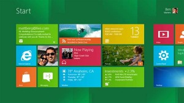
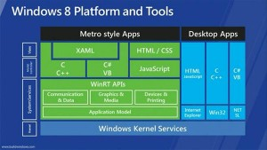

**Overview**
Build was a bit of a different conference.... Initially, when it was announced at MIX it was called PDC (Microsoft's Professional Developers Conference). PDC generally has topics that cover the breadth of the Microsoft eco system from a developer's perspective; creating ASP.NET applications, C# , VB.NET , Entity Framework this and Entity Framework that. Build was NOT that, it was specifically dedicated to Microsoft's upcoming Windows 8 operating system, and especially to the new Metro UI introduced as part of the OS.

Windows 8 is, quite obviously, the next version of Microsoft's Windows platform. Microsoft is laser-focused on optimizing Windows for alternative form factors, especially the tablet. They have reduced the footprint of Windows by eliminating several core services that start up as part of the Operating system as well as the memory footprint. A demo played on an old netbook showed overall resource usage actually decreased when moving from Windows 7 to Windows 8, the first time that a new version of their operating system has had decreased baseline hardware requirements.

The biggest change though is the introduction of the Metro UI for Windows, which can be thought of as the tablet interface for Windows. It is a 'fast and fluid' touch-based interface, similar in some ways to Windows Phone 7, especially in the use of the Live Tiles, which are uber-icons that update with information. Take a look at the screen shot below to see what the new 'start screen' looks like, gone is the iconic start menu introduced in Windows 95, replaced with a 'Windows Phone on steroids' style home screen.

The interface has been well received by folks at large. It's a pretty bold reworking of Windows, part of which involves the fact there are NO Windows, just one or two running applications on screen at a time. For developers, the good news with Windows 8 is that you can also get to the desktop and use all of the applications you already use on Windows 7.

To make all of this fluid, swipey goodness, Microsoft has introduced a new programming API called WinRT, which stands for Windows Runtime. WinRT is to Win32 what Silverlight or Windows Phone 7 are to the full .NET Framework, a smaller API surface optimized for their respective platforms. However, it is different in a couple of ways. First, it introduces new areas to the core Windows API, most of which are focused on using Windows for things like storage and search. Second, Microsoft is providing [or projecting] the WinRT APIs for direct use by C#, C++, VB.NET and JavaScript (and possibly F#), so instead of calling .NET framework libraries that in turn call Win32 APIs, the .NET code directly executes WinRT calls, similar to existing COM interop and P/Invoke technologies. The difference is that the projections include rich metadata so that the libraries appear as 'native' class libraries in each of their respective languages, avoiding a lot of the headaches of existing COM and P/Invoke interactions.

The diagram below outlines the various options for creating applications on Windows 8.

The 'Desktop Apps' section of the diagram is the same types of applications that we currently know and love (or love to hate). These types of applications will continue to be supported and extended moving forward, but WILL NOT be able to interact directly with Metro apps, nor participate in the Windows 8 contracts that provide the rich 'web of applications' that are one of Windows 8's signature features. These applications will also not be able to be installed through the new Windows Store (think the App Store, but for Windows). Desktop applications will be linked through the store, but are not subject to the same certification and safety guarantees as Metro apps.

Similar to how C#, VB.NET, F#, and a host of other languages can create applications using the .NET Framework APIs, there are several options for creating WinRT applications. The options can be split into three different groups. The first group is C/C++ applications using either DirectX or XAML based UI technologies. DirectX is primarily used for game creation or complex imaging applications, and XAML based UIs are really Microsoft's replacement for their existing MFC framework. The second group is a Metro equivalent to WPF applications, written in either C# or VB.NET. The final group is the newly introduced/repurposed HTML/CSS/JavaScript stack, which allows the creation and packing of applications Windows 8 Metro applications using HTML/CSS as the UI layer, and JavaScript as the interface. An entire article could be written on what the HTML/JS layers represent and how they are different than 'web apps', but these types of applications are not executed 'in browser', they are fully fledged 'Metro' apps, using IE's JavaScript engine (Chakra) as the runtime interpreter. To be clear, there is NO fundamental difference in the end result for 'Metro' apps, regardless of what technology stack you choose to use, they really are just options that allow you to use your existing skillset to build Win8 Metro applications.

**Quick Hits**
Here are some quick bullet points for takeaway...

**Microsoft got its C++ love back -**There was quite a lot of time and energy from Microsoft put into the development tools for C++. One of the sessions even stated "C++ is back because performance matters". If you are looking to create uber-optimized WinRT apps on Windows 8, C++ may be the best option. If you are looking to get a date or see your family grow up, the .NET stack is still going to be the best way to create Line of Business applications (LOB). Also, WinRT applications run great with C#/VB/JS languages!

**All Services All the Time -**The data story for WinRT is going to be REST/JSON services. As of now, there is no way to run something like an Entity Framework model on the Metro UI. There are some rumors of SQL Lite support, but the hard push is for connected apps that require backend data sources that are NOT LOCAL to the machine (or even network) in question.

**Metro UI on other processors -**Microsoft is looking to have folks create many different devices and form factors using Windows 8\. A lot of these will run on ARM processors, which are the low energy, middling performance chips that power things like iPads and mobile phones. For classic non-.NET desktop applications to run on these processors they will need to be recompiled. It is worth noting that there are LOTS of confusing statements about this, but as of now, that is the current understanding. Currently there is, at least, a subset of the .NET framework (the Windows Phone runtime) that runs on ARM, so it seems like good .NET framework support should be possible, even on ARM.

**Visual Studio 2011 -**Microsoft has a new version of Visual Studio 2011 that supports templates for many of the WinRT application types

**Asynchronous data access -**Microsoft has a new async/await keywords that are being introduced with the .NET Framework 4.5\. These keywords allow a call to be made on a different thread. This becomes VITALLY important for performant applications because the thread that runs the UI has to wait for data to come back. Microsoft states that any call that takes longer than 50 (or 15, both have been mentioned) milliseconds should be asynchronous. Get used to coding a lot of async calls in the future! The good news is that the new keywords and compiler support mean that writing Metro (and .NET 4.5) applications will look a lot like standard synchronous code that 'just works'.

**Promises -**JavaScript programming on the WinRT stack is going to be implementing the idea of promises. This is the JavaScript version of async/await. Essentially, have JavaScript go get some data, promise data comes back and there is a then() function (or continuation) which will run after your data returns.

**Windows Store -**Microsoft is introducing a Windows Store for users to go and download applications and easily install them on their computer. This will be for WinRT applications only! Other .NET/Win32 applications may exist in the store, but they will link to external sites for purchase and install.

**Conclusion**
So, what does it all mean? At the end of day, at least for now, not a whole lot! In all seriousness, Microsoft is probably a year away from releasing Windows 8 and clients will be at least 6 months to a year out from installing and asking for it. But, be sure to be ready when they start asking!

Having said that, Windows 8 represents a HUGE opportunity! According to Microsoft there are soon to be over 500 million copies of Windows in use. That is more than all the other mobile platforms combined. If there is one thing you want to do today to get ready for Windows 8, I would recommend this... Get your HTML 5/XAML skills up to speed and learn to love creating data services that can be consumed on mobile platforms.

This blog post originally appeared at Skyline Technologies ([http://www.skylinetechnologies.com/blog/Pages/Observations_Microsoft_Build_Conference.aspx](http://www.skylinetechnologies.com/blog/Pages/Observations_Microsoft_Build_Conference.aspx))