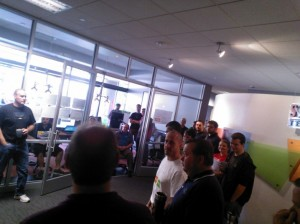
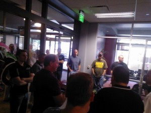

I work at [Skyline Technologies](http://www.skylinetechnologies.com), which is a Wisconsin based consulting company. One way that we really differentiate ourselves in the consulting space is our associate focus. We are always looking for interesting ways to get our teams together, engage with one another and learn from the smart people we have in our organization.

An example of this... our management team had an awesome idea. Let's get everyone together and learn how to write Windows 8 apps. They then said let's make it more awesome, let's get everyone that writes Windows 8 apps a [Windows Surface RT](http://www.microsoft.com/surface/en/us/about.aspx) when they ship. This last weekend (9/15/12 - 9/16/12), we had close to 50 associates show up at our Appleton office to sling code for two days. It was awesome.

[caption id="attachment_1011" align="aligncenter" width="300"] Win 8 Dev Camp[/caption]

We developed six different applications, three on the HTML/Javascript stack and three on the C#/XAML stack. We had several of our associates who have already created applications, including [clearTREND](http://apps.microsoft.com/webpdp/ur-pk/app/cleartrend/8c19bfc1-39de-45f5-b8b9-77fa3717ba81), which has been [recognized](http://www.youtube.com/watch?v=zFwnXTBw-xY&feature=colike) by Microsoft for its innovative UX. We were able to have those associates help out our six development teams whenever people hit roadblocks.

The best part about the [Dev Camps](http://www.skylinetechnologies.com/blog/Pages/Dev_Camps_Bring_Out_the_Best.aspx), [Give Camps](http://www.skylinetechnologies.com/news/Pages/RiverviewGardensGiveCamp.aspx) and [Community projects](http://www.microsoft.com/casestudies/Windows-Azure/Trout-Museum-of-Art/Museum-Increases-Exhibit-s-Reach-Threefold-with-Interactive-Virtual-Exhibit/4000010875) we do, is the opportunity to work and hang out with one another. I am constantly amazed by how smart and engaged the people I work with are. Despite spending a weekend full of 12+ hours days working (with a little beer drinking and football watching thrown in for good measure), we all left energized and excited.

Great people and great apps make for a great weekend.

&nbsp;

[caption id="attachment_1081" align="aligncenter" width="300"] Getting Started

<dl id="attachment_1091" class="wp-caption aligncenter" style="width: 310px;"><dt class="wp-caption-dt"></dt><dd class="wp-caption-dd">Morning Kickoff[/caption]

</dd></dl>

&nbsp;