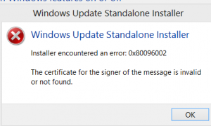
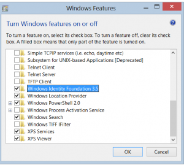

In upgrading to Windows 8, I had issues with existing projects that were using Windows Identity Foundation 3.5 (WIF). Attempts to install the WIF SDK or the stand alone installer resulted in an error. With the installed the message was

Installer encountered an error: 0x80096002\. The certificate for the signer of the message is invalid or not found.

&nbsp;

It turns out WIF 3.5 ships with Windows 8\. You need to enable this feature to work. To do that, go to Win 8 Search and the application settings area and search for Turn Windows features on or off and enable Windows Identity Foundation 3.5

&nbsp;