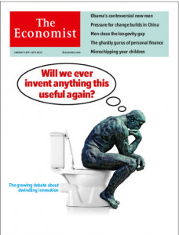

Recently, The Economist magazine had a [cover story](http://www.economist.com/news/briefing/21569381-idea-innovation-and-new-technology-have-stopped-driving-growth-getting-increasing) on Innovation, with Rodin's The Thinker sitting on a toilet wondering "Will we ever invent anything this useful again?"

It is interesting to contemplate the pace of innovation and if we are slowing down.

At first glance, it just FEELS like we are slowing down. There is a great quote from Peter Thiel, who runs the Founders Fund, a venture capital fund, ""We wanted flying cars, instead we got 140 characters." ([New Yorker profile of Peter Thiel](http://www.newyorker.com/reporting/2011/11/28/111128fa_fact_packer?currentPage=all)). That succinctly sums up the disappointment people feel about the progress of innovation.

You can also look back to our history to see this. In December of 1903 the Wright Brothers flew an airplane at Kitty Hawk. A (relatively) mere 66 years later, Neil Armstrong stepped onto the surface of the moon. Apollo 17 saw the last manned moon mission in 1972\. In the ensuing 40 years, we haven't been back. I doubt we will be back in the next 24 either.

In 1900, the average life expectancy in America was 49 years. By 1980 that had risen to 74 years. In the ensuing 30 years, it has risen to 79 years. We can go on and find similar examples that provide the sense that we are slowing down.

There are several reasons for this I believe. The turn of the century was really the time when the benefits of the Industrial Revolution were realized. The advances in Steam Power and mechanization during the early years of the Industrial Revolution gave way to the widespread access to electrical power and lighting in the early half of 1900s that significantly changed the pace of society and saw significant increases in GDP per person (one measure of Innovation) during this time. Economists generally believe similar increases occurred during the period of our history when we moved towards and Agrarian society (a time in which the world obviously did not have a concept of GDP).

In a sense, the pace of Innovation was easier. At the beginning of the Industrial Revolution, the solutions were more readily discovered. However, as we acquire more knowledge and expertise, the barriers to entry become much more difficult. When I was in college, I flirted with idea of studying Astrophysics. Ultimately, I decided not to, and part of the reason was talking to professors it became apparent that you really needed a PHD to find a job. In talking to the PHD students I realized I had years of to prepare myself for a PhD. A good part of this time involved acquiring the math background I would need several math courses to start the graduate classes, despite having an undergraduate degree in Applied Mathematics. I was unwilling to invest more years of mathematical study just to get into a graduate program.

The Economist article refers to this as "burden of knowledge". The more knowledge we have on a subject, the longer it takes to get proficient. The article states that the "age at first innovation", when someone contributes something new, rose about one year between 1985 and 1997, a period of 12 years. And during the last 15 years, things haven't moved any slower.

So is there no hope for the future? Of course not! Two things I think it is important to take into consideration.

First, we are in the midst of moving from the Industrial Age to the Information Age, and we are at the beginning. As we move to fully realize the benefit of the Information Age, we will see significant gains, similar to the benefits realized as a result of being fully engaged in the Industrial Revolution in the early 1900s.

"Digital Natives", today's students, have grown up immersed in the technology and I believe it will change the way we work and learn. Take for example, my daughter, an 8th grade student. She recently had a homework assignment to solve America's Debt Crisis. As part of her work and research for her presentation, she reached out to economists at both Lawrence University (located in Appleton, WI) as well as Harvard University. She also reached out to our congressman, Reid Ribble. All of the people she contacted replied to her with valuable information used in her presentation. For many students, it is first nature to bypass the geographical or communication boundaries that many of us grew up with. They are also used to using distance learning and communicating via video with things like Skype or Google Chat. I believe, this is going to fundamentally change how we work. So much capital is spent on classrooms to learn in and offices for people to work in. As "digital natives" move into the workforce and bring a high level of comfort with distance working, and then become managers, organization will spend less on infrastructure for offices and the like and be able to apply more resources to applied research in their environment. Second, these distance workers also have a MUCH shorter commute. Many people will find extra hours in their day that will also have a positive effect on per person GDP. We will never remove the need for face to face communication, but we can certainly realize benefits of a global network and communicate more efficiently.

Second, it is always darkest before the dawn. I say that half jokingly, but I am always reminded where we were with Physics study at the start of the 20th century. With the discovery of Maxwell's Equations, physicists believed they had essentially come to the end of the road. The basic forces of the universe, like electromagnetism and gravity were well understood and described the world with precision, precisely the goal of physics. The only thing remained was this pesky issue with the model for the atom. That issue though led to Einstein and his changing the world with the discovery of the photoelectric that began Physics on the path to quantum mechanics. The discovery of quantum mechanics in turn lead to solid state physics and the chips that are driving today's information age, not to mention a whole host of other technologies that resulted in immense economic gains.

The thing about innovation, true innovation, it always comes unexpectedly and in ways we can never anticipate. We can all pretend we have crystal balls and can see what the future will be. At best though, we can make educated guesses. Rest assure, there will be technologies that come in disrupt the world and will profoundly change the way we live.

What are steps we can take to facilitate innovation? First off, education. I am not necessarily saying spend more on education, but challenge our students earlier with the topics they need to help them be prepared in science and math. Earlier introduction of these topics, especially classes such as Calculus, ensure our students are able to try and overcome the "burden of knowledge" by starting out with a stronger base at a younger age. Second, continued investment in basic science by governments. The space program was an economic engine for decades that drove innovation. The government's investment in a redundant data network resulted in the Internet which is driving today's information revolution. The ROI on basic science research can be too long for the marketplace to invest in, but when measured in years and decades, the impact to the economy can be massive.

Is Innovation dead? No. Is it slowing down? It may be by some measure. However, I believe we are on the cusp of another great wave of GDP growth as the fruits of the Information Revolution emerge. I am excited to see what is coming next!

This blog post originally appeared at [Skyline Technologies](http://www.skylinetechnologies.com/Blog/Lists/Posts/Post.aspx?ID=167)