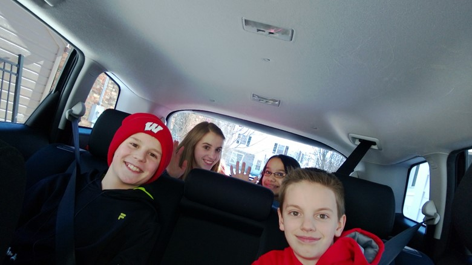
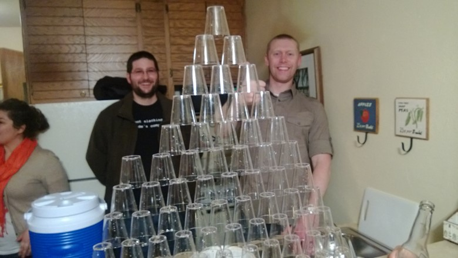
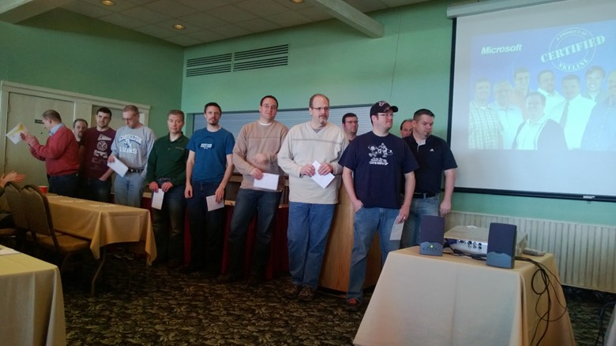

The company I work at, [Skyline Technologies](http://www.skylinetechnologies.com/), hosts an annual retreat for its associates every year. I thought it would be worth talking about what I think the great things Skyline does at these events and how they help foster and grow great teams.

Our founders, Pat Deprey and Keith Kaufman, felt it was important that our associates and their families get to know one another. When you are a consulting company, with associates at various customer locations, it takes organizational focus to make sure people know one another and feel like part of the organization. We have now had the annual retreat for over twenty years, with CEO changes and ups and downs in the economy; preserving the Annual Retreat has always been a top priority. As a matter of fact, as we have added offices in Appleton and Milwaukee, and have associates working all over Wisconsin and the Midwest, it has become even more important.

Previous years have been in Sister Bay, WI, where we took up two different resorts. As our company grows, especially our Milwaukee office, we moved the event further south in Door County to Egg Harbor so we could have all associates at a single location.

So what makes our Annual Retreat such a great event? Let's talk about a few of the ways company get-togethers can help any group grow the strength of their organization:

## Family Fun

Here is a picture of my kids and their friends as we headed on the road. 

As you can see, they are an excited group. The Skyline team that puts together the Annual Retreat makes sure that there are events going on throughout the weekend for families. Some of those events are kid friendly, some of those events are spouse friendly, and some of them are even teenager friendly. 

Friday night starts off with a dinner where associates and their families have the opportunity to get together and socialize. The team I am part of, has associates working out of Madison, Milwaukee, Appleton and Green Bay, and we are pretty evenly distributed. The dinner and social aspects of the weekend are one of the few times each year we are all in the same place and get to have fun together.

On Saturday, we have an overview of the business and how things are going for the company and where we are going. Associates are encouraged to invite their spouses/significant others to join the meeting and learn about the company. With so many new associates joining each year, it is a great way to introduce the organization to our associates' families. For new associates, it really drives home what makes Skyline different from other consulting and tech companies in the Midwest. 

## Fun Events

Organizationally, Skyline is also committed to making a fun work environment. We even have a Director of Fun, who organizes events throughout the year. Door County is littered with events for associates and/or their families to attend. A small example of them:

*   Poker Game

*   Cribbage Game

*   Board Games like Settles of Catan, Carcassone and many more

*   Scavenger Hunt

*   Magic Show

*   Fish Boil

*   Bonfire and Smores

*   Karaoke

As you can see from some of these pictures, a good time is had by all!

## Associate Recognition

Another big highlight during our Annual Retreat are the associate recognition awards. In the state of Wisconsin, Skyline has more certifications than any other Microsoft partner. Below is a picture of all the associates who received certifications in the last year. 

This is one example of an award during the weekend. Skyline has always made it a point of recognizing associates who contribute to our organization. These awards have become one of the highlights of the annual retreat. One of the best parts is recognizing the people who do good work in front of their spouse/significant as well as their peers. 

## Highlights for making a great company event

*   Make it family friendly

*   Provide opportunities for spouses and significant other to learn about the company and its leaders

*   Provide recognition for employees 

*   Have events for employees and their families

*   Provide downtime

*   Provide opportunities for community