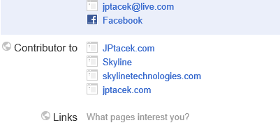
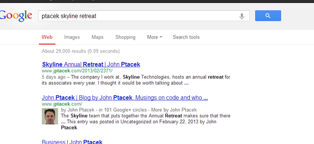
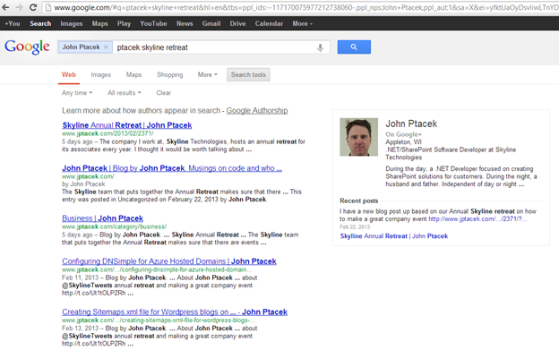

A while back, Scott Hanselman had a blog [post](http://www.hanselman.com/blog/EmbraceAuthorshipTheImportanceOfRelmeAndRelauthorOnYourContentsSEOAndGoogle.aspx) about embracing authorship. Essentially, it was a discussion about using Google's authorship [markup](http://googlewebmastercentral.blogspot.com/2011/06/authorship-markup-and-web-search.html) on your website to help identify content you wrote. Like a lot of my recent posts, I decided to give this a run on my blog, which is an Azure hosted site running Wordpress.

At a high level, implementing this is a two-step process. First, Google needs to have a trusted "identity card". A place where the author identity is managed. As you can imagine, for Google this is [Google+.](http://plus.google.com/) You need to use your identity card (Google+) and say that you write content for a given site (in this example, [jptacek.com](http://www.jptacek.com/)). The next step is when you write content, you need to link back to your Google+ profile.

First why, would someone do this? There are quite a few reasons

1 - Manage "brand". Whether it is your personal brand or your corporate brand, it helps build online presence

2 - Search Engine Optimization. Google keeps the magic sauce of its page ranking very close to the vest. However, former Google CEO Eric Schmidt has explicitly stated in the future, content linked to online profiles will be ranked higher. 

3 - Search Results will be more eye catching. Google will put your author photo into links for pages you have created.

For more on this, Forbes recently published an [article](http://www.forbes.com/sites/johnhall/2013/02/26/6-reasons-why-googles-author-tags-are-important-to-leaders/?ss=strategies-solutions) about why business should be using Google author tags.

So what are the steps to do this for your site? There are several sites that explain this. Google has a nice [introduction](http://support.google.com/webmasters/bin/answer.py?hl=en&answer=2539557) as well as the Scott Hanselman [post](http://www.hanselman.com/blog/EmbraceAuthorshipTheImportanceOfRelmeAndRelauthorOnYourContentsSEOAndGoogle.aspx). 

The first step is to identify to Google that you contribute to a site. This is done by going to your Google+ profile at [http://profiles.google.com/me](http://profiles.google.com/me) and clicking Edit Profile.

Click Add a custom link and link to your blog. I blog a lot for at [Skyline Technologies](http://www.SkylineTechnologies.com), where I work, so I included a contributor link there. I also blog on my personal site. You will notice that each link has multiple links. This is a result of adding the link manually for each site as well as doing a corresponding email verification. So we have finished part one, letting Google know where we are creating content.

The next step is to update Wordpress to have posts link back my author profile with the author tag. For my profile, the url is [https://plus.google.com/117170075977212738060?rel=author](https://plus.google.com/117170075977212738060?rel=author). You will want to change the really long number to be your profile ID. 

I did this in several ways. First, on the main site I have a list of links for things like Twitter and LinkedIn. I included a link to Google+ here also

Next, I update footer.php template for Wordpress to have a link back to the Google Profile. This will ensure each page on the site is identified. Last, the header.php section was updated with a Meta tag 

<link
			rel="author" href="https://plus.google.com/117170075977212738060?rel=me"
				/>
			

Last, is to add a link to the content.php identifying the author of the article that links back to your Google Profile

By <a href="https://plus.google.com/117170075977212738060?rel=author">John Ptacek</a>

Okay, we have setup a bunch of links. How do we know if it works? Google has a Structured Data Testing tool that will tell you. If you go to [http://www.google.com/webmasters/tools/richsnippets](http://www.google.com/webmasters/tools/richsnippets) you can check your blog and see if Google recognizes the markup.

You also notice that there is an email verification. This is another way to ensure your links are set. This is the reason two links appear for each site I was a contributor to in my Google Plus profile. I added each URL manually, and then as another level of verification, I verified an email address for each site.

What is the end result? When I search Google for content, my picture is now appearing in the search results

Posts I have a written now appear with a picture next to my name. You can also see that there are several hyperlinks in the search results. 

The first, the byline (by John Ptacek) links to my Google+ profile.

The second, More by John Ptacek, 

displays articles I have written as well as author information as you can see [here](http://www.google.com/#hl=en&tbs=ppl_ids:--117170075977212738060-%2Cppl_nps%3AJohn+Ptacek%2Cppl_aut%3A1&sclient=psy-ab&dq=&q=John+Ptacek&oq=John+Ptacek&gs_l=serp.3...31815.31815.0.32252.0.0.0.0.0.0.0.0..0.0.les%3B..0.0...1c.1.5.psy-ab.xk3_MinTqHs&pbx=1&bav=on.2,or.r_gc.r_pw.r_qf.&fp=95c9c19312d4e19&biw=1478&bih=757)

As you can see, it is relatively easy to start identifying content you have created and having increased visibility in page results.

As organizations embrace thought leadership, this is a great tool to ensure your employees and their content continues to be discoverable! 