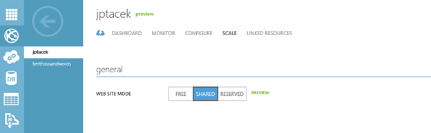
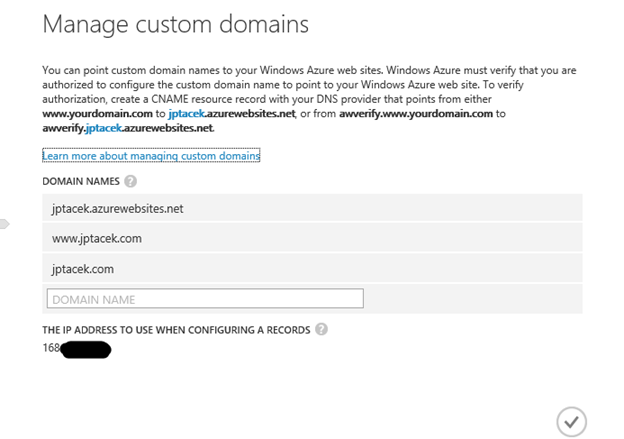
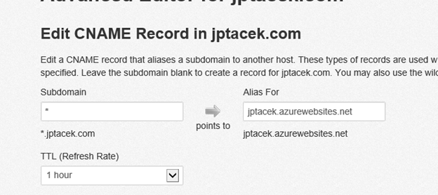
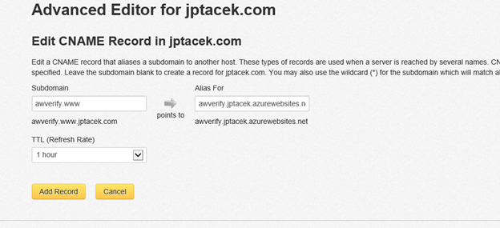
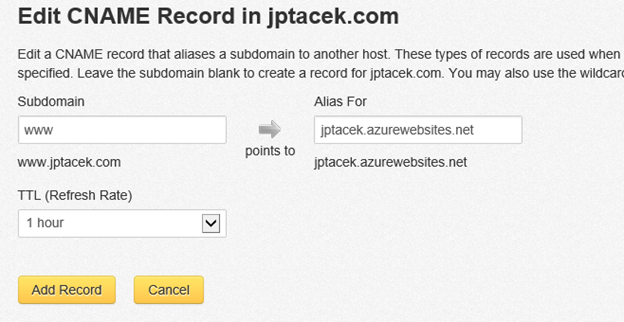
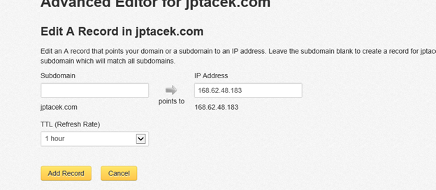

[DNSimple](https://dnsimple.com/) is a great service for hosting and configuring DNS for domains you control. It also benefits by not being Go Daddy. I hate Go Daddy. They supported both SOPA and PIPA, run sexist television commercials and I have no love for their elephant killing CEO. Then there is their utterly confusing website, upselling tricks and poor customer service. Don't use Go Daddy.

DNSimple allows you to host up to 10 domains for $36 (USD) for the year. You can find pricing information at [https://dnsimple.com/pricing](https://dnsimple.com/pricing). For multiple domains, this is significantly cheaper than Go Daddy.

Another nice feature of DNSimple is they have templates for many popular sites to configure all of the necessary DNS settings required for hosting. They have templates for Google App pages, Tumblr, Wordpress, etc. While I am a developer and tend to be technical, I get lost pretty quick in the world of DNS configuration. A records, CNAME, MX, etc, etc. The templates help users get up and moving quickly.

However, they do not have support for Azure hosted websites. It took me a little messing around to get this to work, and finally I have it set correctly.

First, for this to work. You need to be hosting your website in Shared or Reserved mode. Free mode will not allow for users to have a custom domain name. To do this, log onto the Azure management portal and go to Web sites and choose your domain. Click scale and configure either Shared or Reserved. Shared is going to be MUCH cheaper.

&nbsp;

You will then want to configure your domain names. This is done by clicking Configure and Manage Domains

&nbsp;

This will provide a screen for managing custom domains.

The instructions do a good job of telling you what do. You want to have any domain that you want DNS to resolve for added here. In IIS speak, these are the Host headers. You will want one for WWW and another for your TLD, jptacek.com in our case. The issues I ran into was jptacek.com not registering properly and did not redirect to the main site.

Next, you will need to configure your DNS settings in DNSimple. Go to [www.Dnsimple.com](http://www.Dnsimple.com) and login. To configure your DNS, go to Domains, and select the Domain you want to manage

Once in manage, you will want to go the Advanced Editor, which is what to use when a template is not present.

In here you will add for records, three CNAME records and an A name record. First, add a wildcard CNAME and have it point to your azure hosted website.

Next, as mentioned on the Azure site, you will need a record that will verify you own the DNS. To do that, configure the AWVerify to point to Azure's service

Next, a third CNAME record for WWW that goes to the Azure site

Last, and this is the area I ran into issues, you need to create an A record for the domain that points to the IP Address provided by Azure. This can be found on the Manage Domain settings. This will ensure that a request to the top level site, jptacek.com, will redirect to your site. Be sure to leave your subdomain blank.

&nbsp;

You may have to wait up to an hour for the changes to take effect. It is also good to flush your DNS to ensure no issues.

If you are looking for a DNS provider or want to switch from Go Daddy (which is horrible, have we mentioned that), check out DNSimple.com If you want, you can even click on the referral link [https://dnsimple.com/r/b8a105607bde67](https://dnsimple.com/r/b8a105607bde67), and get one month of free hosted DNS. Even better, I would get a free month of free hosted DNS J

&nbsp;