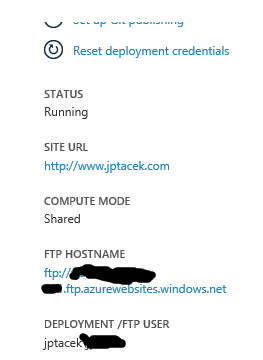
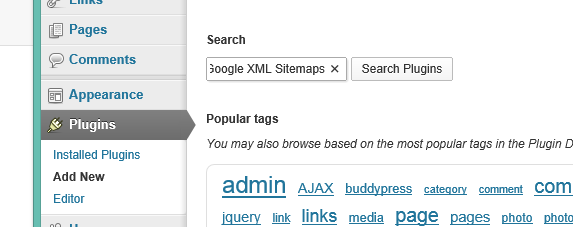
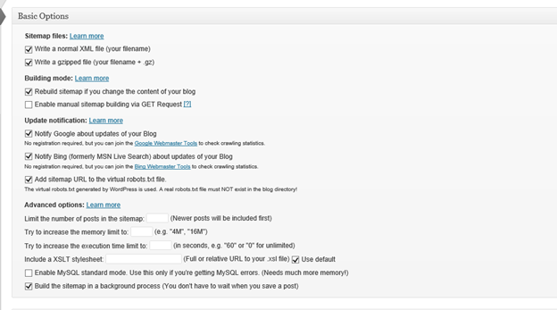
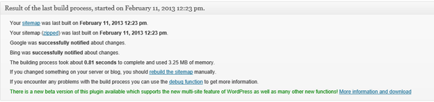
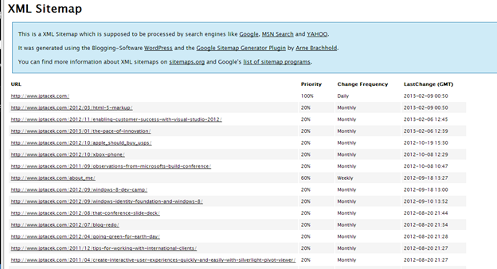

When running Wordpress on Azure websites, you have the ability to create sitemaps. This enables search engines such as Google and Bing to make you content more discoverable. You can find out more about Sitemaps from [Google](http://support.google.com/webmasters/bin/answer.py?hl=en&answer=156184).

The first step in the process is to upload placeholder files for the sitemap files. These are two files, Sitemap.xml and Sitemap.xml.gz (a compressed format). These files are both available on the Wordpress site, so download both [Sitemap.xml](http://www.wp-starter.com/wp-content/uploads/sitemap/sitemap.xml) and [sitemap.xml.gz](http://www.wp-starter.com/wp-content/uploads/sitemap/sitemap.xml.gz) locally to your computer. For this example, our local directory will be c:\scratch.

Next, you are going to need to upload the files to your hosted Azure website. This requires using FTP. The Azure management site has the link to this.

&nbsp;

Clicking the URL will pop up the FTP client in your favorite browser. I hate that FTP client (this hate is browser agnostic). Instead, I use the FTP client on the local OS, in this case Windows 8\. Go to the command prompt and:

1.  Type ftp server.ftp.azurewebsites.windows.net
2.  Type in your FTP user name, being sure to include the domain name
3.  This will put you at the top level of your hosted Azure website. You can see the files there by typing LS (the UNIX version of the Dir command)

1.  You will need to change directories to the location on your server that is the root for Wordpress site, in our case that is wwwroot; cd site\wwwroot
2.  Now change your local directory to the location of the sitemap files you downloaded earlier using the FTP command LCD. This will change your local directory for you. In our example the location directory is c:\scratch, so LCD c:\scratch
3.  You can verify the files are present locally by typing !dir, which shells out to the command prompt
4.  
For each file, type PUT filename;

    1.  PUT sitemap.xml
    2.  PUT sitemamp.xml.gz

It goes without saying you can use your favorite FTP client to upload the files, I just made sure to document at least one.

Now that the sitemap files are present, you need to create the content for them. This can be done by installing a Wordpress plugin. The one I use is the Google XML Sitemaps application that can be downloaded here.

To install this on your Wordpress site hosted on Azure is easy enough. Log in as administrator to your account.

1.  
Go to you Plugins and choose Add New and type Google XML Sitemaps and click search

2.  Click Install Now and move onto setup
You will want to verify the location of your Sitemaps file, which the plugin automatically detect

&nbsp;

The basic options are fine for most implementations. The Plugin will automatically create zipped up files of your sitemap, rebuild on content change as well as notify Google and Bing of changes

&nbsp;

The plugin allows you to build the sitemap for the first time. After it is done, you will see

You can verify the sitemap by looking at the xml for the file. In the case of this blog, [http://www.jptacek.com/sitemap.xml](http://www.jptacek.com/sitemap.xml)

&nbsp;

&nbsp;