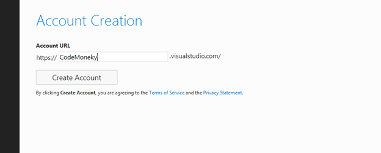
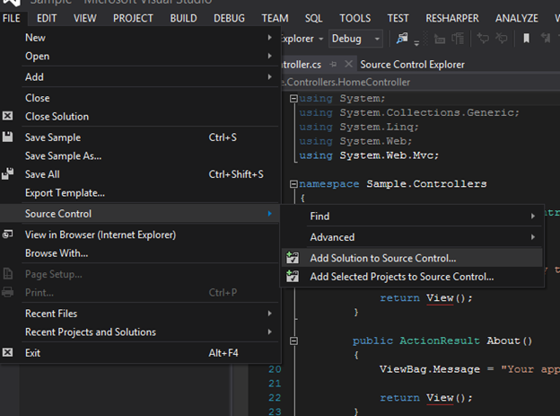
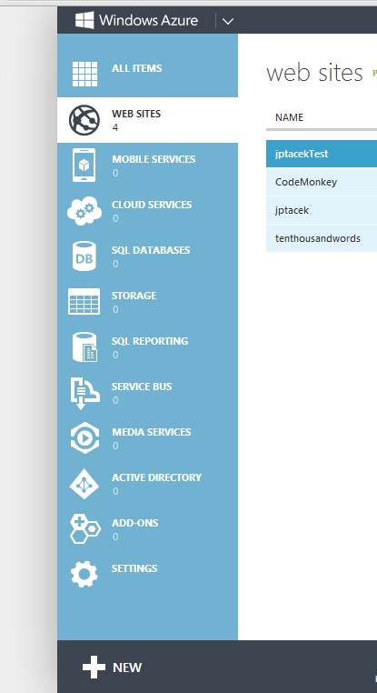

[Azure Websites](http://www.windowsazure.com/en-us/home/scenarios/web-sites/) are a great tool to explore pieces of the various technology stacks, especially in the Microsoft space. They include the ability to quickly spin up servers running blogging engines, CMS systems, etc. You can also create other services such as SQL back ends, Media services, Access control services, etc. At the end of the day though, what you are really getting is a shared server in the cloud, than can host all kinds of custom applications as long as you know how to get them there.

For developers, one of my favorite parts of Azure websites is the integration with cloud hosted source code repositories such as [Github](https://github.com/) and Microsoft's cloud version of [Team Foundation Server](https://tfs.visualstudio.com). You can setup your Azure hosted website so that any time you or members of development teams you are on check in code, it is automatically built and deployed to your site. Organizations that implement projects in this manner, with automatic builds, unit tests and deploys to test or production servers without ever touching the server are much more mature organizations with less bugs and more reliable code. If you are at an organization were you are NOT doing this, Azure websites and integration with TFS or Git can be a great tool in helping build a business case within the organization.

The good news is setting this up with Azure websites is trivial. Let's walk through the process.

For this post, we will automatically deploy a MVC project in Visual Studio hosted in the cloud version of TFS to an Azure website. The first step is to create a TFS account in the cloud if you have yet to do so. You can do this at [https://tfs.visualstudio.com](https://tfs.visualstudio.com). The good news is for individuals and small companies or development shops, this is free. Microsoft allows for up to five users for TFS cloud hosted project. Teams that are bigger than that can also use TFS, but will have to migrate to a paid version down the road. As of this time (March 2013) pricing has yet to be announced.

Click the Sign up for free link after signing into TFS preview. You will then be asked to create a URL for your TFS project

Click create account and you are then take to the Project screen. From here you can either create a Team Project or a Team Project with Git support.

We will create a New Team Project

A few seconds later, a Team Project is created. 

You can now connect to this TFS site from Visual Studio. To do that, go to the Team menu and select Connect to Team Foundation server

Click the Add button and type in the URL that you just created, in our example, CodeMoneky.VisualStudio.com (I realize typo, the original URL was taken...)

You will be prompted to sign in with your Microsoft account. You can then create your project and check it an as you as you normally would. Add the solution to source control

And check in your code

Now you have gone through the process of adding your code to TFS. The next step is to get the automatic build and deploy working. That is the easy part!

Log into the Azure Management console and create a new Azure website by clicking the new button in the bottom right

Choose custom create from the options

Create a URL for your site and make sure Publish from source control is checked. By default it is not

Click the source code repository of your choice, our example will be TFS. 

Independent of the back end (TFS, Git), we will authorize the account. For TFS, click the Authorize Now link

It will then show a list of projects hosted in TFS, we just choose the project to deploy.

It then creates the project. We wait a few minutes, if we have not waited long enough we see a screen like this

And after we are done, the default MVC template project.

The best part, now whenever solution changes are checked in by you, or project team members, they are automatically deployed from TFS to your Azure website. This functionality is the same for other source code repositories.

As you can see, Azure websites integration with source control systems like Git and TFS make the automation of your build process sleek and simple. It is a great opportunities for small companies and startups to have best practices in place as well as the ability to quickly see code changes and updates. Check it out!