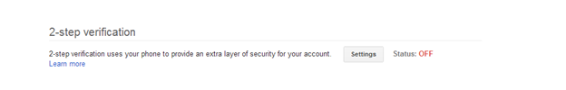
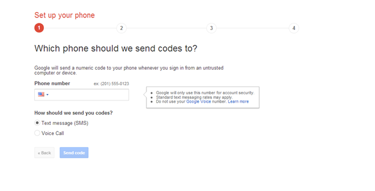
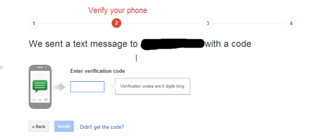
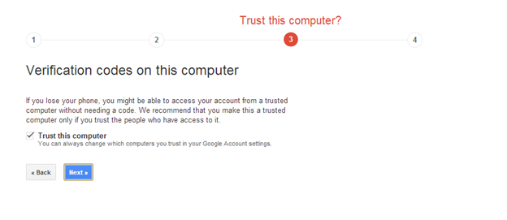
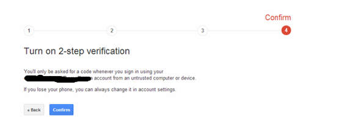
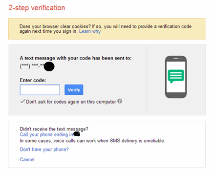
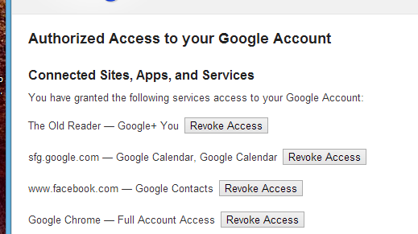

My daughter was recently asking me what classes she should take for next year, one of the options was Creative Writing. I told her the choice was easy, Creative Writing, "You can never be too good of a writer". Similarly for the Internet, you can never be too secure.

There are LOTS of horror stories out about people who have had their lives severely impacted by people getting access to their account information. Last year, Matt Honan [wrote](http://www.wired.com/gadgetlab/2012/08/apple-amazon-mat-honan-hacking/all/) a cautionary tale about how easily someone was able to take over his digital life for Wired. It is well worth reading. If that one was not enough, then you can read another account from James Fallows [wrote](http://www.theatlantic.com/magazine/archive/2011/11/hacked/308673/?single_page=true) for the Atlantic.

First off, you should be doing basic things. Do NOT use the same password for all sites. DO NOT have passwords that exist in the dictionary. DO have special characters, numbers and mixed case in your passwords. That is just plain, Internet common sense though.

The reality though is, your password is only so good. What everyone should do is setup two factor authentication. Two factor authentication is really "something you know" (your password) and "something you have", an object like a phone. For enterprise users, this is old hat. The vast majority of large companies require users to have a SecurID card to get access to their network. The card generates a token that changes on a regular internal (60 seconds for example) that user needs to enter when logging in.

However, in the consumer space, this has been much slower in coming. Several years ago Google introduced two factor authentication. Facebook also has the ability for you to enable a variation of two factor authentication. If the browser is not recognized as one you have used before, it will send a SMS to your phone. Twitter is in the process of enabling two factor authentication after 250,000 user accounts were compromised. Microsoft has SOME variation of it. It will occasionally prompt you with a verification code when making account changes or accessing the device from a non-trusted PC. It is however, not a default option for login, and I have never been able to figure out how it decides to send SMS messages. Microsoft really needs to have this option available for those who want it.

We are going to step three enabling Google's two factor authentication, since so many folks have Google accounts.

To enable Google's two factor authentication, first, go to your Google Account and click security and find 2-step verification.

For 2-step verification, change the settings form Off to On.

You will then be prompted for a phone number to use for SMS messages. The phone, along with the accompanying verification code, is the second factor of authentication, it is the thing you have. Type in the mobile phone number

Enter in your phone number and a verification code will be sent to your mobile device. You will then be asked to verify the code

You will then be asked if you want to trust the computer you are on. This will allow you to log in without being prompted with a code very time. This trust usually lasts 30 days.

And then lastly, click confirm

Now, each time you log into your Google account from a non trusted computer, a SMS message will be sent to your phone that will need to enter.

Now, this is a bit cumbersome, I grant you. However, it is almost necessary if you are using Google services for anything remotely important to your non-digital world. Do you have bank account information in Gmail? Then turn on two factor authentication. Do you have send yourself passwords in Gmail? Then turn on two factor authentication. Do you have health information in Gmail? Then turn on two factor authentication. Do you use your Google account as your account name for anything important? Then turn on two factor authentication.

There are a couple of things to realize. You NEED your cell phone to log into Google services now. If you do not have your cell phone with you, or you are travelling overseas without phone access, then you will not be able to log in to your account. However, Google has several options for you. First, for those on the Android platform they have an app called [Google Authenticator](https://play.google.com/store/apps/details?id=com.google.android.apps.authenticator2&hl=en) that will generate the authentication codes for you. Option the second is you can print out a small piece of paper that has a one time, ten digit codes that you can use to get access.

Second, applications that log into Google services to get access to your mail or contacts via POP or IMAP will no longer work. To work around this, Google allows you to create application specific passwords. These passwords are generated on the screen and then you never see them again. There are steps on how to do this at [http://support.google.com/accounts/bin/answer.py?hl=en&answer=185833](http://support.google.com/accounts/bin/answer.py?hl=en&answer=185833). For those using Outlook, Apple Mail, accessing email via phone, this will need to be done. Those of you paying attention at home will realize you are really back to a single password. While this is true, you cannot get access to your account via web browsers. Second, and more importantly, you cannot manage your account with it. You can also revoke access to anyone of these passwords at any time.

Last, it is good measure to, in Google, Facebook, Twitter, your Microsoft account, anything account you allow to do authorization at other locations, to review what applications you have authorized. So while you are on your account page, review the Connected applications and sites to see who you have authorized to have access, and what level of access to your Google account data.

Personally, I have a Gmail account that I use for my "public" life. It is the address I sign up for things like Facebook with, the email address I use for accessing services I subscribe to, like Netflix, etc. For personal use, I also have a Google Apps domain that I use for personal email with family and friends. Google Apps also support two factor authentication.

As digital identity becomes more and more integrated into daily lives, it is everyone's responsibility to ensure they can be secure as possible. Take the steps now where you can, because by the time you should have taken the steps, it will be too late.