WordPress, is obviously, a VERY popular blogging platform. You are going to have a lot better luck finding information out on the Internets than you will here. So we will take a quick look around, and focus a bit on the differences on the Azure platform.

First off, WordPress is developed on the PHP platform. The vast majority of the management functionality can be done right on the website. This is the dashboard and can be seen below

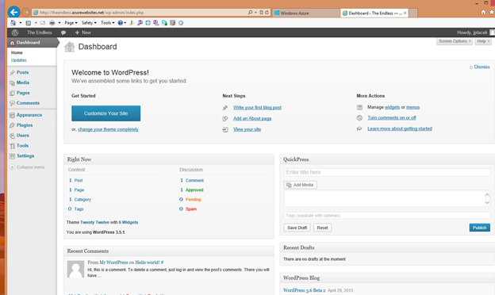

At a high level

*   Home - This is the main Dashboard page

*   Posts - These are where you manage your blog posts

*   Media -This allows you to add and manage media to your site such as images, videos, etc.

*   Pages - These are web pages for your site. A good example would be an about me page

*   Comments - This is where you manage comments posted to your blog. Be ready for SPAM, lots and lots of SPAM

*   Appearance - This is where you control the look and feel of your site, add widgets, headers, backgrounds, etc.

*   Plugins - These are third party pieces of functionality you can add to your site. There is a very robust eco system of widgets surrounding WordPress

*   Users  - Allow you to add users to your site so that more than one person can blog, etc.

*   Tools - Similar to plugins, tools you can add to your site

*   Settings - These are the general settings of your WordPress blog. For example, the name of the site, time zone, formats, how links are displayed, etc

The first thing most users will want to do with their WordPress site is select a theme. Much like Plugins, there is a vast ecosystem around WordPress theme development. Users can get a default theme, or find a theme that suites there needs much more closely and pay money for it. 

To choose a theme, (get ready for it), go to Appearance and Themes. There is the default themes that ship with the version of WordPress you installed, as of the writing of this, Twenty Twelve and Twenty Eleven.

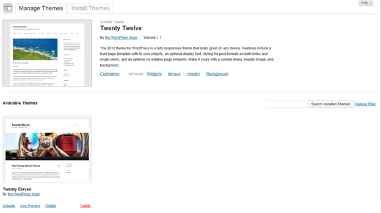

You can go to Install Themes, and look for themes you think are more representative of your site. To get an idea of the options, choose Newest and take a look at the latest site themes people have created.

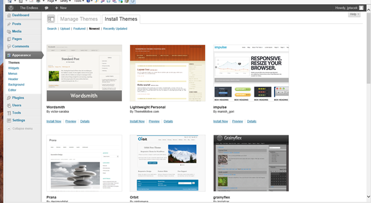

Personally, and this is a shortcoming, I am really not that interested in aesthetics. So I choose the default Twenty Twelve theme and run with it. One of the things I DO like about this theme is that it utilizes responsive design, so it looks good on a number of form factors.

In your theme, you can choose to customize the theme. This enables you to change site description, updated colors, choose background images, etc

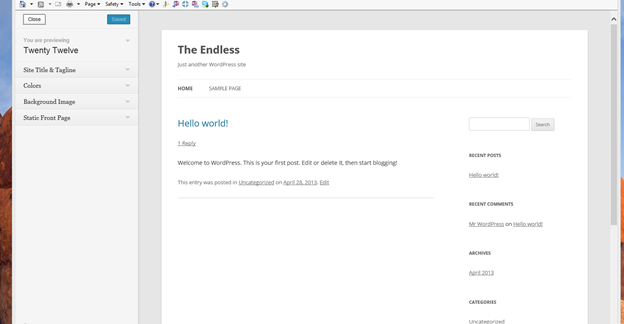

We can choose Site Title and Tagline and change our Tagline to say something different; for example, A Dysfunctional Family, and click Save & Publish

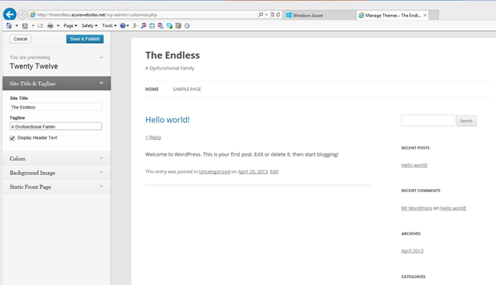

And the changes are immediately seen on our site.

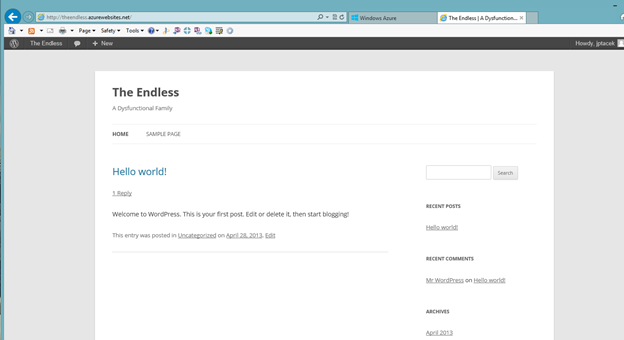

Just to give an idea of how a theme would work. We can quickly change it and see the effect. Let's install the Lightweight Personal theme we saw previously. We click the Install now link and it downloads and install the theme locally. We can click the Activate link to have immediately take effect

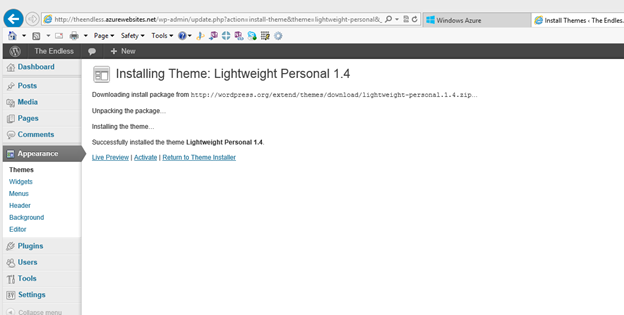

And voila! A totally different user experience.

		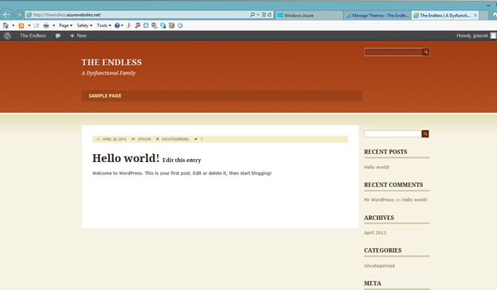

Notice, of course, that our content stays the same, it is just the UI that changes.

To get an idea of how plugins work, let's install a plugin and take a look. All the cool kids today are on twitter (actually, I am on Twitter, so the cool kids are probably somewhere else), so let us add twitter functionality to our site.

Click plugins on the management dashboard and you will see the default plugins that are installed with WordPress

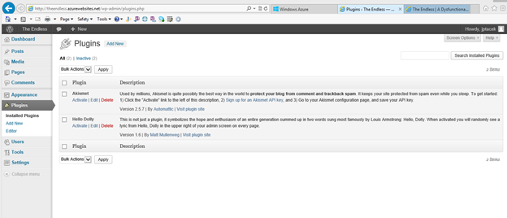

Hello Dolly features lyrics from Louis Armstrong's Hello, Dolly randomly on your site. While I love Louis Armstrong (his two albums, Ella and Louis with Ella Fitzgerald are required listening), the lyrics do not really fit in on our site.

The Akismet plugin is much more useful. It helps you determine what comments are spam on your site, and you will be getting lots of spam. It is worthwhile activating it, though it requires registering for a WordPress account, and if you so desire, paying some money.

For us though, we want to add Twitter to our site. So click the Add New link and search for Rotating Tweets

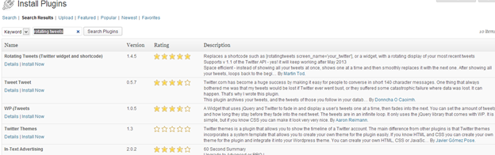

We click Install Now and verify we want to install. We are then taken to the post install screen, where we can either activate the plugin, or leave installed, but not activated. Let's activate by clicking the Activate Plugin link

We now see this on our list of plugins

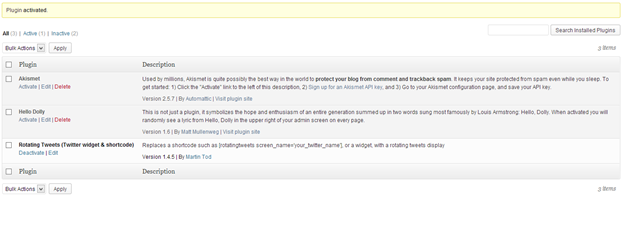

Plugins that are activated, then become Widgets. Similar to SharePoint web parts, widgets are items of functionality that can be added to a page. You can add widgets by modifying the appearance of your site. Click Appearance and then Widgets

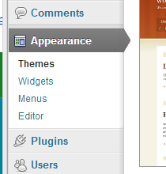

The page shows the available widgets and then the side bar widget area. You can drag a Widget from the available section to the sidebar and put in the order you want. We will put our Rotating Tweets widget there by dragging it.

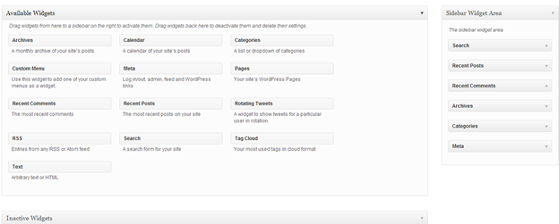

Nearly all plugins have sections for you to modify for your site. We are going to add a Title and a twitter username and click save

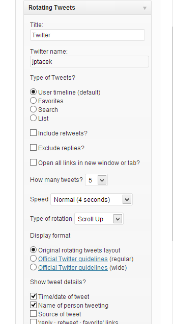

Our site is now updated

As you can see, the WordPress functionality provided by Plugins and Themes allows you to quickly customize your site's look and feel.

Next time, we are going to dig a big deeper into modifying your site by adding socialization links using PHP and WebMatrix!