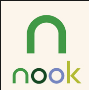

[Microsoft](http://www.Microsoft.com/), over the last year, has stated they are a devices and services company. In a lot of ways, this is not just not true J. Microsoft WANTS to be a services and devices company. Right now they are an enterprise Software company that sells the world's most popular PC operating system in a world where PC sales are quickly falling.

How do they make the move to truly being a devices and services company? Well, if I was CEO for a while, this is what I would do.....

Microsoft really has three things they need to ramp up. First, they need more users of its services, especially on the consumer side. Second, they need to increase the diversity of software on mobile devices, both Windows, Windows Phone and competing platforms like Android and iOS. Last, but not least, they need to have more devices.

So how would I go about tackling these issues? It is time to pullout the checkbook.

First, Microsoft already has a very popular service that is used by close to 750 million people in [Skype](http://www.skype.com/). Over a third of all international phone calls last year were done with Skype. Skype is an example of how these purchases should unfold. Buy an organization and integrate into Microsoft platform stack, but for the most part, leave it alone. Let the teams that have run the company and have made it successful continue to build it.

Part of growing users is having great applications, so let us start with Microsoft buying [Flipboard](http://flipboard.com/). Flipboard is a great RSS reader on the iOS and Android platforms that considers itself your personal magazine. They collect content from social media and other websites and bring them together in a visually appealing way. Once purchasing Flipboard, immediately make clients for their Windows 8 and Windows Phone 8 platforms, create a web version and move to replace Google Reader, which will soon be going away. LinkedIn recently purchased a similar company, Pulse, for $90 million dollars. Flipboard, in their most recent funding round over a year ago came out at about $200 million, so let's be safe and say it will cost $500 million.

Next up, jumpstart their social offerings. I like my Twitter, grudgingly go to Facebook to see how family and friends are doing and occasionally check out Google+ and LinkedIn. I don't spend a ton of time being social on the web and do not pretend to be an expert. Having said that, based on the like/post buttons on the sites I go to, Facebook, Twitter, LinkdedIn, Google+ and Pinterest seem to be the most popular. Microsoft already owns about 5% of Facebook and they (most likely) won't ever own the rest of Facebook. LindedIn fits into the Enterprise Microsoft wants to expand out of. Twitter would be an interesting buy, but the market cap is very high. That leaves us with Pinterest, and it kind of makes sense for Microsoft, a lot of sense.

Pinterest is a photo sharing site using a pinboard style that has become popular from a design standpoint (I am looking at you recently redesigned [Google+](http://plus.google.com)). It is also like Bradley Cooper, very popular with the ladies. This would help Microsoft because their most popular social service, Xbox and Xbox live, is very popular with the males of the species. A Pinterest buy allows Microsoft to break out of its male dominated social user base in a big way. (Of course, trying to use a little hyperbole above, realize plenty of males and females on each platform). Similar to Flipboard, focus on getting applications on their Windows and Windows Phone platform. Over time, provide tie-ins to your Microsoft account.

&nbsp;

Pinterest's current valuation is 2.5 billion. Let's give it a little bump to be safe and pay $3 billion for Pinterest and our total cost is $3.5 billion.

Next up, buy Barnes and Noble Nook division. I was not really sure about this because I do not think it makes a ton of sense, but it is not my money. Rumors have been around for a while that Microsoft is already considering doing this. They invested ~$300 million a while back in Nook and are already part owners. I don't think it makes sense because Nook is not doing well, Microsoft should be spending on brands going up, and not down. On the other hand, as they move to a services division they are the only major player without a book platform. Google, Apple and Amazon all have various offerings. With the Xbox video and music services that already exist, the Nook platform helps them spread across the media space. Throw in the consumption side of Flipboard, its magazine publishing features and you have a nice solution across multiple media spots. This helps Microsoft in the checkbox battle of marketing, but I am not sure much more beyond that. Current buyout rumors say for about a billion dollars, so let us do that. So far, we have spent $4.5 billion.

We have addressed some of the application, user base and holes in the Microsoft media space. We need devices though. For Microsoft's mobile phone platform, Windows Phone 8, that means one thing, Nokia. Currently, Nokia accounts for about 80% of all Windows Phone 8 device sales. They also have great [data](http://here.com/) and [tools](http://vimeo.com/60855585) in the mapping space. Microsoft could use this data to make its own Bing Maps service even better. They in fact, currently license Nokia map data today. Obviously though, the reason for this would be to sell more phones. Nokia and their Lumia brand for the most part, are Windows Phone today. Purchasing Nokia allows Microsoft to truly become a devices company today instead of waiting for their Surface line to become a huge part of their bottom line.

Having said that, it is important, and quite possibly bordering imperative that Microsoft get out of Nokia's way, similar to what they did with Skype. Nokia understands the mobile space and devices better than Microsoft can. They have relationships with carriers across the world. That is what Microsoft is really buying, expertise in supply chain for making phones and the relationships to sell across the world. Nokia's market cap is approximately $14 billion. We will put a 15% premium on the stock, which puts the buyout at 16.1 billion. This puts us at $20.6 billion dollars.

So, one of my concerns about this though is Microsoft wants to sell more Windows Phones and not less. While Microsoft isn't seeing tons of people buying Windows phones, the platform is oh so slowly growing and you don't want to lose that other 20%. There are also some great devices by vendors like HTC that people who buy them, really like.

If you are Microsoft, go to the Android route. Give away the OS. With a purchase of Nokia, Microsoft would quite possibly be making money on every smartphone device being sold in the world. Nokia currently gets a [royalty](http://press.nokia.com/2011/06/14/nokia-enters-into-patent-license-agreement-with-apple/) on every iPhone sold. Microsoft has license agreements that we assume involve royalty payments from nearly every Android vendor not named Google/Motorola. What Microsoft needs to do is get more users of its phone system. By giving away Windows Phone OS to hardware vendors, it may act as an incentive. The other reason for this is that rumors abound that Samsung will be creating its own OS platform. While Microsoft is a distant third in mobile OS, they do not want Samsung to catapult them if they move away from Android to their own platform. Given the sales of the Samsung Galaxy series, this could be a distinct possibility.

We are trying to grow the Windows Phone base, we also want to grow the Windows 8 base. Microsoft released Windows 8 last October. They have sold close to 100 million copies, but it is not taking the world by storm. The next Windows release, Blue, will be out later this year. Rumors are it will focus on smaller form factors, like the 7 inch iPad mini size. When you start getting to devices of that size, it makes very little sense to have the legacy Windows software running there. You also have the issue of hardware vendors trying to sell $300 tablets to compete against the Kindle fire. With $50 going to Microsoft for Windows the math just won't work and it will be almost impossible for hardware vendors to compete on price.

Realizing this, Microsoft should release two version of Windows. One is the current version of Windows 8, with both old school/legacy Windows that can run things like Word and Photoshop as well as the fully enabled touch interface that is Windows Metro (or Modern apps or RT). This would be for laptop/desktop users, which for sake of this article we would call Windows Classic, but definitely not thee name you want going forward. I would then release a version of Windows RT, with ONLY the Windows Metro side of the house included. Get rid of the current Windows desktop side of the house. You lose the selling point of Office on these devices, but I am not going to write too many Word documents on such a small form factor. Plus, Microsoft should have RT versions of the software soon that they could provide as part of the Windows RT version, similar to what they do with the desktop office currently. And then, similar to Windows Phone, give away the OS to hardware vendors. Without having to pay a license fee to Microsoft, vendors can release a variety of devices, and not worry about the fee for the OS impacting their ability to be competitively priced. This will help grow the user base for Windows 8 and the number of applications in the app store. By having Windows 8 Classic with the current Windows desktop, they can still preserve their income stream from Enterprises as they transition to making money from their app store.

To become a devices and services company, Microsoft is going to need more users using its services and they need them quick. Nothing will jump start the market like giving away their phone and fully enabled touch operating system to any hardware vendor that asks.

Microsoft also needs to get its Enterprise apps like Office onto Android and iOS devices. The longer they wait to do this, the more reason folks have to look at things like Google Apps as their productivity suite. I assume they are waiting until they have RT versions of their Office applications available, but they cannot wait another year or two to do this.

Last, don't mess up Xbox. Microsoft is announcing their next generation Xbox later today. They need to get this right, since it is the only great consumer winner they have today. I am also interested to see what kind of peripheral devices they release. I have written in the past about an [Xbox phone](http://www.jptacek.com/2012/10/xbox-phone/), I am pretty sure we will see some kind of Xbox Surface device this year. Should be a very interesting time in the Xbox/Surface space over the next 6 months.

So to recap, if I were CEO for a while

*   Buy Flipboard for $500 million
*   Buy Pinterest for $3 billion
*   Buy Nook for $1 billion
*   Buy Nokia for $16.1 billion
*   Give away Windows Phone to hardware manufacturers
*   Split Windows 8 into Windows RT and Windows "Classic"
*   Make Windows RT free for hardware manufacturers
*   Get Office on Android and iOS
*   Xbox home run
So $20.6 billion is a lot of money, close to half of Microsoft's cash reserves. However, Microsoft needs to move quickly. It will continue to make money in the Enterprise space for a long time. They have great enterprise services emerging like Azure and Office 365\. What they need to do is quickly adjust to a world where PC sales are declining and people are bringing devices to the office to do their work. They don't want to turn into another RIM where their cash reserves just help them run out the clock.

Microsoft is transitioning to a devices and services company, however they are doing it slouching towards Bethlehem waiting to be born style. It needs to be more Gangam style, more quick, more energized. They need to increase their velocity and they need to do it now.

&nbsp;

&nbsp;