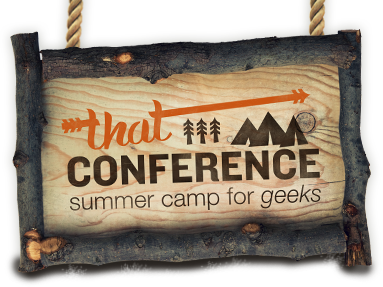
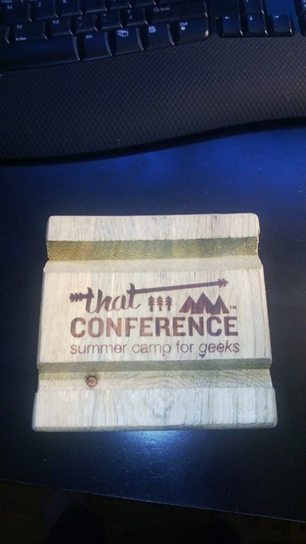
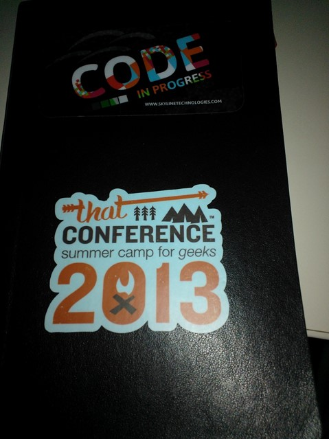

That Conference 2013 tickets go on sale tomorrow (5/15). If you are invested in your career and love making the web a more awesome place, you should be buying a ticket. Allow me to ramble a bit and elaborate...

That Conference ([http://www.ThatConference.com](http://www.ThatConference.com)) is a three day conference (August 12th -14th) in its second year and is hosted in Wisconsin Dells. For those of you from not around here (here being Wisconsin), the Dells is a huge tourist destination located about an hour north of Madison, WI.

The thing I loved most about last year's That Conference is the community aspect. The main mad-scientist behind bringing the conference together is [Clark Sell](http://csell.net/). Clark is passionate about what he does. You can tell he loves getting on the keyboard and hitting the compile button. However, the true genius of Clark (and make no mistake, it is genius) is Community and it permeates the conference in ways that folks may not realize. There is a longer break between sessions than there is at most conferences. You are either forced to be bored out of your skull or actually say to someone, "Hey, that is a pretty awesome Hold Steady concert shirt, are you a fan?" and then many hours later you are closing down the bar with your new buddy. There are Open Spaces going on throughout the conference, and I do not know if it was dumb luck or inspired room placement (I am going inspired room placement because I still want to believe in Santa Clause) but there is a constant flow of people through the room, engaging with one another. Clark and the rest of the Camp Staff, to the best of their ability, make sure the speakers meet the "Not a Jerk" rule. You can be sure if Clark or the rest of the Camp Staff know the speaker, then that speaker is going to be someone you can go up to after their talk, or anytime during the conference and bend their ear and they will stop what they're doing, listen and offer suggestions and help. Whether you realize it or not, Clark and the staff will go out of their way to make sure you make new connections during the week and you will be better for it.

Next, the [speaker list](http://www.thatconference.com/Speakers) is outstanding. Last year saw keynotes from Richard Campbell of[ .NET Rocks](http://www.dotnetrocks.com) fame, Scott Hanselman of [Scott Hanselman](http://www.hanselman.com/) fame and Leon Gersing, the [Ruby Buddha](http://about.me/leongersing), who probably had the best received keynote of them all. The thing that differentiated the keynotes at That Conference for me last year was that they were more focused on life outside of code. You are about to have a day full of deep technical dives into a wide and varied array of topics. Each of the key notes though were more focused on the developer outside of developing code. Hansleman focused on making sure you were not overwhelmed in the flow of information we all see, Campbell talked about the sea of change in front of everyone with mobile devices and offered perspective and history while Gersing asked everyone to follow their passion. I thought it was awesome.

This year's [keynoters](http://viewer.expresspigeon.com/view_online?v=nw4iq517o5pj4xjjowmwkyyaios35756dxb559mt37smo61mqbtegc18tj46zz3mca17i1jc3gx74xpzgogo697zqcgsgynyatizmpa) promise to be along the same level of greatness. Doc Norton is the Director of Engineering at Groupon and has a great background in delivering large scale applications. Dave Thomas helped create Ruby and wants you to enjoy what you are doing. Denise Jacobs is probably the talk I am most excited to see. I have heard many great things about her presentations throughout the Interwebs and couldn't be more excited to see her in person.

That however is only the tip of the iceberg. The speaker list (or Camp Counselors in keeping with the Summer Camp for Geeks theme) is full of top notch national speakers, and they are all coming to my backyard of Wisconsin. Richard Campbell and Leon Gersing will be back. Pete Brown, who does awesome things in his garage, is back presenting. Tim Huckaby is going to be presenting as is Beth Massi. There is a whole list of people I follow on Twitter and have seen present at national conferences like Tech-Ed and Build that will be coming to Wisconsin for three days in August.

On a personal level, six of my fellow Skyline Technologies peers will be speaking. I know the passion each of them have for what they do in their day to day, and even more important, how willing they are to share their experiences and help developers around them. What blew me away about last year, is that each session I attended, you could see that same passion in the speakers. They are not speaking because their boss is telling them to, they are speaking because they love what they do and they want you to share.

Usually tourist areas during the busy season makes me break out into hives, but it really works for the conference (not the hives, the location). It is hosted at a huge resort complex, [The Kalahari](http://www.kalahariresorts.com/wi/), which has a water park associated with it. This is genius for two reasons; 1) water parks are fun for adults, 2) water parks are MORE fun for children. For those of you with families, this is a GREAT summer event where you can bring your spouse/significant other with you. And if you have children in your life, it is a great get away for you and your people. The Camp Staff have family friendly events like game night, and even more awesome, a coding for kids event, which will be hosted by Keith Burnell. Great fun.

For the cost of $349, you are not going to find a better deal on making yourself a better developer. More important though, if you are in the Midwest you are investing and supporting something awesome in your backyard, and you can never have enough awesome in your backyard. By attending Year Two and making it great, we all make sure we get to go to an even greater Year Three. Most importantly though, you are going to build your community. You will meet people engaged and passionate in what they do and help you realize that you too are doing awesome by being part of the community. Starting tomorrow, sign up is [here](http://thatconference2013.eventbrite.com/). I will see you in August!

