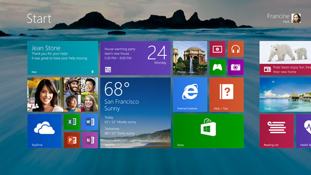

Build is a Microsoft developer conference that has taken the place of their Professional Developer Conference (PDC). The first
Build was held in 2011 and introduced the world to Windows 8 Preview. Last year’s Build, saw the release of Windows 8 and
Microsoft’s Surface RT tablet. You can read my thoughts on Build 2011 [here](http://www.jptacek.com/2011/09/observations-from-microsofts-build-conference/). Microsoft has not yet announced sessions or topics for this year’s Build, which will be held
June 26-28, 2013 in San Francisco’s Moscone Center. However, that is not stopping us from speculating on what we are going to see.

**Windows 8.1** – It has already been announced that the next version of Windows, Windows 8.1, will be announced and available for
download at Build. Not too much is known about the next version, codenamed Blue, but Microsoft has announced some features
recently. Users can expect to see:

* The return of the start button
* Better personalization features
* Integrated search across multiple applications and the web

**Windows RT** – Microsoft Windows RT, the ARM based version of their Operating System, is in a weird place. It runs Metro/Modern Design apps in a full touch mode. It also ships with a subset of Microsoft Office such as Word and Excel. However it does not run other Windows applications. What it does do is run all day on a single charge. It is a great productivity tool for knowledge workers. However, with the release of Intel’s Haswell chipset it seems that all-day battery life will be available on much more powerful chipsets. What, then, becomes the future of Windows RT? Will it move to being Microsoft Windows Phone OS? Will Microsoft reduce the cost of Windows RT to get more hardware vendors building machines? Maybe we will find out more at Build!

**Devices and Services Company** – Microsoft has repeatedly said they are now a devices and services company. They released their Surface RT machines last year and this January released their Surface Pro, a full blown Intel machine. With the exception of Xbox One, Microsoft has not announced any new devices in almost a year. It seems like Build would be a great time.

**Xbox One** – Microsoft has a month of information about their next Xbox platform. Late May saw the introduction of Xbox One. E3, at the beginning of June, saw Microsoft focusing on games for the platform and game play demos. Build should see Microsoft talking about Xbox One’s developer story. With the core of Xbox now being Windows 8, it should be interesting to see what the development story is. Will Microsoft make it easier for Indie Game developers to create applications for Xbox One? Will Win 8 games port over to Xbox One easily?

**Windows Phone** – With the release of Windows Phone 8, Microsoft reworked its Phone OS to also have a Windows core. From a developer’s standpoint, the XAML code development for Windows 8 and Windows Phone 8 are relatively similar, however, WinJS, Microsoft’s HTML based API for Windows 8 development was not an option. Will Microsoft release its WinJS API for Windows Phone at Build?

**Smaller Windows 8 Devices** – Since the release of Windows 8, a market has emerged for either large phones/phablets as well as smaller tablet devices like the Kindel Fire or iPad Mini. We expect Microsoft will be detailing support for these form factors at Build. Hopefully they will be showing off some of them too!

**Kinect for Windows RT** – Microsoft’s Kinect is impressive technology. Microsoft released a Kinect for Windows last year, but the hardware did not work on the RT side of the house. Will there be APIs in Windows RT for Kinect? Will there be new Kinect hardware?

**Microsoft buys Nook?** – Microsoft is usually good for an acquisition or partnership announcement. Will they be announcing during Build that they have purchased Nook from Barnes and Noble? Microsoft has digital media eco systems for music (Xbox Music), videos (Xbox Movies) but not for books. A purchase of Nook would allow them to compete with Google Books, iBooks and of course, Amazon and the Kindle.

**One API To Rule Them All** – With the core of Windows driving Xbox One, Windows Phone and Windows 8, will Microsoft release a single API that enables development across all of their platform? That would be great to see and could drive a lot of great applications across Windows, Windows Phone and Xbox!

With Build quickly approaching, we expect some exciting news in the next few weeks. Skyline Technologies will be there to help our clients synthesize it!

This blog post originally appeared at Skyline Technologies (http://www.skylinetechnologies.com/Blog/Article/2321/Speculations-for-Build-2013.aspx)