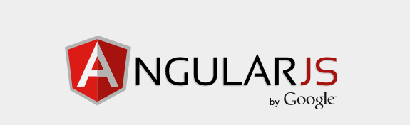
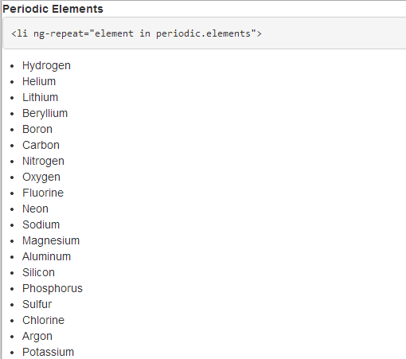
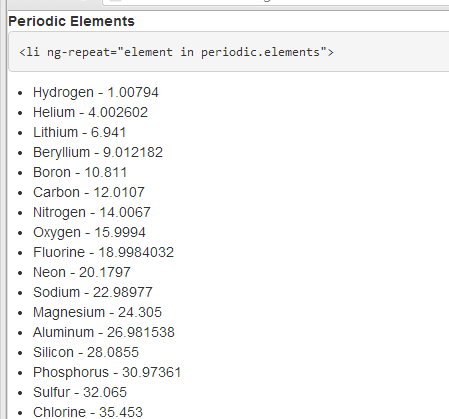
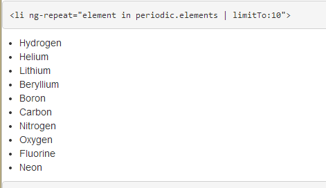
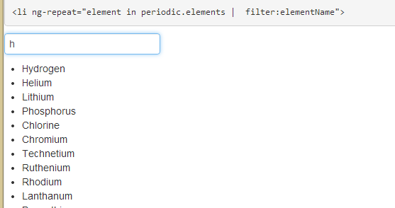
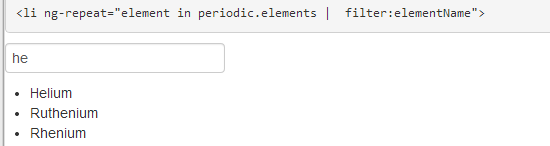
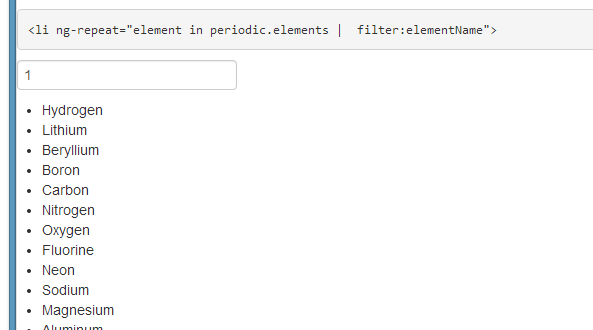
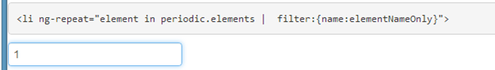

Angular.JS is a JavaScript MVC framework from the fine folks over at Google. In this post we are going to explore displaying repeating information.

We have previously talked about AngularJS and controllers. However, an important part of web development is displaying data, especially repeating data. We are going to use our Periodical data and look at options for displaying on the page.

For this example, we have created a chemistry controller that contains information from the periodic table. An element in our JSON object looks like
<pre class="brush: js">
 "atomicNumber": 1,
 "name": "Hydrogen",
 "atomicWeight": 1.00794,
 "phase": "Gas",
 "ionization": 13.5984,
 "melting": -259.15,
 "boiling": -252.87
</pre>

&nbsp;

Our chemistry controller essentially is responsible for setting a local scope variable.

<pre class="brush: js">
function chemCtrl($scope) {

 $scope.periodic = {
 elements: [
 {
 "atomicNumber": 1,
 "name": "Hydrogen",
 "atomicWeight": 1.00794,
 "phase": "Gas",
 "ionization": 13.5984,
 "melting": -259.15,
 "boiling": -252.87
 },

....

&nbsp;
 ]
 };
}
</pre>

Our scope now has a JavaScript variable on our Angular scope called periodic, which hold all of our JSON chemistry data. To display this on the page, we want to take advantage of the [ng-repeat](http://docs.angularjs.org/api/ng.directive:ngRepeat) directive in AngularJS. The syntax for this is pretty simple. In our example, we will display all of the chemical element names from the periodic table in an unordered list.

We start our list with a ul tag. The next step is to apply the ng-repeat directive to the markup we want to repeat, in this case, the li tag, which we will go and display the name of the element. The syntax is ng-repeat="element in periodic.elements". Essentially, ng-repeat is expecting an expression. In this instance, we are saying we want to loop through all items in our periodic data source, and we are going to call each item element. Last, we need to output the data for display. In this instance then element's name, which is a property on our json object called name.

<pre class="brush: xml;">
<ul>

<li data-ng-repeat="element in periodic.elements">

{{element.name}}

 </li>

</ul>

</pre>
&nbsp;

Here is a screen shot of the output

&nbsp;

We could also go an easily update our markup to display the atomic weight along with the name by changing our li display to

 {{element.name}} - {{element.atomicWeight}}

&nbsp;
See it work in [JSiddle](http://jsfiddle.net)

<iframe style="width: 100%; height: 300px;" src="result,js,html" height="240" width="320">
Your browser does not allow iFrames.
</iframe>
&nbsp;
Looking at our page though, we have a lot of data that we are displaying. Angular has the concept of filters, which can be applied to our expressions. An example of this is the [limitTo](http://docs.angularjs.org/api/ng.filter:limitTo) filter. We can limit the number of items we display, in our scenario to 10\. This is as simple as

<li data-ng-repeat="element in periodic.elements'limitTo:10 ">

We now our displaying ten results on our page

See it work in [JSiddle](http://jsfiddle.net)

<iframe style="width: 100%; height: 300px;" src="result,js,html" height="240" width="320">
Your browser does not allow iFrames.
</iframe>

Angular can also quickly allow the data to be searched. An input box can be created, we can use the ng-model syntax to define a variable, and then use that as our filter. First, we can create an input box

<input type="text" data-ng-model="elementName"/>

Next, we use that as the parameter for our filter instead of limitTo by using the [filter](http://docs.angularjs.org/api/ng.filter:filter) keyword. The syntax for this is

<li data-ng-repeat="element in periodic.elements ' filter:elementName">

We can then type in an element name and the list will narrow down.,

&nbsp;

&nbsp;

See it work in [JSiddle](http://jsfiddle.net)

<iframe style="width: 100%; height: 300px;" src="result,js,html" height="240" width="320">
Your browser does not allow iFrames.
</iframe>

You will notice that this does not REALLY work. What we want to be able to do is filter the name. For example, if you type 1, you will see results appear, for example Hydrogen. The reason for this is we are filtering on the WHOLE json object, so when we type 1 we are getting Hydrogen's Atomic number of 1 as a result and Lithium's atomic weight of 6.941, etc.

What we want to be able to do is filter on the JSON object property. I bring this up, because AngularJS, of course, has the ability to do this. This is accomplished by updating our Filter expression to identify the property of the JSON object we want to filter on. For example

<li data-ng-repeat='element in periodic.elements ' filter:{name:elementNameOnly}'>

Note, there appears to be a bug in the current version of AngularJS, 1.0.8, where you need to initialize the filter. Using the current release candidate, 1.2, resolves this issue. Thanks to my Skyline Technologies colleague [Berny Zamora](https://twitter.com/bernyzamora) for helping me chase that down.

Now when we type 1, we get no results

&nbsp;

I have created an Azure Website to host all of this code at [http://angularperiodic.azurewebsites.net/](http://angularperiodic.azurewebsites.net/)

The code is also available on [GitHub](https://github.com/jptacek/AngularPeriodic)
&nbsp;

&nbsp;

&nbsp;