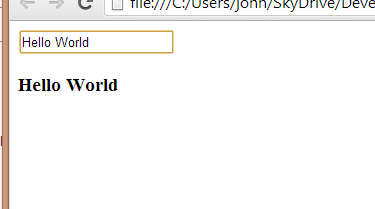
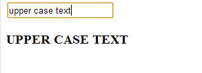
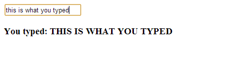
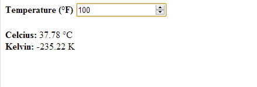
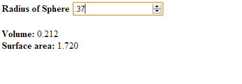

AngularJS is a Javascript MVC framework from the fine folks over at Google. The focus of Angular is building complex HTML based client applications. Its design philosophy is data first, where your data will be updating the DOM. Contrast this to a framework like JQuery where the DOM will update your data.

I am going to be dipping my fingers into Angular a bit over my next few blog posts, so I thought it would be worth starting with a very simple Hello World app, and then moving on to a temperature converter and finally a sphere calculator.

First, like all good Javascript programs, you will need to download the Angular library or link to a CDN version. You can always download the latest version from the Angular site at [http://angularjs.org/](http://angularjs.org/). They will also show a link when you request a download of the latest Angular version via CDN, at the time of this writing the link is [angular.min.js](angular.min.js).

Here is our HTML based page that uses Angular.
<pre class="brush: xml;"><!DOCTYPE html>
<html>
<head>
    <title>Hello World</title>
    
</head>
<body ng-app>

    <input type="text" ng-model="displayText"/>
    <h3>{{displayText}}</h3>

</body>
</html></pre>
You can seed there are really four things we have done here.

1.  Link out to the CDN version of the Angular library by putting a script tag in our HTML
2.  The second is the inclusion of ng-app in our markup for the body tag. All Angular applications need to be wrapped in this directive. It indicates that everything within the tab can be part of an Angular application. For example, if we put the ng-app directive within a DIV tag, only content within that DIV would be within scope. It is probably uber-best practice to prepend angular tags (which are always ng-something, with a data attribute to ensure maximum HTML compliance, obviously, I am not doing that J)
3.  The ng-model="displayText" within the input type. This is the first part of our data-binding where we have angular setup the variables to the name of our control
4.  Last is the magical curly braces {{ }}. This is the Angular markup for databinding. It essentially says display our model variable displayText
The cool thing is we are automatically displaying data from a HTML input control on our page and we have not written any Javascript. The framework is handling.

See it work in [JSiddle](http://jsfiddle.net)

<iframe style="width: 100%; height: 300px;" src="result,html" height="240" width="320">
Your browser does not allow iFrames.
</iframe>
The databinidng in Angular goes a little deeper than just displaying text. We would update our binding syntax to tie into Javascript functions. For example, changing {{displayText}} to {{displayText.toUpperCase()}} and our input will then be uppercased.

 <h3>{{displayText.toUpperCase()}}</h3>

See it work in [JSiddle](http://jsfiddle.net)

<iframe style="width: 100%; height: 300px;" src="result,html" height="240" width="320">
Your browser does not allow iFrames.
</iframe>

You can also have expressions, such as {{'You typed: '+ displayText.toUpperCase()}}. This will then prepend the string 'You typed: ' to what is displayed in our browser.

 <h3>{{'You typed:' + displayText.toUpperCase()}}</h3>

&nbsp;

See it work in [JSiddle](http://jsfiddle.net)

<iframe style="width: 100%; height: 300px;" src="result,html" height="240" width="320">
Your browser does not allow iFrames.
</iframe>

The magic of curly braces continues though. Angular also has the concept of filters for our binding element that we can then apply to the code. We can have Angular upper case our code instead of doing it ourselves by having our binding be {{ displayText ' uppercase}}. You can also filter to things such as numbers, limit the inputs being displayed etc.

Next up, let's just combine a couple of things to make an HTML application to convert the temperature from Degrees Fahrenheit to degrees Celsius and Kelvin.

Our HTML
<pre class="brush: xml;"><!DOCTYPE html>
<html ng-app>
<head>
    <title>Temperature Conversion</title>
</head>
<body>

    <b>Temperature (&degF)</b>
    <input type="number" ng-model="tempF" value=0>
     
     
    <b>Celcius:</b> {{ ((5/9)*(tempF-32)) 'number:2 }} &degC 
    <b>Kelvin:</b> {{ (((5/9)*(tempF-32))-273.0) 'number:2 }} K

</body>
</html></pre>
&nbsp;

See it work in [JSiddle](http://jsfiddle.net)

<iframe style="width: 100%; height: 300px;" src="result,html" height="240" width="320">
Your browser does not allow iFrames.
</iframe>

And just since we are having so much fun, we can use angular to calculate the volume and surface area of a cube

&nbsp;
<pre class="brush: xml"><!DOCTYPE html>
<html ng-app>
<head>
    <title>Sphere calculations</title>
</head>
<body>

    <b>Radius of Sphere</b>
    <input type="number" ng-model="radius" value=0>
     
     
    <b>Volume:</b> {{ (4*3.141*radius*radius*radius)/3 ' number:3}}  
    <b>Surface area:</b> {{ (4*3.141*radius*radius) ' number:3}}  

</body>
</html></pre>

See it work in [JSiddle](http://jsfiddle.net)

<iframe style="width: 100%; height: 300px;" src="result,html" height="240" width="320">
Your browser does not allow iFrames.
</iframe>

It is pretty cool that we are able to write these quick little applications without any Javascript. Just by using Angular and it's built in databinding functionality!

I am still working on a good way to get some Javascript demos into my Wordpress blog. In the interim, you can check them out at an Azure website I created to host these demos, [http://angularperiodic.azurewebsites.net/](http://angularperiodic.azurewebsites.net/). Specifically

[Hello World](http://angularperiodic.azurewebsites.net/Demo1/helloworld.html)

[Temperature Conversion](http://angularperiodic.azurewebsites.net/Demo1/tempConversion.html)

[Sphere Calculation](http://angularperiodic.azurewebsites.net/Demo1/spherecalculation.html)

&nbsp;

**Update:** I have created JSFiddles to embed the code samples. You can either visit [http://angularperiodic.azurewebsites.net/](http://angularperiodic.azurewebsites.net/) to see the code in action or view the JSFiddles embedded on the page. As always, the code is out on [GitHub](https://github.com/jptacek/AngularPeriodic)