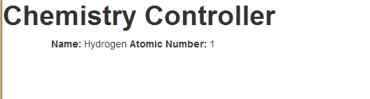

As we talked in our last blog [post](/2013/10/angularjs-introduction/), Angular.JS is a JavaScript MVC framework from the fine folks over at Google. In this post we are going to explore some the concept of controllers and scope.

In general, just binding text boxes on a page may be able to create a simple calculator, but it is not what the web of 2013 and beyond is about. We want our pages to interact with backend data stores, we want to display this information on the page and send it back to the server so it is there the next time we view the page. 

Angular is really a Model View Controller (MVC) JavaScript library. The model is our data, the view is the presentation of this data and the controller is responsible for the marshalling between the two. In angular, this is done via the scope, which is a glorified object property bag available within your page. The first responsibility of the Controller is to create this scope object. The scope is then how you communicate with the view. The view is able to bind to properties and functions on the scope. It is also able to call functions on the scope. It is important to realize that the scope exposes the model to the view, however the scope is NOT the model. The model is updated, either via two way data binding on the scope, or functions on the scope that the view calls to update the data. So, if you are going to be doing a lot with Angular, say hello to your little friend, $scope.

Let's take a look at the pieces needed to bring this together. First off, harking back to a time long, long ago, I am going to be working with information from the Periodic Table from Chemistry during these demos, so you will be seeing chemistry naming as we going along, so let us alleviate the confusion up front.

First, we want to take a look at our HTML.

We are going to use Twitter bootstrap for some down the road reasons so we are going to add that CSS reference.

Second, we are adding a reference to app.js. This is the starting script that identifies our Angular module. We are going to call our Application chemistryApp.

**App.js**

<pre class="brush: js">
'use strict';

var chemistryApp = angular.module('chemistryApp', []);
</pre>

Now that our app.js file is identified, we add a ng-app directive to our body tag. That tells Angular that chemistryApp will be responsible for our page.

Next, we want to create the controller. The controller will be responsible for managing data for the HTML view. Usually, controllers are associated with DIVs. First, we will create our controller called chemistryController.js

We reference our module, chemistryApp, from our App.js file. We then identify the name of the controller, chemistryController and then have a second parameter, which is a function, that is our actual controller. We want to be sure to pass in any parameters our controller will need. Almost all controllers will require the $scope variable, since the controller interacts with the view via this, so almost all of our controllers will at a minimum have this.

As of now, our controller skeleton is built and ready to go, it just not doing anything at the moment

**chemistryController.js**
<pre class="brush: js">
'use strict';

chemistryApp.controller('chemistryController',
    function chemistryController($scope) {

    }
);
</pre>

We go and add our controller JavaScript file to our HTML with a script tag, but we have to update our HTML to identify where the controller will function. This is done via the ng-controller directive. The syntax is as so
<pre class="brush: xml">

</pre>

And for now, our HTML looks like
<pre class="brush: xml;">
<!DOCTYPE html>
<html lang="en">
<head>
    <title>Controller Demo 1</title>
    <link rel="stylesheet" href="/css/bootstrap.min.css"/>
</head>
<body ng-app="chemistryApp">
<h1>Chemistry Controller</h1>

</body>
</html>
</pre>

This page renders, but does not do anything. Mostly as a result of us telling it to do nothing! In general though, these three steps are the basis of an Angular application. 

1.  We identify ng-app, via app.js, that is responsible for the page.
2.  We create a controller, chemistryController.js, that takes the $scope variable from our page and then populates it with data and/or functions so our HTML can later render it. We have not seen this in action yet, but soon.
3.  The last part then is identifying, via the ng-controller directive, the area of responsibility for our controller.

As previously mentioned, the $scope variable is the glorified property bag we use to populate data. So within our controller, we can go and set some values for display in our view/web page. In our example, that will be the name of a chemical element and it's atomic number, Hydgroen and 1\. Our controller function now looks like

**chemistryController.js**

<pre class="brush: js">

'use strict';

chemistryApp.controller('chemistryController',
    function chemistryController($scope) {
        $scope.elementName = 'Hydrogen';
        $scope.atomicNumber = 1;

    }
);
</pre>

Now, we can have the values from our scope value inject into our HTML markup. This is done via our friend, the magical curly braces. It is as simple as

<pre class="brush: xml;"><b>Name:</b> {{elementName}} <b>Atomic Number:</b> {{atomicNumber}}</pre>

The value we set in our controller are automatically displayed.

You can see these code samples in action at the companion site for this blog series, [http://angularPeriodic.azurewebsites.net](http://angularPeriodic.azurewebsites.net)

[Introducing AngularJS Controllers](http://angularperiodic.azurewebsites.net/Demo2/controller1.html)

You can download or view the code on Github, [https://github.com/jptacek/AngularPeriodic/](https://github.com/jptacek/AngularPeriodic/)