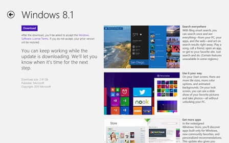
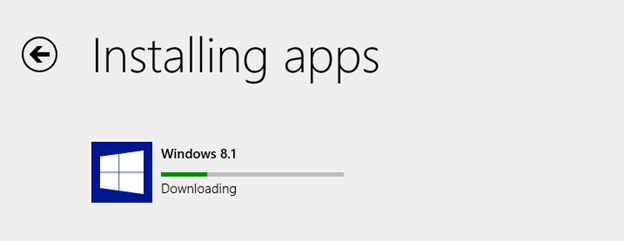

I recently upgraded a Windows RT device from the Win 8.1 preview to the final version of Win 8.1\. Inexplicably, I found the install a bit confusing. There really did not seem to be a lot of information being displayed during the process, which made the install look like it was hung. I thought I would document the steps I took to make things a bit more apparent what is happening during the install.

To upgrade from Windows 8 to Windows 8.1, you are supposed to be able to go to the Windows store and see something like the screen shot below.

I DID NOT see this, most likely a result of running the Win 8.1 preview. So I followed Microsoft's instructions at [http://windows.microsoft.com/en-us/windows-8/update-from-preview](http://windows.microsoft.com/en-us/windows-8/update-from-preview) which has the link to install directly from the Windows store ([ms-windows-store:WindowsUpgrade](ms-windows-store:WindowsUpgrade)). 

This starts the install, which begins by downloading a very large file. Unfortunately, it appears that nothing has been initiated leaving people to think the install has not started. In reality, the download has begun but the status is not being displayed. In order to see the progress of the download, you will want to use a second Windows Store URL, [ms-windows-store:installprogress](ms-windows-store:installprogress), to display the progress.

Entering this link in a browser will then show you the progress bar for the download

**Update:** Upgrades to Windows RT 8.1 have been temporarily [suspended](http://www.winbeta.org/news/microsoft-pulls-windows-rt-81-update-windows-store-due-situation).

**Update:** As of October 23, 2013, update to Win 8.1 RT are back from [Mary Jo Foley](http://www.zdnet.com/microsoft-fixes-windows-rt-8-1-update-is-back-in-windows-store-7000022259/).