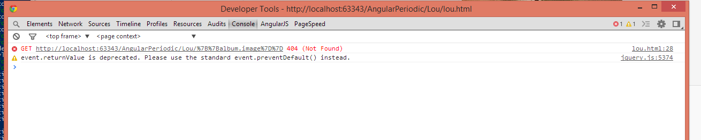
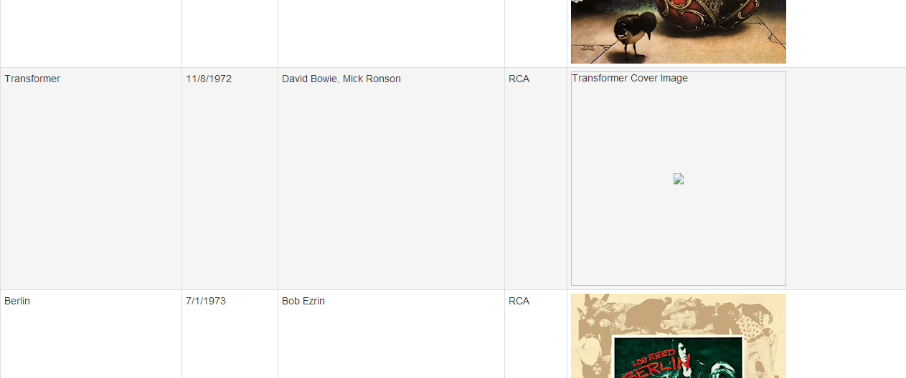

[AngularJS](http://www.angularjs.org) is a Javascript MVC framework from the fine folks over at
[Google](http://www.google.com). The focus of Angular is building complex
 HTML based client applications. Its design philosophy is data first, where your data will be updating the DOM.
 Contrast this to a framework like JQuery where the DOM will update your data.


This is the fifth in a series of posts on AngularJS where we are using Chemistry data from the periodic table
to help us understand the framework. The others posts are

1. [AngularJS - Introduction](http://www.jptacek.com/2013/10/angularjs-introduction/)
2. [AngularJS - Introducing AngularJS Controllers](http://www.jptacek.com/2013/10/introducing-angularjs-controllers/)
3. [AngularJS - Introducing NG-Repeat](http://www.jptacek.com/2013/10/angularjs-introducing-ng-repeat/)
4. [AngularJS - More with NG-Repeat](http://www.jptacek.com/2014/01/angularjs-further-with-ng-repeat/)
5. AngularJS - Image Binding
6. [AngularJS - Introducing Templates](http://www.jptacek.com/2014/02/angularJS-templates/)
7. [AngularJS - Introducing Routing](http://www.jptacek.com/2014/02/angularJS-IntroToRouting/)
8. [AngularJS - Introduction to Services](http://www.jptacek.com//2014/05/angularJS-Intro-To-Services/)
9. [AngularJS - Introduction to Directives](http://www.jptacek.com/2014/06/angularJS-intro-to-directives/)
10. [AngularJS - Further with Directives](http://www.jptacek.com/2014/12/angularJS-further-with-directives/)

>Note: AngularJS does not allow for more than one ng-app directive. When I have multiple angular posts on
the home page of my blog, only one application will work. I need to refactor the entire site to account for
this. All of that to say this, you are best clicking on a single article so you can see the pages in action.

If you have spent any time with me in the real world, you quickly come to realize I am a music fan. If
you have spent a little time with me, especially when I was a younger, you realize I am a huge
[Lou Reed](http://en.wikipedia.org/wiki/Lou_Reed) fan too.
My boss, [Tim VanHammond](https://twitter.com/tvanhammond) still holds it against me the one time
I played Lou Reed's the Possum song without headphones when he was in the office we shared.
The reality is, I probably spent WAY too
much time listening to Lou Reed and Velvet Underground music when I was a teenager. So, having said all that, soon
after Lou Reed died, I was doing a [presentation](/2013/11/fvnug-presentation-nov-2013/) at the
[NorthEast Wisconsin Developer UserGroup](http://newdug.org/) (aka, NEWDUG and
yes it is a lot to type) and I thought it would be fun to have a little Lou Reed shout out. Since the talk
was about AngularJS, it of course had an Angular flavor. So we did a little Lou Reed segue, and talked about
binding images using AngularJS. Most important and of interest to you dear reader, is
how I found out a way to deal with missing images!


Instead of using chemistry data, we used Lou data. This data was a JSON object of record releases. Lou put out
a lot of albums, and we are loading images, so to keep things quick, we are just doing the first few releases.
One of our Lou
objects looks like

```javascript
 {
            "album": "Lou Reed",
            "artist": "Lou Reed",
            "releaseDate": 6/1/1972,
            "image": "http://upload.wikimedia.org/wikipedia/en/8/88/Lour72.jpg",
            "label": "RCA"
        }
```

Essentially what we are doing is the same stuff that came before, instantiating the app and referencing our
controller and looping through the albums and making a little table. This is quickly becoming old hat
for us!

<h3>Lou Reed pages</h3>

<div id='appLouContainer' ng-app="louApp">
 <div id="louTable0"  ng-controller="louCtrl" >
    <table class="table table-striped table-bordered table-hover table-condensed">
        <tr>
            <th>Album</th><th>Release</th><th>Producer</th><th>Label</th><th></th>
        </tr>
        <tr ng-repeat="album in louDrops.releases">
            <td>{{album.album}}</td>
            <td>{{album.releaseDate|date}}</td>
            <td>{{album.producer}}</td>
            <td>{{album.label}}</td>
            <td></td>
        </tr>
    </table>
   </div>

<b>Note:</b> There is an issue with the markup being generated by DocPad prepending the local URL. You can see the
actual correct HTML at http://angularperiodic.azurewebsites.net/lou/lou.html until the I fix this.

Again, we have done this before. The interesting thing to note though is the album release date. JavaScript and
dates are something that make me a little crazy, but having said that, AngularJS does a nice job. You can pass
a JSON date object to a filter and have it format, ``{{album.releaseDate|date}}`` as above. More info on the ``date``
filter at the [AngularJS](http://docs.angularjs.org/api/ng.filter:date#!) site.

The second thing to notice is we are using a ``src`` attribute in our ``img`` tag. Things are loading fine, but if
you look at the page load, you will actually see a 404 error that happens.



This is because the AngularJS functionality is executed AFTER the page loads. We are still making the get request
that the ``src`` attribute had identified because we have yet to get into the javscript
processing on the page. With ``src`` attributes and ``href`` tags you that reference
AngularJS objects, this is something you need to be cognizant of. The fix is easy enough, we just prepend a ``ng`` tag on our
attribute. This will then be part of the page processing that happens during the Angular load. Our image reference
is now

```xml

```

<h3>Adding ng-src</h3>
 <div id="louTable1"  ng-controller="louCtrl" >
    <table class="table table-striped table-bordered table-hover table-condensed">
        <tr>
            <th>Album</th><th>Release</th><th>Producer</th><th>Label</th><th></th>
        </tr>
        <tr ng-repeat="album in louDrops.releases">
            <td>{{album.album}}</td>
            <td>{{album.releaseDate|date}}</td>
            <td>{{album.producer}}</td>
            <td>{{album.label}}</td>
            <td></td>
        </tr>
    </table>
</div>

The last thing to hit on is on the image loading, and a cool little trick I learned. One of the customer sites
I work at it is using AngularJS and they are integrating with a third party data source. What they wanted to be
able to do is not show a broken or missing image. I sat there and thought to myself that this is going to be
pretty difficult. Our client side scripting language was going to have to not call the source directly, but go
through some kind of nutty proxy we would develop that would check if the image existed and then send that
image or else a proxy for the missing image, etc. It wasn't going to be fun. However, a little time
on the [Google](http://www.google.com) found a MUCH easier way to get by this.

To expand on our discussion, our images are coming from Wikipedia and reference images they have for entries on Lou Reed albums. If
one of these images changes, we would get an error and display a broken image marker on our page. To illustrate, I have created a
second controller where we change the image for Metal Machine Music and Transformer so they would return 404s.

We now are receiving missing image links in our page. This is NOT use friendly



You can see the example below

<h3>Missing Images in Javascript Object</h3>

   <div id="louTable2"  ng-controller="lou2Ctrl" >
        <table class="table table-striped table-bordered table-hover table-condensed">
            <tr>
                <th>Album</th><th>Release</th><th>Producer</th><th>Label</th><th></th>
            </tr>
            <tr ng-repeat="album in lou2Drops.releases">
                <td>{{album.album}}</td>
                <td>{{album.releaseDate| date:'medium'}}</td>
                <td>{{album.producer}}</td>
                <td>{{album.label}}</td>
                <td></td>
            </tr>
        </table>
    </div>

The fix is easy enough though! We can add an on error function within our ``img`` tag. First, we want to add a
default local image we can reference. So let us use the Wikipedia image that I have at the top of our page.

Within our ``img`` tag we add an ``onerrror`` function like so

```xml
 onerror="this.src='Lou_Reed.jpg'"
```

so that our entire ``img`` tag is now

```xml

```

and we now handle missing images on page load (with ng-src) and missing images in our data source, with
onerror by placing a default placeholder image for missing images.

 <h3>Resolve missing images</h3>
    <div id="louTable3"  ng-controller="lou2Ctrl" >
        <table class="table table-striped table-bordered table-hover table-condensed">
            <tr>
                <th>Album</th><th>Release</th><th>Producer</th><th>Label</th><th></th>
            </tr>
            <tr ng-repeat="album in lou2Drops.releases">
                <td>{{album.album}}</td>
                <td>{{album.releaseDate| date:'medium'}}</td>
                <td>{{album.producer}}</td>
                <td>{{album.label}}</td>
                <td></td>
            </tr>
        </table>
    </div>
</div>

So the when I gave my presentation someone asked me favorite Lou Reed album... Hard one, I think at various times
most of them have been a favorite, but I will go with New York. Favorite song, same as album, it changes, but let's
call it Street Hassle.


You can either visit [http://angularperiodic.azurewebsites.net/](http://angularperiodic.azurewebsites.net/) to see the code in action and
as always find the code out on [GitHub](https://github.com/jptacek/AngularPeriodic)

(I am working on some display issues with the post with the Markdown/DocPad combo, I should have updated soon)

<script type="text/javascript" src="/2014/01/angularjs-lou-reed/js/louApp.js"></script>
<script type="text/javascript" src="/2014/01/angularjs-lou-reed/js/louController.js"></script>
<script type="text/javascript" src="/2014/01/angularjs-lou-reed/js/louController2.js"></script>
