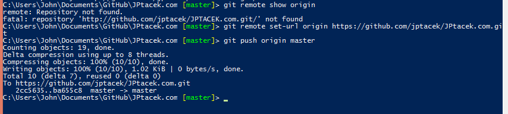

This morning, I was pushing a small update to my blog and I received an error that my GitHub repository was unable to
sync. Usually my workflow goes something like this...

1. Commit GitHub changes via [WebStorm](http://www.jetbrains.com/webstorm/)
2. If that doesn't work, use the GitHub Windows/WPF client http://windows.github.com/
3. Use command line Git

While I want to get better at 3, 1 is much easier and when I do 2, I am in a hurry. :)

Ultimately, I am not really sure what happened. My development environment worked fine yesterday when I committed
changes, but today there were issues. I THINK it may have to do with case differences between when I setup
the repository locally and how GitHub may be handling it on the backend today.

When I pushed my commit to the repo with the command

```bash
git push origin master
```

The following error was returned
```bash
remote: Repository not found.
fatal: repository 'http://github.com/jptacek/JPTACEK.com.git/' not found
```

You can see the message below


Again, no changes have been made to the repo. Similar messages appeared in the GitHub client and WebStorm. Other
repositories I had on GitHub I was able to commit and push changes to. The only thing I could think was that
the case was different on my local origin in comparison to the backend GitHub repository.

The fix was simple enough, reset the origin with and change the case of the URL so that it was exactly the
same as my repository on GitHub.

```bash
 git remote set-url origin https://github.com/jptacek/JPtacek.com.git
```

After this, I was then able to commit changes without issue in all the different client apps as well as the command
line.

as shown in the following screen shot

 

It strikes me as pretty odd that GitHub would suddenly stop working because of a case issue between my local dev
machine, which has been working fine for many months, and the GitHub server. However, that appears to be the case in this instance.

Pretty much just documenting this for my future self :)


