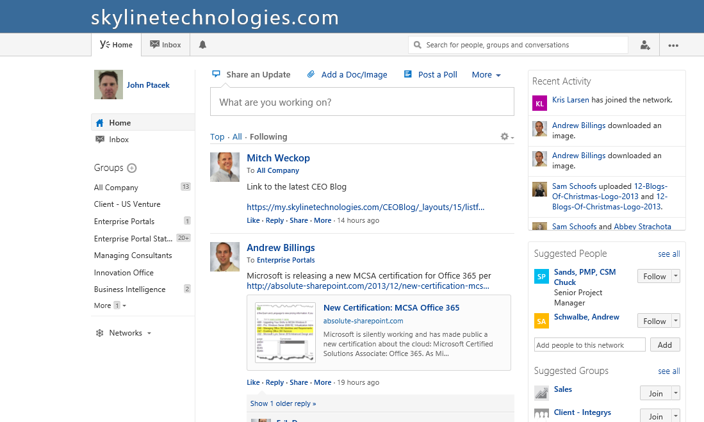

In real life, I can tend to be a socially awkward computer geek. In digital life, I am quite social where I have accounts on
[Twitter](www.twitter.com/jptacek), [LinkedIn](www.linkedin.com/in/johnptacek), [Google+](http://plus.google.com/+JohnPtacek),
etc. Recently, our company has started using Yammer and I struggled with do I need another social media account. How does Yammer work better than the sites I already use? How does it supplant and/or supplement the awesome way Skyline uses SharePoint to drive collaboration within our growing company?

One of my favorite words to use is Grok. It is from Robert Heinlein’s Stranger in a Strange Land. Essentially, grok is to understand something truly (http://en.wikipedia.org/wiki/Grok). I try on occasion to grok things. It doesn’t always work well. So, here is where I am currently on trying to grok Yammer and how it can be used in SharePoint, within our teams, and Skyline (or your company) to enable us to better deliver for our clients.

So what is the first thing I think….. Yammer is ALL about the timeline. What do I mean by that? Let me start by example. I walk around with what I call my little black book, which is a Moleskine I use for writing stuff in it all the time. It is meeting notes, To-Dos, etc. I used to use OneNote a lot, but the reason I moved away from it is there is no sense of the flow of time. I know if I wrote something ~ three months ago, but I don’t know if I wrote it in a SharePoint ideas folder, a blog ideas folder, or my dev things to explore. I was impacted because I never had a good way to see things chronologically by paging through the content flow. The lack of timeline has moved me away from OneNote unless it is recording info from my brain. I use it for information I need at a later point. For example, what are my favorite recipes, what is the URL that explains WIF security, what is the wireless password, what music do I need to check out, that kind of stuff. OneNote has become the persistence mechanism for information I need.

I see SharePoint as the location of storage for information for companies. Essentially where instead of looking for information that is pertinent to me, SharePoint is information that is important to an organization. It is there for persistence of business information. What is the customer deliverable for a project, where is information about our benefits, where is the blog post one of my colleagues wrote on FAST search. However, not all business information NEEDS to be persisted. Some of it can be very valuable in the timeline sense. I posted a link recently within our internal Skyline Yammer about Mercury Marine expanding in Fon Du Lac. Is it interesting to Skyline? Maybe. Does it need to be in SharePoint for business needs? No. Is the information valuable for a short time frame? Definitely. It is that ephemeral type of content and discussion that Yammer is useful for.

So here is an EXCELLENT example of where Yammer is useful for an organization and how the concept of a timeline is valuable. Our CEO, Mitch Weckop, writes some pretty interesting blog posts on our SharePoint Intranet. Mitch talks about the economy or current legislation and how it can impact our business. Mitch meets with lots of our customers and shares his experiences in terms of how we can make Skyline better. Using these posts, Mitch does a great job trying to engage our associates in dialog. However, unless you subscribe to the blog posts via an alert or you notice it on our Skyline Intranet, our associates would miss it. However, if you log onto Yammer, where Mitch also posts a link back to his blog, it appears in our Associates’ timeline, right near the top, since it is recent. Organizationally, this timeline drives further value because unless you are Mitch, you are not seeing any comments that are being put on his blog after you visit it. When our company has a dialog within Yammer about the blog posts, everyone will see recent comments because they are at the top of the timeline. It essentially pokes the discussion back to the top of the information flow. Previously, this would not happen unless you were constantly checking the blog posts internally, because SharePoint does not have a great, “hey look here!” mechanism.

So ultimately, thing one I have come to understand about Yammer is the value comes in taking the flow of organizational information, and getting in front of people in terms of timeliness. THIS is the reason email continues to persist I believe. You have a timeline. You know the emails of today are MUCH more important than the information of six months ago. SharePoint as the persistence of business critical information has a difficult time projecting this information as a flow of time for its users. Hence, Microsoft’s buy of Yammer. It allows Microsoft to provide time pertinent information to organizations on top of SharePoint’s persistence based excellence.

Thing two about Yammer is the social aspect. Any of you folks who jump on Twitter realize you learn and understand people a bit better than you otherwise would. If you follow me on Twitter, you know I occasionally babble on my family, listen to too much music, etc. Is there any business value in that? You bet. As organizations grow, they are not going to have a metaphorical water cooler to gather at. Companies need to try and use a social tools like Yammer to get a sense of the people they work with. At Skyline recently we have learned through Yammer that some of our Green Bay associates were rocking some pretty awesome mustaches for Movember. We learned about the results of sponsorships we do for hackathons in Milwaukee. We also learned who is on the naughty list (Bear fans) and who is on the nice list (Packer fans), or vice versa. Using Yammer helps employees build social capital with your organization. The cool thing this social capital does is allow us to have bad days (I went to school at UW-Madison, so I apologize if this is getting too touch/feely). You are much more likely to give the benefit of the doubt to a peer when they have a bad day if you know them personally, and social tools like Yammer help build that for organizations, especially geographically disperse organization where you do not have day to day interactions. Digital tools will never be the most important part of building social capital, but it can be valuable part, because even though you may not interact on a day to day basis, you still can learn about your peers. With Yammer, you can help socialize your culture.

To summarize

1 – Yammer is timeline. Get timely information in front of associates and yourself

2 – Yammer is dialog. Dialoging about the timely information to provide input, feedback and discussion

3 – Yammer is NOT about persistence. Yammer is not the place for project proposals, financials, etc

4- Yammer is people. Yammer can be the virtual water cooler (or Skyline style, virtual coffee machine). An opportunity to engage people as people, rather than employees

5 – Yammer is NOT required. Just like you don’t want to try and keep up to date on your entire Twitter feed, you shouldn’t have to feel like that with Yammer. Business persisted information happens generally outside of Yammer, business supplementing happens with in. As cultures grow, this can change over time, but definitely not day one!

If you want to learn more about Yammer or how your organization can use, feel free to reach out to me!

This blog origanally appeared at  http://www.skylinetechnologies.com/Blog/Article/2428/What-is-Yammer-and-why-should-your-company-use-it.aspx#