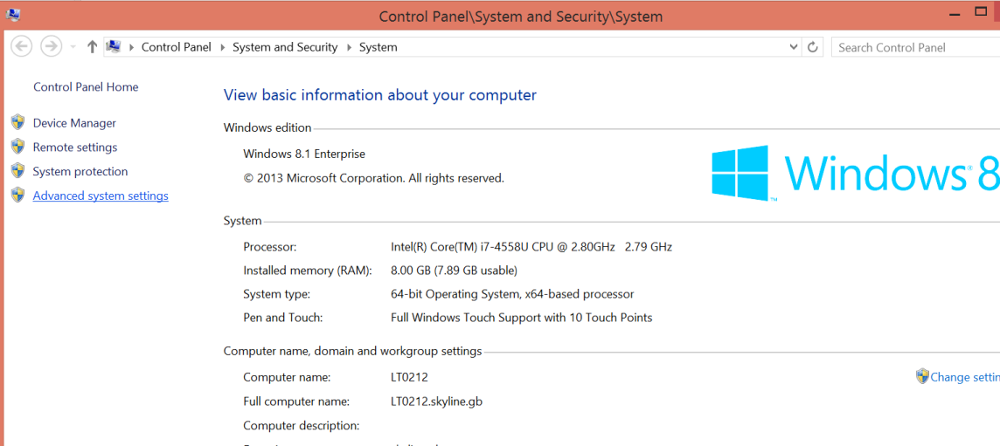
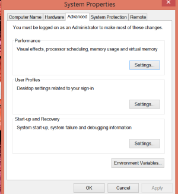
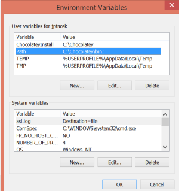
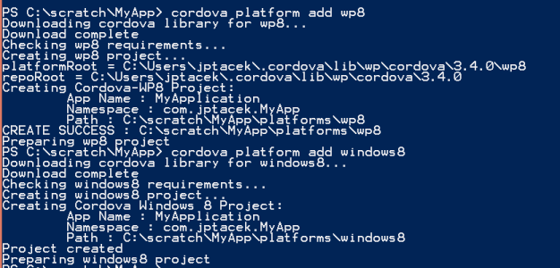
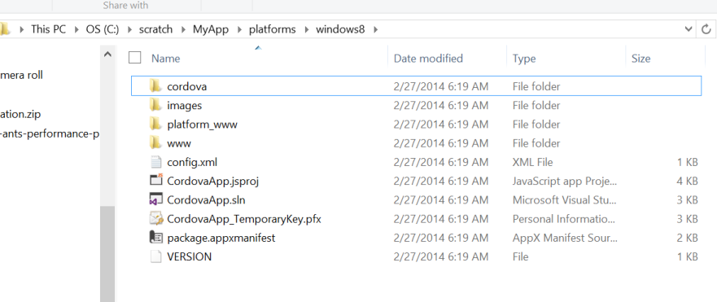

Cordova, also known as PhoneGap, is an interesting technology to bundle up mobile web apps created with HTML, CSS and JavaScript for deployment across multiple phone platforms, such as iOS and Android. Cordova also has a JavaScript library that provides access to phone features such as the camera, accelerometer, compass, etc. For organizations that don’t want to invest in coding up an application for multiple platforms, it can be a quick option.
Recent versions of Cordova have utilized a Command Line Interface (CLI) for installation and configuration leveraging Node.JS for their implementation.

To install Cordova on Windows 8, follow these steps.

First, you will need to download and install Node.js (http://nodejs.org/download). After this, you should be able to start up PowerShell and run Node from the command line. You can ensure you have node setup by running node –version within a PowerShell prompt


We will be installing global packages via the Node Package Manager (NPM). If you have never used or installed Node previously, you will need to update your path variables to the global packages location is in your path.

This is done by going to the computer properties and selecting Advanced System Settings



Since we need to update the path, we choose Environment Variables




Within the Environment Variables, there are two paths you can choose between, the path for the logged in use and the path for all users. I usually update the current logged in user (the first Path listed under user variables for jptacek)



You then just update the Path by clicking edit and adding the location of the NPM packages by appending the following

```bash
%userprofile%\AppData\Roaming\npm
```

Note, if you did not have the NPM packages in your path and have taken these steps, you will need to restart PowerShell for your environment variables to be set.
At this point, we have Node setup and are set to install Cordova. This is accomplished via the Node Package Manager (NPM), which downloads and sets up Node applications.

```bash
Npm install –g cordova
```


The ``–g`` flag indicates to the NPM package manager that that package should be installed globally. On Windows, this directory
is often your user directory, ``AppData\Roaming\NPM``, which we talked about setting up above.

Now that we have Node and Cordova setup and configured on our machine, we are moving on to the fun stuff, app development!

The way Cordova applications work is by having a base web application with our HTML, JavaScript, CSS and other assets. For each platform we want to deploy and build locally, we have to add the platform. This will also enable us to use emulators for devices on our development machine. We will then invoke the build process, which takes assets from our main WWW application and packages and deploys them to the various platforms we have on our machine. So if, as we are about to do, have platforms for Windows Phone 8 and Windows 8, the build process takes our web assets from our base WWW app, copies them to those specific platform installs.

Let us take a look at this…

To create an application in Cordova, we use the CLI to have it generate the shell of our application by running the Cordova create command

```bash
cordova create MyApp com.jptacek.MyApp MyApplication
```

The ``MyApp`` parameter identifies the directory for the application, which will be created. The second argument,
is the identifier, which you want to be unique. Most people use the reverse domain style identifier.
The last parameter is optional, but is the title of the application for display.

This process will actually go and download the latest template and create the project structure


If we take a look in our directory, you will see it created the default structure for the application with the creation of a www directory with a shell application, a plugins directory, etc.


So far, so good, but we cannot actually BUILD anything yet because we haven’t created any platforms on the development machine. The WWW directory shown above has our HTML, JavaScript, CSS and other assets. The platforms are the various devices we want to be able to build locally on our machine. The implication here is that you need to setup the local machine for those platforms. This is done by adding the platforms via the CLI.

Since we are doing this on a Windows machine, we will add two platforms, one for Windows Phone 8 and one for Windows “Metro” 8



Note, if you try and add platforms that are not available for development, Cordova will not allow this. For example, you cannot do iOS development on a Windows 8 machine, so Cordova will not be able to find the XCode libraries and will raise an error trying to setup. If you want to be able to build locally for an Android device, you will need eclipse and the Android SDK, etc.

By adding the platform, you are actually creating Visual Studio solution files for creating both a native Windows Phone 8 and


Windows 8 application that can be loaded in Visual Studio and run with the appropriate emulator.



You can load up these solutions and run them natively. However, you first need to build the solution. At this point, you just have a skeleton setup for the project, no assets have been deployed to the skeleton of the project. To do this, you will run the build command in Cordova.

```bash
Cordova build
```

This then enables you to run either Windows 8 or Windows Phone 8 to see your solution. Two things… Since each build recreates your solution files from the default WWW directory, your changes will be overwritten. As a result, I usually don’t like doing my code editing with the WP8 and Windows 8 emulator.

Second, since you essentially have a web application, you like having access to tools you have come to know and love like Chrome Developer tools or FireFox as you develop your code. For this reason, I usually will create a Virtual Directory to server up the WWW assets from a platform, for example, Windows8, that are deployed during a build. This allows for me to use my tools of choice for web development.

The reality is, I am most likely to use [build.phonegap.com](build.phonegap.com) for testing by using the
actual native deivces. Build.PhoneGap.com will actually take your source, and build your application for the multiple platforms
supported by PhoneGap. Its hydrate function automatically check for new versions and downloads when you launch on a mobile device like Android or Windows Phone.

I have not found a great way to do development with PhoneGap. I am VERY interested in the workflow other people use for
their Cordova/PhoneGap development, please share!


