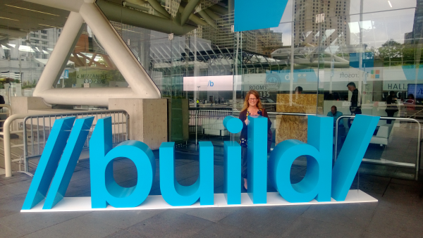

Build is a Microsoft developer conference that has taken the place of their Professional Developer Conference (PDC). The first
Build was held in 2011 and introduced the world to Windows 8, along with an early preview of Windows 8 and a Samsung tablet.
You can read my thoughts on Build 2011 [here](http://www.jptacek.com/2011/09/observations-from-microsofts-build-conference/).
In 2012, Build was held in Seattle and saw the release of Windows 8 and
Microsoft’s Surface RT tablet.  In 2013, Build was held in San Francisco and Microsoft announced Windows 8.1 as well as
made available a preview
release for developers. Before Build 2013 last year, I took a [stab](http://www.jptacek.com/2013/06/Speculation-Microsoft-Build/) at
 speculating about what would be coming and did pretty spectacularly bad. With Build 2014 a
month away, I thought it would be fun to try again!

First, it is interesting to look at how short the time is becoming between Microsoft Build conferences

* Build 2011, Anaheim, CA September 13 - 16, 2011
* Build 2012, Seattle, WA October 30 - November 2, 2012 (~13 months later)
* Build 2013, San Francisco, CA June 26-28, 2013 (~8 months later)
* Build 2014, San Francisco, CA April 2-4, 2014 (~9 months later)

You can see that Microsoft is quickly iterating and getting information out to developers. However, having said that, certain parts
of Microsoft are executing VERY fast (I am looking at you Azure) and other parts are executing VERY slow (I am looking at you Windows
Phone). With the breadth of developer platforms Microsoft has, they have many opportunities to get in front of developers, but it
not always what the developers are expecting. So all of that to say this.... A lot of my speculation for Build this year looks a lot like last year! There are still some
important pieces for the Microsoft developer story that I believe have yet to be communicated.

###One API To Rule Them All###
The reality is, developing on the Microsoft stack
today can be downright confusing. You have options between....

* Web using MVC with HTML/JS/CSS
* Web using Silverlight (version of XAML), though this is deprecated
* Desktop using WPF (version of XAML)
* Windows Modern/Metro/Store Apps using WinJS with HTML/JS/CSS
* Windows Modern/Metro/Store Apps using XAML
* Windows Phone (version of XAML)

For shops that are all in on the Microsoft stack, it can be confusing to determine what to go all in on. If you are a web developer
and love HTML and JavaScript, your options are limited for Windows Phone. If you love all things XAML, you have to choose amongst
WPF, Windows Phone or Windows 8 flavor of XAML. And while the XAML platforms are similar, they are not similar enough to not
have a lot of rework. Things have gotten better though over the years with the introduction of the [Cross-Platform portable class
library](http://www.hanselman.com/blog/CrossPlatformPortableClassLibrariesWithNETAreHappening.aspx), though it is still cumbersome hitting
multiple endpoints.

Last summer I wrote

**One API To Rule Them All** – With the core of Windows driving Xbox One, Windows Phone and Windows 8, will Microsoft release a single API that enables development across all of their platform? That would be great to see and could drive a lot of great applications across Windows, Windows Phone and Xbox!

This year, I can write the same thing. There have been [rumors](http://www.wpcentral.com/rumor-windows-phone-81-ditch-back-button)
 coming from a leaked release of the Windows Phone 8.1 SDK of Universal Binaries that will allow Windows Phone 8.1 and Windows
 RT/Metro/Modern/Store Apps have a common base. According to the earlier link, over 75% of Windows Phone and Windows RT have
 the same shared API. That would be a great starting point for Windows 8 developers, especially if WinJS development is now an option
 for Windows Phone 8.1. Giving developers the opportunity to have one platform they can choose to develop on and hit multiple devices
 in the Microsoft devices strategy would be a great leap forward.

###Windows RT###

Last summer I wrote

**Windows RT** – Microsoft Windows RT, the ARM based version of their Operating System, is in a weird place. It runs Metro/Modern Design apps in a full touch mode. It also ships with a subset of Microsoft Office such as Word and Excel. However it does not run other Windows applications. What it does do is run all day on a single charge. It is a great productivity tool for knowledge workers. However, with the release of Intel’s Haswell chipset it seems that all-day battery life will be available on much more powerful chipsets. What, then, becomes the future of Windows RT? Will it move to being Microsoft Windows Phone OS? Will Microsoft reduce the cost of Windows RT to get more hardware vendors building machines? Maybe we will find out more at Build!

Again, same thing this Build. Windows RT has not had a lot of explanation about its continued existence in the Windows ecosystem.
I am not 100% sure, but I believe the only devices released for WinRT in 2013 were from Lumia ([Lumia 2520](http://www.nokia.com/global/products/tablet/lumia2520/)) and Microsoft
([Surface2](http://www.microsoft.com/surface/en-us/products/surface-2)). The good news is, both of these devices were well received.
The battery life and productivity for ARM based tablets running RT make for great use cases. However, as Intel releases improved Haswell and Atom chips with great battery
life and the ability to run desktop applications, it doesn't make long term sense for Microsoft to support both platforms the way they are now.
Unless, Microsoft is focused on making Win RT the phone platform
as well as a tablet only platform, without the legacy desktop. I am pretty sure this is the case, but we haven't heard it from
Microsoft yet. Maybe this Build we will?!?!

###Devices and Services Company###
Microsoft has repeatedly said they are now a devices and services company. Since this announcement in 2012, they have released both Windows
Surface Pro and Windows Surface RT, along with follow up versions in 2013. The Pro update was minimal in terms of hardware (adding the Haswell chip),
but the Surface RT 2,
now called Surface 2, saw a pretty significant upgrade in performance and hardware. In 2013, the release of Xbox One happened. Other
than that, not a whole lot in terms of devices.

Obviously, the purchase of Nokia's Lumia line will see a lot more Microsoft devices being released in 2014.
However these will be phone devices, there
has not been a 7-8 inch Surface release to compete with the iPad Mini or Kindle fire, the fastest growing tablet market. There also has not been a
Microsoft Laptop/Ultrabooks released. Further, we still are not sure what happens
to the Lumia Brand and the Surface Brand. Will they merge? Will one replace the other? Will one be the Tablet platform and the other the
Phone platform? Will one be for consumers and the other for enterprises? An explanation of these brands moving forward would be great!

I expect that Build 2014 will shed a lot more light on this, especially the company's strategy for integrating Nokia and the possible
announcement of a Surface Mini. In general, except for the first Build, it is not a place where Microsoft announces hardware though.

###Xbox One###
With the news that Xbox One is built on Windows 8, and a tease at Build 2013 about a JavaScript based API for Xbox One, everyone
I talk with thinks Xbox One will be part of Build 2014. Bring it on! This will be exciting for indie developers.

###Windows Phone###
My guess, and that of many others, is above all things, Build 2014 will be about Windows Phone 8.1. I, and most of the world, expect them to show Windows Phone
8.1 while hitting on the developer story. It may be even that some new Lumia devices are announced to drive developer enthusiasm.

###Kinect for Windows RT###

Last year I wrote

Microsoft’s Kinect is impressive technology. Microsoft released a Kinect for Windows last year, but the hardware did not work on the RT side of the house. Will there be APIs in Windows RT for Kinect? Will there be new Kinect hardware?

This year, I again hope that the Kinect API will be part of the Win Metro API so developers can take advantage of the Kinect in
Windows 8.1 apps. The technology is too impressive for Microsoft to just let it be used on the Xbox platform!

###Azure###
Microsoft's Azure platform is amazing. The degree to which the Azure team can execute and release new features is dizzying. As someone
who is a big proponent of the cloud for organizations to embrace, I spend time following the various platforms. It is hard to keep up
with all the great things the Azure team is doing.

The one
thing that I am most interested in seeing from Microsoft over the next year, is if the speed of execution that Satya Nadella bought to the Azure team
when he led the group, can be bought to the whole Microsoft organization. If there is one person from within Microsoft that can
execute on the Microsoft One strategy, it is Satya. It will be something to watch in 2014.

###Pick a Name###
I am still very confused by what Microsoft calls its non-desktop platform, aka the Windows formerly called Metro. Is it Windows Store apps?
Is it Modern apps? Is it Win RT? What is the Microsoft design language formerly known as Metro called? It would be nice to clearly and
concisely pick the terms and have everyone use the same vocabulary. Even the Microsoft developers presenting at previous Builds still call
everything Metro!

###Conclusion###
I have the sense that Build 2014 is really Build 2013, part 2. A lot of the pieces that weren't fully basked for Build last June, like Xbox One and Windows Phone 8.1,
 should
be announced this April. I am quite hopeful that the Microsoft One vision will be introduced for developers at Build 2014.
 I believe this will really help Microsoft accelerate application across multiple platforms and give developers a sense
 of ease about a single execution strategy. More to come!

 I will be out at Build 2014. Feel free to hit me up on twitter, [@jptacek](http://twitter.com/jptacek) if you are out there in
 April.