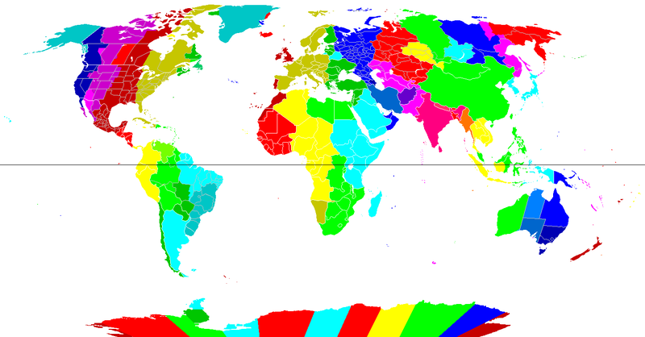

Time, when you really think about it, is CRAZY. We expect it to be this constant in life, slowly, we hope, marching forward,
but invariably going quicker than we want. However, the concept of time, as in “What time is it?” has changed over
the centuries, with the pace escalating during the information age. If there is one thing Einstein taught us with the Theory of
Relativity, it is that time is not constant.

There are really two ideas of time… The first, relates to the time on a clock that we all reference. The second, is the larger concept of time that is part of the theories that
Einstein laid out in his Special and General Theories of Relativity. We will focus on the clock for most of this.

 (gratuitous Einstein picture)

When I interview people for jobs, or talk with young programmers, I will sometimes ask a variation of this question, "you are running a
website and are taking orders for customers all over the world, how do you handle the date and time of an order?" This question
is amazingly complex.

First, you get an idea if the person has a grasp of time zones and local geography beyond the one they are in,
which is always a good first step. This leads to other discussions. Do they mention Daylight Saving Time? Do they mention 
what a pain Indiana and/or Arizona are,
 neither of which recognize Daylight Saving Time?

They make it this far, you are happy. Next however, you hope they mention there really isn’t a decent way to know where a 
user
is when they place an order so that you can display a time when they think they bought their product.
 Unless they explicitly provide 
an address or a time zone, you are not guaranteed to know where they are. You can
 guess based on things like IP address, however, this costs money. You can ask the user if your application can use their 
 browser geolocation feature to determine where they are, but if they are like me, this is a sign to go to another site.

So, you say to yourself, the best thing I can do when a user places an order is to ask them to provide a username that is tied
to a physical address in the real world. This will surely solve the problem! No, it really won’t….. Do you save the time zone where they placed the order? If I
am vacationing in sunny California and order the latest Marvel Blu-Ray to be shipped to my house, what is the proper order time
from my perspective? The time back home or the time where I am?

None of this touches on craziness of time zone names. I live in the United States Midwest, home of Central Standard Time (CST).
However, there is also Cuba Standard Time, China Standard Time, and Central Standard Time in Australia, all claiming the acronym
CST. Which one wins?

So it is a GREAT interview question because you get an idea of the breadth of experience of a candidate in dealing with
large scale applications. However, I only tend
to ask this question if I am trying to be a deliberate jerk. It is a difficult question.

If you work with large companies or companies with interests all over the world, you realize how much time you spend talking
about time. Most people I talk to have no idea that when it is 8:00 AM in the United States Midwest, in India it is
6:30 PM. That is right, not only is the time many hours different than ours, it is staggered 30 minutes. Throw in the fact
that countries all over the world have different ways of dealing with Daylight Savings Time and sometimes their governments
will change it at the last minute and you have many, many opportunities for error. Time is a constant source of discussion when you
work with people across the globe. That discussion of time costs the world money and effectiveness.

So, I propose a few things. First, let me start in the United States. Let us abolish Daylight Savings Time. There really is no
need for this anymore. We are not at war, and the cost savings for going through this process twice a year have not been [proven
out](http://phys.org/news/2014-03-daylight-energy.html). Every person in Illinois who has missed a meeting with a colleague in
Indiana when we “spring forward” or “fall back” can
verify this.

Second, and I assume much more controversially, let us abandon time zones in the United States. We live in a time and place where we
ALL need to be on the same time as a country. In our agrarian past, it may have made sense for 12:00 PM to represent when the
sun was at its apex. However, for the most part, we are NOT an agrarian society currently. Our economy is an information and
finance based economy. I can guarantee you, stock brokers living in California, don’t wake up at 9:30 AM PST for the opening bell
on Wall Street, they wake and are ready to serve their customers every day by 6:30 AM PST to match the 9:30 AM EST opening bell. Our
economy already is driven by the time when business happens, not when we want it to happen.

Many folks may think the idea of a single time zone in the states is crazy talk, and it probably is. As a country, we tend to
be obstinate to change and prefer to cling to the way things have been done (I am looking at you Metric
System conversion). However, time marches on, and more importantly, our economy marches
on. It wasn’t until commerce became widespread, that the concept of time (or more exactly, time keeping) became prevalent in order
to facilitate commerce. Our
economy though has moved past local time, it has moved global. The reality is that countries like China are already ahead of us
here, with a single time that spans five time zones. One needs to only look at the image of the differing morass of
time zones from [WikiPedia](http://en.wikipedia.org/wiki/Time_zone)
to realize there is a huge opportunity for improvement.

So then, let us take it to the logical conclusion. We should wipe out time zones everywhere in the world. They are no longer
needed. ALL business should act on the same time. The first benefit of this is that the mental energy the world spends each day
to just set up a meeting with colleagues disappears. Instead of everyone doing a little math determining their GMT offset, they just say what time.
Everyone has the same reference. It all gets done much quicker. We loose the concept of 12:00 PM being when the sun is brightest,
but the benefits are huge.

The second benefit is that computer systems are MUCH more efficient. While we will never get past the scourge of developers
checking if an item is NULL, the second thing they spend their time on is dealing with dates and times in their programming
language of choice. By consolidating on a single global time, that problem disappears. That is pretty cool. You may think this is
 superfluous, but it is analogous to the metric and British system of units. One need only look at the loss of the [Mars Climate
 Orbiter](http://en.wikipedia.org/wiki/Mars_Climate_Orbiter) because of unit conversions to realize there are real reasons for
 simplicity and very high costs for ignoring it!

So then, what time is it? Well, the answer is easy. We already have it and it is
[Coordinated Universal Time (UTC)](http://en.wikipedia.org/wiki/Coordinated_Universal_Time). The interesting thing is, from a
programming standpoint, we are all moving there. If you do multi time zone or country work, you are most likely already saving
time as UTC. If you aren’t, you soon will be as you move to a cloud infrastructure. Amazon Web Services (AWS) and Azure already
default to UTC since their servers are geographically dispersed and they need to standardize on tme.
This is so prevalent, that for me personally, on my development PCs I have two times displayed,
one for local time and one for UTC time. When I code, I spend more time in
UTC than my local time zone.

It is time for the geeks of the world to lead the charge on this. We need to encourage businesses to focus on driving costs
down for doing business globally. We need to challenge politicians to take up the banner and make the world more connected and
consolidated by having a single global time.

In the news lately has been the disappearance of Malaysian Flight 370. Take for instance this article at the
[New York Times](http://www.nytimes.com/2014/03/13/world/asia/missing-malaysia-airlines-flight-370.html)
that discusses the timeline of the plane radar reading. It says the last contact happened at 2:15 am local time. First, I
 assume they mean local time in Malaysia and not New York. If it is Malaysia, I have no idea without a little
 Internet searching what time that is for me. I think a good way to begin the journey is to whenever we display time to also
  display the UTC time. So 2:15 am local time in Malaysia becomes 2:15 am/Saturday 18:15 U, where the U designation indicates
 Universal time.

How hard can it be?!?!? Probably hard, the reality is it is coming sooner or later, with sooner being better.
However, amazing things happen every day. Let us start. I am posting this article at 6 AM in the morning, but 11:00 U
wherever you are.
