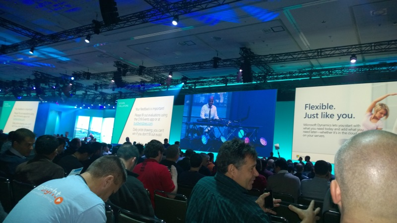
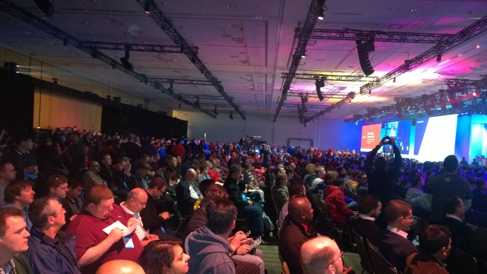

Today, April 2 2014,  is the first day of Microsoft’s Build conference, a developer focused conference from Microsoft. The Build conference is usually a big day for Microsoft as they talk through their development stack, tools and strategy. Today’s keynote was no exception.

Skyline has a contingent of our team out in San Francisco and we thought we would provide a quick overview of some of the highlights. You are going to be able to find a lot more in depth information at various tech new sites, but we thought we would hit on high points for our customers before we hop to another session.

First, this morning’s main focus was the announcement of Windows Phone 8.1 and some of its new features. Microsoft has worked hard at integrating in features that Enterprise users will find valuable, including the ability to automatically add users to an organization and set policies and controls around what users can do. This includes the ability to wipe a user’s phone after they leave the organization. There was also announcements of integration with VPN software, secure email, etc. Windows Phone 8.1 sows Microsoft has focused on strengthening their platform for Enterprises.

While that is of interest to enterprises, the biggest announcements were focused for end users. Microsoft had a couple of places they need to play catch up; specifically a notification center and speech enabled assistants.

Microsoft introduced their version of the notification center called Action Center. It allows users to set different area for display in the notification center such as VPN, Airplane mode, etc. It also enables developers to integrate their application into the notification. This is been long awaited feature for Windows Phone and Microsoft looks like they have a solid offering here.

Microsoft also introduced their version of Siri, called Cortana. The name comes from a character in their Halo series of games for the Xbox. It is refreshing, and Cortana even joked, to see the program wasn’t named Microsoft Speech Notification Center for Windows Phone 8.1 Update 3. During the keynote Microsoft really drove home how Cortana was the first “digital assistant” for mobile phones. Microsoft has really spent a good deal of time talking with personal assistants to see how they work with their customers. They have worked hard to bring personalization into the platform, such as your work and home locations, family members, etc. While it is difficult to say without actually using, it looks like Microsoft may have leapfrogged competitors like Siri and Google now with their speech assistant, especially with the ability to integrate with other applications like Facebook and Twitter.

There was also a number of features announced that really improve the Windows Phone platform. An improved calendar, themes for the lock screen, better Skype integration, etc. All in all, Microsoft has made strides in making Windows Phone a more compelling platform for users. You can find out a LOT more information at the [Windows Phone Blog](http://blogs.windows.com/windows_phone/b/windowsphone/archive/2014/04/02/cortana-yes-and-many-many-other-great-features-coming-in-windows-phone-8-1.aspx).

There was also the introduction of Windows 8.1 Update 1 (yeah, I don’t know who names these things either). Update 1 enables more mouse functionality in desktop mode for users. The title bar now appears in Windows Store apps and the task bar will also display when running Windows metro apps. The search and power button are also more prominently displayed for desktop users. It appears a lot of the new features are to enable desktop users to be even more productive. We will all find out soon enough, downloads start on Tuesday April 8.

From a developer standpoint, the most interesting announcement of morning was Universal Applications. This will enable you write an application that will hit both Xbox One, Windows Phone and Windows. The functionality looks pretty interesting and will definitely be something to pay attention to. Microsoft demoed creating the Kahn Academy app by taking a single base of shared code, and then making UI updates to hit both the Windows phone and Xbox One. Users can even have a single UI without worrying about creating custom for each version. VERY COOL.

From a single platform standpoint, there is also integration of the Windows Phone and Windows store. If you buy Angry Birds Star Wars in the consolidated store, you also have the ability to download for Windows.

Fresh off the announcement and release of Office for the iPad, Microsoft showed off the Windows Store version of PowerPoint, with the same functionality running on both the Windows Phone and the Windows version of the application. Microsoft is promising full fidelity across the desktop, Windows Phone and Windows Store version. No release information was shared.

Microsoft also announced that they were open sourcing their WinJS platform. The library will be available on GitHub and enable developers to create applications that run not only on the Windows stack of devices, but also on Android and iOS.

There was a host of other information in the nearly three hour keynote that is available across Internet news sites. At the end of the day though, I think the message Microsoft and their CEO Satya Nadala are saying are pretty obvious. Microsoft is moving beyond just Windows and they are simplifying their development platform to reach more devices. The new version of Windows Phone and Windows show they are listening to their customers and end users by simplifying and consolidating their Windows platforms while branching out to other vendors. They communicated a vision for enabling success for developers, enterprises and users using Microsoft tools and languages.

Another big keynote tomorrow! On to the next session.

This post originally appeard at [Skyline Technologies](http://www.skylinetechnologies.com/Blog/Article/2464/Build-2014-Observations-Day-1.aspx)
