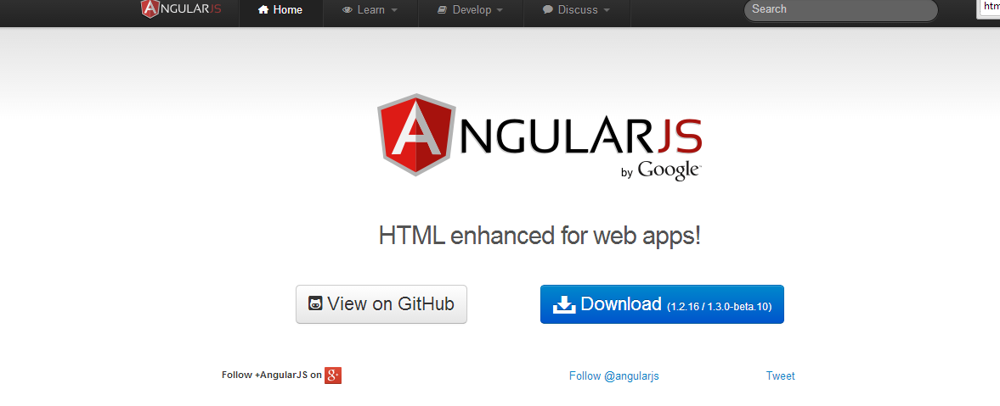

 
[AngularJS](http://www.angularjs.org) is a Javascript MVC framework from the fine folks over at
[Google](http://www.google.com). The focus of Angular is building complex
 HTML based client applications. Its design philosophy is data first, where your data will be updating the DOM.
 Contrast this to a framework like JQuery where the DOM will update your data.


This is the ninth in a series of posts on AngularJS where we are using Chemistry data from the periodic table
to help us understand the framework. The others posts are

1. [AngularJS - Introduction](http://www.jptacek.com/2013/10/angularjs-introduction/)
2. [AngularJS - Introducing AngularJS Controllers](http://www.jptacek.com/2013/10/introducing-angularjs-controllers/)
3. [AngularJS - Introducing NG-Repeat](http://www.jptacek.com/2013/10/angularjs-introducing-ng-repeat/)
4. [AngularJS - More with NG-Repeat](http://www.jptacek.com/2014/01/angularjs-further-with-ng-repeat/)
5. [AngularJS - Image Binding](http://www.jptacek.com/2014/01/angularjs-lou-reed/)
6. [AngularJS - Introducing Templates](http://www.jptacek.com/2014/02/angularJS-templates/)
7. [AngularJS - Introducing Routing](http://www.jptacek.com/2014/02/angularJS-IntroToRouting/)
8. [AngularJS - Introduction to Services](http://www.jptacek.com/2014/05/angularJS-Intro-To-Services/)
9. AngularJS - Introduction to Directives

>Note: AngularJS does not allow for more than one ng-app directive. When I have multiple angular posts on
the home page of my blog, only one application will work. I need to refactor the entire site to account for
this. All of that to say this, you are best clicking on a single article so you can see the pages in action.

On the AngularJS [homepage](https://angularjs.org/) you see the claim that Angular is "HTML Enhanced for Web Apps!".
What does this actually mean though?



HTML, when initially created, was a subset of SGML, which is popular in the print industry. HTML, especially in the early
days, kept a lot of the print mentality. However, with Web 2.0 applications, it became obvious that HTML was moving way
beyond it's print background and becoming an application platform itself. 

Given it's print background and laborious standards process that defines the HTML specification, HTML is relatively fixed 
platform. Your chances of getting a new tag into the standard for use in your application in the next ten years are 
pretty close to zero. However, Google starts earning the superheroic name it gave AngularJS by solving this problem with 
directives.

While we have seen directives previously, they have been attributes that allow us to markup existing HTML elements with
bits and pieces of Angular functionality. Examples of this have been ``ng-show`` or ``ng-repeat``. For this example, we are
going to create a custom directive, which will allow us to create our own HTML tag. 

Creating our own HTML tags, allow us to 
start thinking of our HTML markup as a domain specific language. Throughout this series, we have been using Chemistry data
to explore Angular. In keeping with that model, we are going to create a simple custom directive to display chemical 
data in its own "HTML" tag called ``periodicchartelement``. Cool things are starting to happen here people!

So how do we do this? First, similar to controllers, directives are defined on the module for our application via the 
``module.directive`` API. Templates then have the ability to setup a template. Our JavaScript would look something like

```javascript
.directive('periodicchartelement', function() {
    return {
      template: 'Name: {{element.name}} Atomic Weight: {{element.weight}}'
    };
  });
```

We can, of course, make it behave similar to the template we saw early by using a snippet of HTML, my preferred approach.


<div id="app" ng-app="chemistryApp">
    <div id="app" ng-controller="chemistryController">
    <div class="row">
            <select ng-model="periodicElement"  ng-options="e.name for e in elements" ng-click="updateController(periodicElement)"></select><br />
            </div>
            <div class="row">
                &nbsp;
            </div>
            <div class="row">
                <periodicchartelement element="periodicElement" csstypeclass="getCssClassElement"></periodicchartelement>
            </div>
    </div>
</div>


You can either visit [http://angularperiodic.azurewebsites.net/](http://angularperiodic.azurewebsites.net/) to see the code in action and
as always find the code out on [GitHub](https://github.com/jptacek/AngularPeriodic).


<script type="text/javascript" src="/2014/05/angularJS-intro-to-directives/js/chemistryApp.js"></script>
<script type="text/javascript" src="/2014/05/angularJS-intro-to-directives/js/chemistryController.js"></script>
<script type="text/javascript" src="/2014/05/angularJS-intro-to-directives/js/chemistryService.js"></script>
<script type="text/javascript" src="/2014/05/angularJS-intro-to-directives/js/chemistryDirective.js"></script>


