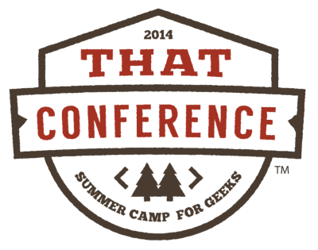

I am honored to be speaking this year at That Conference. That Conference is a conference with national speakers held every
year in the Wisconsin Dells at the [Kalahari Resort](http://www.kalahariresorts.com/wisconsin). It is very high on the awesome scale,
and I wrote many words about it [last year](http://www.jptacek.com/2013/05/that-conference-2013/).
Tickets went on sale yesterday, and are $25 off for a week. Go forth, [click](https://www.thatconference.com/Home/TicketRegistration),
[buy](https://www.eventbrite.com/e/that-conference-2014-tickets-7410869109) and come back, I need your help!

This is the third year in a row I have had the chance to speak. For
the inaugural That Conference, I spoke on SharePoint claims based security, Windows Identity Foundation and Access Control
Services. You can find the slides on my [site](http://www.jptacek.com//2012/08/that-conference-slide-deck/).

Last year, I put on a tin foil hat, so aliens couldn't read my brain waves, and talked about Being You and managing your
digital identity on the web. I talked a lot about security, Azure Websites, WordPress and Two Factor authentication. You can also
 view that slide deck [here](http://www.jptacek.com/2013/08/2013-that-conference-presentation/).

This year, my presentation is entitled, You Can't Always Be Hiking - Ways to Hack Your Day to Better Health. You can read
more about it at the [That Conference site](https://www.thatconference.com/Sessions/Session/2271). Here is a copy of the
abstract

>Developers do awesome things by creating apps and web sites that make users go ooh and ahh (and possibly occasionally curse).
Despite doing awesome things for those around you, you generally are not doing awesome things for yourself. Sitting all day is
bad for you. Noshing pizza to rip through a late night code jam isn’t optimal eating. Missing sleep trying to ship code is
not great. In this presentation, we will talk through some ways developers can hack their day to better health with some simple steps
and ideas you can incorporate in your day to make sure you are still slinging code in the old folks home.

I have several things I plan on talking about during presentation, but I would love to hear from other people. So in
 embracing the awesomeness of community that [Clark Sell](http://www.csell.net/) and rest of the wizards at That Conference
 have created, give
 me some of your tips! What do you
do to keep healthy during the day? Feel free to sound off in the Disqus comments below with ideas and discussion!

