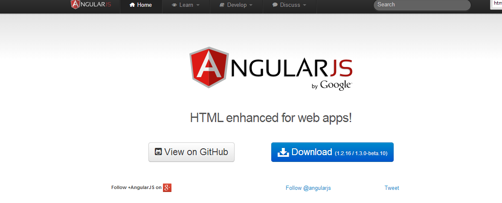

 
[AngularJS](http://www.angularjs.org) is a Javascript MVC framework from the fine folks over at
[Google](http://www.google.com). The focus of Angular is building complex
 HTML based client applications. Its design philosophy is data first, where your data will be updating the DOM.
 Contrast this to a framework like JQuery where the DOM will update your data.


This is the ninth in a series of posts on AngularJS where we are using Chemistry data from the periodic table
to help us understand the framework. The others posts are

1. [AngularJS - Introduction](http://www.jptacek.com/2013/10/angularjs-introduction/)
2. [AngularJS - Introducing AngularJS Controllers](http://www.jptacek.com/2013/10/introducing-angularjs-controllers/)
3. [AngularJS - Introducing NG-Repeat](http://www.jptacek.com/2013/10/angularjs-introducing-ng-repeat/)
4. [AngularJS - More with NG-Repeat](http://www.jptacek.com/2014/01/angularjs-further-with-ng-repeat/)
5. [AngularJS - Image Binding](http://www.jptacek.com/2014/01/angularjs-lou-reed/)
6. [AngularJS - Introducing Templates](http://www.jptacek.com/2014/02/angularJS-templates/)
7. [AngularJS - Introducing Routing](http://www.jptacek.com/2014/02/angularJS-IntroToRouting/)
8. [AngularJS - Introduction to Services](http://www.jptacek.com/2014/05/angularJS-Intro-To-Services/)
9. AngularJS - Introduction to Directives
10. [AngularJS - Further with Directives](http://www.jptacek.com/2014/12/angularJS-further-with-directives/)

>Note: AngularJS does not allow for more than one ng-app directive. When I have multiple angular posts on
the home page of my blog, only one application will work. I need to refactor the entire site to account for
this. All of that to say this, you are best clicking on a single article so you can see the pages in action.

On the AngularJS [homepage](https://angularjs.org/) you see the claim that Angular is "HTML Enhanced for Web Apps!"
What does this actually mean though? For me, it means directives, which allow us to extend HTML and create new HTML
markup. Let us pretend and call it our own HTML 6.



HTML, when initially created, was a subset of SGML, which is popular in the print industry. HTML, especially in the early
days, kept a lot of the print mentality. However, during the period when Web 2.0 applications emerged, it became 
obvious that HTML was moving way
beyond it's print background and becoming an application platform itself. 

Given it's print background and laborious standards process that defines the HTML specification, HTML is relatively fixed 
platform. Your chances of getting a new tag into the standard for use in your application in the next ten years are 
pretty close to zero. However, Google starts earning the superheroic name it gave AngularJS by solving this problem with 
directives. To my knowledge, they are the only JavaScript framework that enables you to do this so far.

While we have seen directives previously, they have been attributes that allow us to markup existing HTML elements with
bits and pieces of Angular functionality. Examples of this have been ``ng-show`` or ``ng-repeat``. For this post, we are
going to make a custom directive, which will allow us to create our own HTML tag. 

The value of creating our own tags, is that it allows us to 
start thinking of our HTML markup as a domain specific language. Throughout this series, we have been using Chemistry data
to explore Angular. In keeping with that theme, we are going to create a simple custom directive to display chemical 
data in its own "HTML" tag called ``periodicchartelement``. Cool things are starting to happen here people!

So how do we do this? First, similar to controllers, directives are defined on the module for our application via the 
``module.directive`` API. Within here, we can setup a small template. Our JavaScript would look something like

```javascript
.directive('periodicchartelement', function() {
    return {
      template: 'Name: {{element.name}} Atomic Weight: {{element.weight}}'
    };
  });
```

Of course, we can break the template into its own file by using templateUrl as we have discussed 
[earlier](http://www.jptacek.com/2014/02/angularJS-templates/), which is the preferred approach.

We next define what part of our HTML our directive will be expanding. We do this by using ``restrict`` to 
indicate the DOM element we are creating from the following options

* ``'A'`` - The attribute of a DOM element. for example  ``<div periodicchartelement="element">``
* ``'C'`` - class name 
* ``'E'`` - A new element name, for example  ``<periodicchartelement></periodicchartelement>``

There is also the ability creative directives tied to HTML comments with ``restrict:M``. The restrict keyword
can also be combined together to in a manner such as ``ACM``, indicating the directive applies to attributes, classes, 
and comments.

```javascript
.directive('periodicchartelement', function() {
    return {        
    restrict: 'E',
      template: 'Name: {{element.name}} Atomic Weight: {{element.weight}}'
    };
  });
```

Our directive function now creates a new HTML element, ``periodicchartelement``. 

For the example we are creating, we have changed a few things in comparison to previous posts. 
Based on our [introduction of services](http://www.jptacek.com/2014/05/angularJS-Intro-To-Services/)
 last time, we have wrapped our periodic data in a service with a function called ``getElements()``. Second, we have expanded the properties 
 of our JSON object used in the application to include fields about the periodicity of chemical elements. Here is an example
 
 ```javascript
  {"atomicNumber": 1,
  "name": "Hydrogen",
  "atomicWeight": 1.00794,
  "phase": "Gas",
  "ionization": 13.5984,
  "melting": -259.14,
  "boiling": -252.87,
  "electronegativity": 2.2,
  "type": 'Non Metal',
  "group": 1,
  "group2": 'IA',
  "period": 1,
  "elecconfig": '1s1',
  "symbol": 'H'},
 ```

With that in place, let's create a directive that will allow us to display an element from the periodic table.

The first step is to create the directive function, we will create a new file, chemistryDirective.js and then hang 
the directive off of our module and call it ```periodicchartelement``

```javascript
chemistryApp.directive('periodicchartelement', function (chemistryService) {;
    return {
        restrict: 'E',
        templateUrl: '/2014/06/angularJS-intro-to-directives/template/periodic-template.html',
        scope:{
            element:'=',
            cssType:'=csstypeclass'
        }

    }

});
```

You will notice several things. First, we are using the ``restrict`` keyword to explicitly identify this as a
HTML element by using the value of ``E``. Second, we are loading a HTML template for display. Last, we are passing in two items, the element 
from our JSON object and a cssType, which is a function from our scope to display our CSS class.

Our HTML markup is pretty basic. Notice though where we are setting a CSS class using ``ng-class`` and binding to the value 
of cssType.

```xml
<div class='periodicCell' ng-class="cssType">
    <span style="text-align: left"><small>{{element.atomicNumber}}</small></span>&nbsp;&nbsp; <span style="text-align: right"><small>{{element.atomicWeight}}</small></span><br />
    <span style="font-size:24px;"><strong>{{element.symbol}}</strong></span><br />
    <span><small>{{element.name }}</small></span>
</div>

```

Our CSS type is then a function that determines the CSS class based on the type of element and is defined in our
service, ``chemistryService.js``

```javascript
var getCssClassElement = function ( elementType) {
        var cssClass = '';
        elementType = elementType.toLowerCase();
        cssClass = elementType;
        switch (elementType) {
            case 'metalloids':
                cssClass = 'metalloids';
                break;
            case 'alkali metal':
                cssClass = 'alkaliMetal';
                break;
            case 'non metal':
                cssClass = 'nonMetal';
                break;
            case 'noble gas':
                cssClass = 'nobleGas';
                break;
            case 'halogen':
                cssClass = 'halogen';
                break;
            case 'alkaline earth':
                cssClass = 'alkalineEarth';
                break;
            case 'poor metal':
                cssClass = 'poorMetal';
                break;
            case 'rare earth metal':
                cssClass = 'lathanoids';
                break;
            case 'transition metal':
                cssClass = 'actinoids';
                break;
            case 'alkaline earth metal':
                cssClass = 'poorMetal';
                break;
        }
        return cssClass;
    };
```


<div id="app" ng-app="chemistryApp">
    <div id="app" ng-controller="chemistryController">
    <div class="row">
            <select ng-model="periodicElement"  ng-options="e.name for e in elements" ng-click="updateController(periodicElement)"></select><br />
            </div>
            <div class="row">
                &nbsp;
            </div>
            <div class="row">
            <div class="col-md-2">
                <periodicchartelement element="periodicElement" csstypeclass="getCssClassElement"></periodicchartelement>
                </div>
            <div class="col-md-3">
                <div class="metalloids"><b>Metalloids</b></div>
                <div class="alkaliMetal"><b>Alkali Metal</b></div>
                <div class="nonMetal"><b>Non Metal</b></div>
                <div class="nobleGas"><b>Noble Gas</b></div>
                <div class="halogen"><b>Halogen</b></div>
                <div class="alkalineEarth"><b>Alkaline Earth</b></div>
                <div class="poorMetal"><b>Poor Metal</b></div>
                <div class="lathanoids"><b>Rare Earth Metal</b></div>
                <div class="actinoids"><b>Transition Metal</b></div>
                <div class="poorMetal"><b>Alkaline Earth Metal</b></div>
                </div>
            </div>
    </div>
</div>
<br/>
We have now created a new HTML element! It displays the atomic number, the atomic weight, atomic symbol and the name from 
our JSON object of periodic data. Based on the element type, we then color code the element appropriately.

This is the  most basic of introductions of creating [directives](https://docs.angularjs.org/guide/directive) with AngularJS,
 next time, we will dig in deeper!

You can either visit [http://angularperiodic.azurewebsites.net/](http://angularperiodic.azurewebsites.net/) to see the code in action and
as always find the code out on [GitHub](https://github.com/jptacek/AngularPeriodic).


<script type="text/javascript" src="/2014/06/angularJS-intro-to-directives/js/chemistryApp.js"></script>
<script type="text/javascript" src="/2014/06/angularJS-intro-to-directives/js/chemistryController.js"></script>
<script type="text/javascript" src="/2014/06/angularJS-intro-to-directives/js/chemistryService.js"></script>
<script type="text/javascript" src="/2014/06/angularJS-intro-to-directives/js/chemistryDirective.js"></script>


