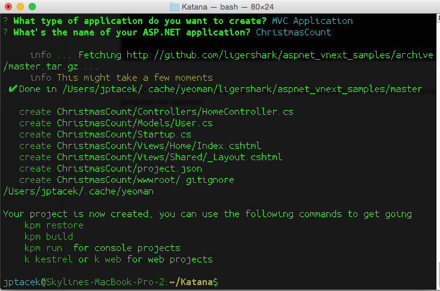

Santa Claus is Coming to Town!! All the geeks get pretty excited for Santa’s arrival to see what will be awaiting us under the tree
each year. However, sometimes the things geeks are most excited about aren’t ready for Christmas. We can read about them, maybe see
some snippets or even get a preview.

For example, there is a new Star Wars movie coming, but that will not be out until December of 2015, right before Santa’s
next visit. There are also a good percentage of geeks getting excited for the release of Apple Watch, which will be out
sometime in early 2015, so it won’t be waiting under the Christmas tree this year either.

However, one of the things I am most interested in, workwise, while it is arriving in 2015, is available
to kick the tires on now. The early preview present under the tree is running .NET on non-Microsoft platforms like
the OS X or Linux. So while Santa will not be putting the final version under my tree this year, we can at least start
getting ready.

November and December are always exceedingly busy times, but it is worth taking a moment to realize that something huge
happened. Microsoft has opened sourced their .NET framework. I am a big fan of Microsoft’s C# language. I think, for
most developers, it is a great and productive way to get work done. Having this option available on Linux and Mac
machines is going to be great. Throw in ASP.NET MVC and Web API coming along too, and 2015 will be awesome one for
developers.

Scott Hanselman has a [blog post](http://www.hanselman.com/blog/AnnouncingNET2015NETAsOpenSourceNETOnMacAndLinuxAndVisualStudioCommunity.aspx)
 where he gets into the details about the open sourcing of .NET and there is a lot to
get into. However, but for now, let us just build an ASP.Net vNext app and jump into it like a kid opening presents on
Christmas morning!

We are going to create an ASP.NET vNext app to countdown several things… the days until Christmas, the days
until the release of the next ASP (assuming Build 2015) and finally, the days until new Star Wars movie.

How do we jump in? These steps are mostly identified on the ASP.NET GitHub page (I know, crazy, right. Microsoft
documenting stuff on GitHub!?!?) at [https://github.com/aspnet/home](https://github.com/aspnet/home). We can still step through.

First, because vocabulary is important…. Since the codename for the next version of ASP.NET vNext is Katana,
Microsoft is going all in with the letter K. So many of the tools utilize the letter K. A quick run through of the
most important.

* KRE is the K Runtime Environment. This is the code that bootstraps your ASP.NET vNext application; compilers,
Common Language Runtime (CLR), etc.

* KVM is the K Version Manager. It will install appropriate version of the KRE. You will be able to have multiple ASP.NET vNext runtimes and applications running on your machine.

* KPM is the K Package Manager. This will download packages needed for your application to run.

First thing to do is ensure you have Homebrew setup on your OS X machine. If you are doing development work, you most likely have this already, so we will assume you are ready to go.

Next, we need to install the ASP.NET vNext runtime environment (KRE). This is done by downloading appropriate git repositories via a bash script.

```bash
brew tap aspnet/k
```

Similar commands are used for other platforms such as Linux and Windows, which uses PowerShell.

The next step is to install KVM (The K Version Manager), which is the runtime manager. It is responsible for getting the runtime and enables multiple different runtimes on the same machine. I have seen some mention of issues using KVM on OS X with different shells, like zsh. I use the Bash shell and have not run into issues. To install KVM type

```bash
brew install kvm
```

Next we run a script to setup our environment variables, etc

```bash
source kvm.sh
```

We have pretty quickly setup and downloaded the environment to run ASP.NET vNext apps on an OS X machine, but, we have
no code! Thankfully, someone wrote an ASP.NET MVC Project Generator for Yeoman. Yeoman, for those of you not familiar,
is a tool to generate scaffolding for your projects. It utilizes Node.js.

So to get all of this working, you are going to need to have Node.JS and the Node Package Manager (NPM) installed.
Again, since we are talking developers, you probably already have all of this. The next step then is to install
Yeoman, using NPM. From your Bash shell we will install Yeoman first

```bash
npm install –g yo
```

Next, we install the generator for ASP.Net

```bash
npm install -g generator-aspnet
```

Next step, since we have all of the tools we need installed and downloaded, we can generate our application. This is done by running Yeoman from the bash shell type by typing

```bash
yo aspnet
```


We have the option of choosing a console application, a Web App, MVC app or Nancy ASP.NET app. We choose MVC
application and provide a name


And our application gets generated



And we can take a look and see our directory structure, with many of the controllers and views most of us know from
our MVC projects.


For those of you well versed in ASP.NET, a couple of pretty interesting things to note. First, no solution file!
Second, no Project file! Most of the Visual Studio generate file constructs are gone. Similar to a Node.JS
application, there is a json file outlining the dependencies needed for an application, as opposed to the Solution
and Project files of Visual Studio. Very cool.

To build and run the application, we use the commands shown in the previous screen shot of the bash shell

``kpm restore``, which gets the packages for your application

``kpm build``, builds the application

``k kestrel``, fires up the web server to serve the pages

By using the kestrel web server we are actually firing up Mono, the open source version of the .NET framework.
We access the location locally on port 5004 (http://localhost:5004/)


So that is all kind of Christmas goodies Santa has for us, what is the most impressive programming language
for business development being able to run on non-Microsoft platforms. When you start thinking about integrating in
with some popular Linux tools like Docker, it doesn’t take a lot to realize things will be a lot different on the .NET
stack when Santa is coming back to town in 2015. Plus, new Star Wars!

You can download this code from a GitHub repository I have setup at
[https://github.com/jptacek/ChristmasCountdown](https://github.com/jptacek/ChristmasCountdown)

Note: When running the web site, it will use the same port for the web server. I usually exit the process (k kestrel) by typing Ctrl-Z.
However, I need to list the processes using PS and then kill, by typing kill -9 <pid>, the process that is mono.
That way I can restart.

**UPDATE (December 17, 2014)** - Links updated to include link to Microsoft [post](http://blogs.msdn.com/b/webdev/archive/2014/12/17/yeoman-generators-for-asp-net-vnext.aspx) on Yeoman

**UPDATE 2 (December 18, 2014)** - Thanks to [Sayed Hashimi](https://twitter.com/sayedihashimi) for helping clean up some typos
with case issues.
[https://twitter.com/sayedihashimi/status/545720905171603456](https://twitter.com/sayedihashimi/status/545720905171603456)

Links

* ASP.NET MVC Project Generator for Yeoman - [http://hassakarn.com/2014/02/07/asp-net-mvc-project-generator-for-yeoman/](http://hassakarn.com/2014/02/07/asp-net-mvc-project-generator-for-yeoman/)
* Yeoman - [http://yeoman.io/](http://yeoman.io/)
* ASP.NET GitHub repo - [https://github.com/aspnet/home](https://github.com/aspnet/home)
* OmniSharp.NET - [http://www.omnisharp.net/](http://www.omnisharp.net/)
* GitHub for this Code - [https://github.com/jptacek/ChristmasCountdown](https://github.com/jptacek/ChristmasCountdown)
* Microsoft on Yeoman for ASP.NET - [http://blogs.msdn.com/b/webdev/archive/2014/12/17/yeoman-generators-for-asp-net-vnext.aspx](http://blogs.msdn.com/b/webdev/archive/2014/12/17/yeoman-generators-for-asp-net-vnext.aspx)

This blog post originally appeared at [Skyline Technologies](http://www.skylinetechnologies.com/Blog/Article/2586/12-Days-of-Christmas-Mac.aspx)
as part of their [12 Blogs of Christmas series](http://www.skylinetechnologies.com/Blog/Article/2586/12-Days-of-Christmas-Mac.aspx)


