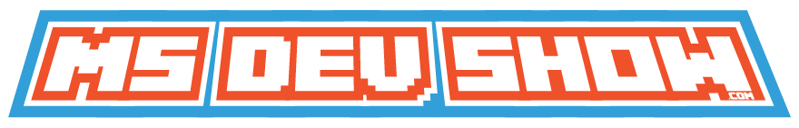

I had the very cool experience of being invited to be part of the [MS Dev Show](http://msdevshow.com/), a Podcast focused on Microsoft Developer
Technologies hosted by [Carl Schweitzer](https://twitter.com/carlschweitzer) and
[Jason Young](https://twitter.com/ytechie). I enjoy the show when I get to a chance listen and, truth be told, Jason
was one of the inspirations for me switching my blogging engine to Docpad. That means I was pretty excited to be
invited on!

The Podcast mostly focused on AngularJS, but we talked a bit about some of the upcoming Visual Studio changes and
ASP.NET vNext, which is going to be really cool for Microsoft Developers. You can get a hint of what is coming on one of my
recent blog posts
[Running ASP.NET vNext on OS X](http://www.jptacek.com/2014/12/creating-ASP.NET-vNext-application-on-OSX/).

You can listen to the show at
[http://msdevshow.com/2014/12/angularjs-with-john-ptacek/](http://msdevshow.com/2014/12/angularjs-with-john-ptacek/).
Wished I would have sounded a bit more eloquent for everyone, but kind of sleep deprived.

Thanks Carl and Jason!

 

