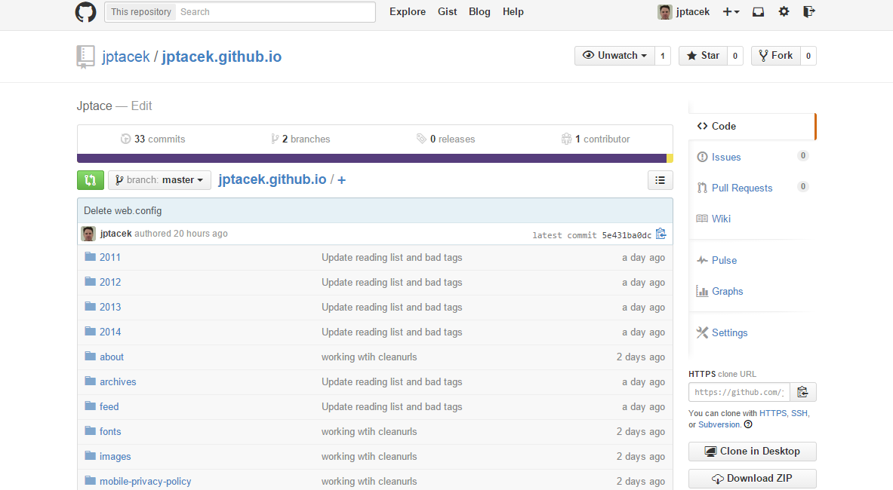
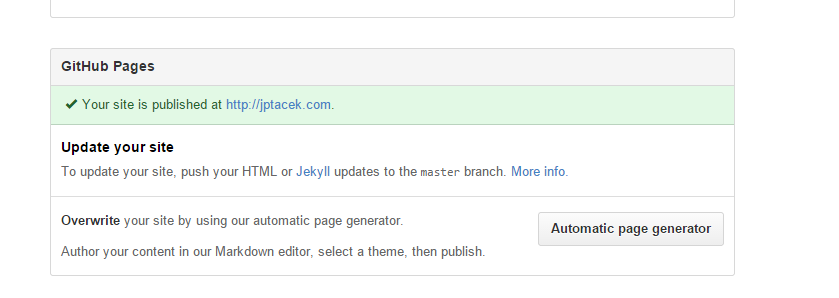
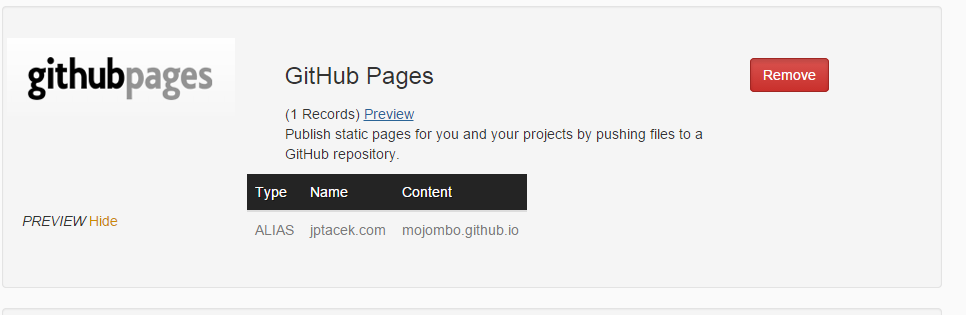
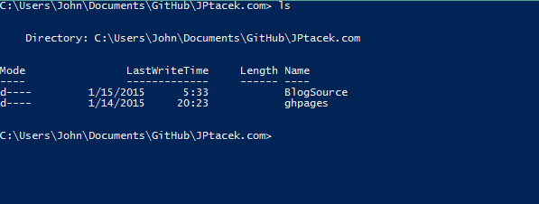

I am a fan, a HUGE fan, of Microsoft's [Azure](http://azure.microsoft.com/) platform, especially their Azure Websites.
This blog, [jptacek.com](jptacek.com) has been hosted
on Azure for several iterations. First as a blog on WordPress, and later, as a blog being generated using
[DocPad](https://docpad.org/). Feel
free to follow my [Wordpress](http://jptacek.com/tags/wordpress/) and [DocPad](http://jptacek.com/tags/docpad/)
adventures. Further, when I speak at events, I often say the subtitle of my talk should be
"Azure, a love story". It is awesome and it
is a great tool for developers.

The only thing that causes me a slight measure of discomfort is that it costs actual money to host my blog on Azure.
I am fine paying money, especially
for things I think are awesome, like Azure. However, my site, after migrating to DocPad is pretty stupid, it is just
static HTML. Having a server for that can be a bit of overkill.

Enter [GitHub](http://www.github.com).


They have a platform for serving up static HTML. I think the thing that first
time I had a seed planted was a [blog post](http://haacked.com/archive/2013/12/02/dr-jekyll-and-mr-haack/)
that [Phil Haack](https://twitter.com/Haacked) did about moving his personal blog
to GitHub Pages. In it, he steals a
tweet from [Zach Holman](https://twitter.com/holman), one of his GitHub colleagues.

>@haacked the ops team gets paged when http://zachholman.com is down. You still have a lot to learn, buddy

I thought that was a pretty good line. I also realize it is the same thing Microsoft does on their cloud platform, but
it DID inspire me to dig a bit more into GitHub pages. At the time I looked, it was pretty focused on Jekyll, which
I shied away from it based on its Ruby background (more info about my decision
[here](http://jptacek.com/2013/12/saying-hello-to-docpad/) ). A year later though, I have gotten a bit more
comfortable with DocPad, and have a workflow to get my pages published to GitHub Pages.

What are GitHub Pages? They are public webpages that are hosted on GitHub's infrastructure. They do NOT support
HTTPS, so you won't want to host eCommerce sites on it. However, for blogs and other public content they work great.
You can use Jekyll, which is a Ruby based static site generator. It is similar to DocPad. One benefit of using Jekyll
with GitHub pages though is that you can check in your posts into your GitHub repository and it will automatically
generate the site for you.

There are two types of GitHub pages, User/Organization and Project sites. This blog, [JPtacek.com](http://jptacek.com)
is a User site. For User/Organization pages, GitHub will take content committed to the repository *username*.github.io,
where *username* is a user's GitHub account. For me, this essentially means I check in my content to a the GitHub repository
[https://github.com/jptacek/jptacek.github.io](jptacek.github.io). HTML content checked into this repository is then
automatically deployed to a static site at the URL [https://jptacek.github.io](jptacek.github.io). You can find out
more about this at GitHubs site [https://pages.github.com/](https://pages.github.com/).

It is worth noting that GitHub Pages User/Organization pages get checked into the master branch of the repository.
GitHub project sites, which are for, wait for it....., projects, are a bit different. One of those differences is that
they have content checked into the GHPages branch of the project.

So far, so good. However, the site has been living at a specific domain for a while, which I would really like to
continue to use. Of course, GitHub pages also supports custom domain names for a site. Instructions are
[available](https://help.github.com/articles/setting-up-a-custom-domain-with-github-pages/) online. Essentially though,
it is pretty slick and quick to do. You check in a single file called CNAME (all caps) into your *username*.github.io
repository. This file should be in the root of your repository and have the URL of the site, in my case, www.jptacek.com,
without any http:// in front. After committing your changes you can click settings in your repository



and you can then verify the URL is set



We have GitHub all set to serve up our requests, but now we need to actually do some work with DNS to do that. I use
[DNSimmple](https://dnsimple.com/) to manage my DNS. Part of the neat things about DNSimple is they keep it simple :).
There is a template setup for you to enable GitHub pages already present. It will add an Alias record for you and
you are on your way



So we have a site ready to go and it is live on the Internet, but we need content! Previously, through the magic of
Azure, I would check in my blog content as a markdown file, Azure would read the check ins from my GitHub repository,
download appropriate NPM pacakges, compile my markdown to static HTML and publish a site. All pretty cool. That is gone
now. So instead of having the cloud compile my markdown, I am now doing it all local. This is the main negative for me
about moving to GitHub pages, but sometimes freedom has a cost :)

Since I will be dealing with two GitHub repositories, I reworked my workflow a bit. My site, and all of it's content
and DocPad assets lives in GitHub at [https://github.com/jptacek/JPtacek.com](https://github.com/jptacek/JPtacek.com)
and my static blog content, needs to be in
[https://github.com/jptacek/jptacek.github.io](https://github.com/jptacek/jptacek.github.io) to get published to
GitHub Pages. What I have done is reworked a couple of things with DocPad to support this. Previously, I had
my repository checked out locally to a directory called JPtacek.com. What I have done is keep this as the root
directory and created two subdirectories within there. The first directory, BlogSource, is the DocPad repository which
will be responsible for generating my static content from markdown files. I cloned my GitHub
[https://github.com/jptacek/JPtacek.com](JPtacek.com) repository here. The second directory, ghpages, is where
I cloned the [https://github.com/jptacek/jptacek.github.io](jptacek.github.io) repository.



The next step is to be able to generate the content locally so I can psu my static content from my local drvie
to the [https://github.com/jptacek/jptacek.github.io](jptacek.github.io) repository. This was done by updating my
DocPad environment a bit. In the DocPad configuration file, ``docpad.coffee``, I created two environment, one
for local development, the default way I had been using DocPad previously before, and a second for static. The
static environment is what I use when I want to publish a new blog post. The main thing to note is the configuration setting for
``outPath``, which points up a directory level from where my DocPad environment is (the ``BlogSource``) directory and
publishes files to the (``ghpages``) directory.

I can run this command by typing ``docpad -e static generate``. After running DocPad and generating the static
content I am a commit and a push away from an updated website!

```javascript
#docpad -e static generate
  environments:
    static:
      outPath: '../ghpages'
      collections:   posts: ->
        @getCollection("html").findAllLive({layout: 'post'},[{date:-1}])
    development:
      outPath: '.out'
      collections:
        posts: ->
          @getCollection('documents').findAllLive({layout: {'$in' : ['post', 'drafts']}}, [layout: 1,  date: -1])

```

So in closing, my site is no longer hosted on Azure, but GitHub pages and it wasn't too painful. I am now saving $10-15
a month. This will translate to more coffee. A high level overview about the pros and cons.

Pros about GitHub Pages
* Free! Azure was costing from $10-$15/month
* Bypass some CPU usage limits on Azure

Cons about GitHub Pages
* Cannot automatically build sites from Git commits
* No IPV6 support (issue with Azure Websites currently)
* No SSL support

