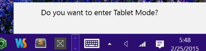

Microsoft is currently working on the next major release of Windows, called Windows 10. Currently, Windows 10 is in technical preview mode, with millions of people testing it across the world
via their [Windows Insider Program](https://insider.windows.com/). I have been part of the Insider Program for a while now and have been through several releases and thought I would share some initial
impressions of Windows 10.

## Start Menu ##
For most users, one of the biggest changes is the Start Menu is back. In Windows 8, the Start Menu was replaced by the Start Screen. Many users found this disconcerting as you moved back and forth between full screen “Windows Modern” and the traditional desktop mode. Microsoft is addressing this heads on by bringing back the start menu. It is also making the start menu more “modern”, by including Microsoft’s innovative Live Tiles in the start menu.

## Cortana ##
Microsoft’s Cortana has been a big hit on Windows Phone. It is a voice driven assistant, similar to Google Now or Apple’s Siri. You can click the search icon and “talk” to Cortana and have it perform searches for you. You can even change some settings and say “Hey Cortana” and have it do searches for you.

Cortana also bills itself as a personal digital assistant. It is able to parse through emails and documents and “learn” about you. So if you have a flight on Delta and you say Hey Cortana, Delta, it will show information about you flight.

It also knows I like the Chicago Bulls, so it keeps information front and center. It is also nice enough not to mention that Derick Rose is out for the rest of the season, again.

Again, all of this code is pre-release and may change, but so far Cortana looks like a great feature for Windows 10.

## Continuum ##
One of the biggest issues many people had with Windows 8 was how the tablet/modern mode was so prevalent and jarring in desktop mode. Microsoft is again addressing, heads on, one of the major Win 8 complaints, by including a new feature called Continuum. Continuum is there to make dual use machines like a Microsoft Surface function even better.

Users can decide to go to Tablet Mode, either via the Notification Bar and selecting Tablet Mode or by disconnecting/connecting a keyboard and responding to the prompt. This will then put have your apps run full screen making them more touch friendly and applicable to running on a tablet.

When you are running in desktop mode, applications are then windowed, including “Modern” apps. Previously, “Modern” apps would run in full screen mode for all users. This is a pretty significant change from Microsoft and highlights how they are enabling users to be productive if they are in tablet mode or desktop mode.

## Universal Apps ##
One of the biggest changes under the hood of Windows promises to be Universal Apps. This is a single platform that enables to developers to develop an application for Windows, Windows Phone and the Xbox One. Microsoft is hoping this will reignite developer interest as the multi platform development opens up many new opportunities.

## All Roads Lead to Build ##
Microsoft’s Build Conference at the end of April 2015 promises to have A LOT more information on the new version of Windows, especially for developers. We will all know more soon after that. Windows 10 is supposed to be available in the second half of 2015.

This blog post originally appeared at [Skyline Technologies](http://www.skylinetechnologies.com/Blog/Article/2737/Introduction-to-Windows-10.aspx),

