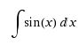
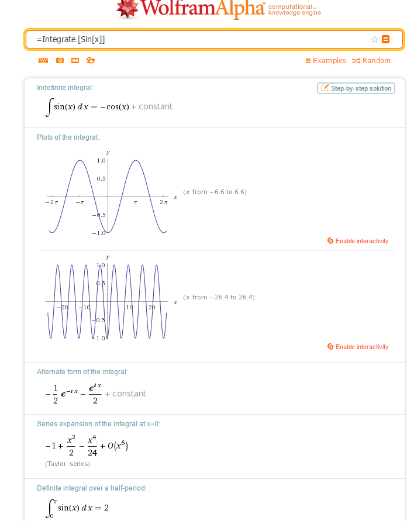
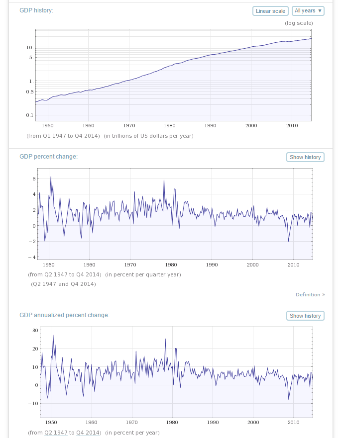

On March 14th, geeks across North America celebrate [Pi Day](http://en.wikipedia.org/wiki/Pi_Day).
That is when the US version of the date (3/14) is the same
as the world’s most famous number π (pi), 3.14. The last several years we celebrated by calculating π , once with [a
Monte Carlo Simulator](http://jptacek.com/2014/03/National-Pi-Day-2014/) and AngularJS and another time comparing
[C# and C++ performance](http://jptacek.com/2013/03/have_your_pi/). We aren’t going to break with
tradition this year, so onward to more about π!

Instead of calculating π again, which is fun because math (yeah, MATH!), we thought we would take a different spin and
look at a valuable tool that a lot of people know use without even knowing it,
and that is [Wolfram Alpha](http://www.wolframalpha.com/). The Bing and
DuckDuckGo search engines utilize Alpha for some searches as well as Apple’s Siri.

Wolfram Alpha has its genesis in a symbolic math program called [Mathematica](http://www.wolfram.com/mathematica/). A
symbolic math program can be thought of
as a math calculator, but calling it a calculator is like calling that $500 supercomputer in your pocket a phone.
Mathematica enables mathematicians, scientists, financial folks and all kinds of people to solve math problems, from
the easy to the difficult. So instead of getting a numerical value for the integral of Sin from 0 to π, it solves the
solutions in closed form and gives you the indefinite integral. A less fancy way of saying this, it does your calculus
homework for you. So

becomes

This computation engine, became the basis for Wolfram Alpha, so Wolfram Alpha can do great things with math,
for example, here is [the integral of Sin](http://www.wolframalpha.com/input/?i=%3DIntegrate+%5BSin%5Bx%5D%5D).

So Alpha is great at math, but what differentiates it from its Mathematica toots is the incorporation of curated
knowledge base and the alpha parsing engine. What does this mean? Alpha takes historical data, like stock price
information, Gross Domestic product, historical weather data and many other data sets. It then creates knowledge sets
which are made queryable via human type questions.

You can then do natural language queries across a wide set of data. For example, you can find that
Albert Einstein was 65 in the beginning of 1945 by typing
[“how old was albert Einstein in 1945”](http://www.wolframalpha.com/input/?i=how+old+was+albert+einstein+in+1945).
You can find the
[US GDP was 8.788 trillion in 1997](http://www.wolframalpha.com/input/?i=what+was+the+US+GDP+in+1997) or that the
[Chicago White Sox won the 2005 World Series](http://www.wolframalpha.com/input/?i=who+won+the+2005+world+series).

At this point, most of you realize you can get this by a well type Google query. Two things to realize, first the
Wolfram Alpha application shows lots of data about your query, not just the result. It exposes data from its data set.
For example, the World Series query shows the dates the World Series occurred,
locations (Houston and Chicago), participants (Astros and White Sox), etc.
Point 2 though, and this is the most valuable one, these queries can be aggregated. The
US GDP data can be take and plotted by asking Alpha to [“plot the US GDP”](http://www.wolframalpha.com/input/?i=plot+the+US+GDP).

It will show folks the [median home value in Madison Wi](http://www.wolframalpha.com/input/?i=median+home+value+Madison%2C+WI&lk=3)
or [F4 tornadoes in Indiana](http://www.wolframalpha.com/input/?i=F4+tornadoes+in+Indiana&lk=3) or
[compare Microsoft, Apple and Google stocks](http://www.wolframalpha.com/input/?i=MSFT%2C+AAPL%2C+GOOG&lk=3) or even
[tell you a joke](http://www.wolframalpha.com/input/?i=tell+me+a+joke&lk=3) (FYI, I didn't say a FUNNY joke).

Wolfram Alpha is a powerful tool for organizations. It can find historical data and make the data available to teams
doing research. It can help make sense of that data too. If you haven’t looked at it, I can encourage people to take
some times at the [Alpha examples](http://www.wolframalpha.com/examples/), they are a great demonstration of what
can be done.

We started out today talking about Pi Day, so let us close the loop. Of course Alpha has a lot to say about Pi!
You can find out more [here](http://www.wolframalpha.com/input/?i=pi).
I was able to calculate Pi to 2000 significant digits by typing
[N[Pi,2000]](http://www.wolframalpha.com/input/?i=N%5BPi%2C2000%5D) and get an answer faster than
ANY program I could write.

>3.1415926535897932384626433832795028841971693993751058209749445923078164062862089986280348253421170679821480865132823066470938446095505822317253594081284811174502841027019385211055596446229489549303819644288109756659334461284756482337867831652712019091456485669234603486104543266482133936072602491412737245870066063155881748815209209628292540917153643678925903600113305305488204665213841469519415116094330572703657595919530921861173819326117931051185480744623799627495673518857527248912279381830119491298336733624406566430860213949463952247371907021798609437027705392171762931767523846748184676694051320005681271452635608277857713427577896091736371787214684409012249534301465495853710507922796892589235420199561121290219608640344181598136297747713099605187072113499999983729780499510597317328160963185950244594553469083026425223082533446850352619311881710100031378387528865875332083814206171776691473035982534904287554687311595628638823537875937519577818577805321712268066130019278766111959092164201989380952572010654858632788659361533818279682303019520353018529689957736225994138912497217752834791315155748572424541506959508295331168617278558890750983817546374649393192550604009277016711390098488240128583616035637076601047101819429555961989467678374494482553797747268471040475346462080466842590694912933136770289891521047521620569660240580381501935112533824300355876402474964732639141992726042699227967823547816360093417216412199245863150302861829745557067498385054945885869269956909272107975093029553211653449872027559602364806654991198818347977535663698074265425278625518184175746728909777727938000816470600161452491921732172147723501414419735685481613611573525521334757418494684385233239073941433345477624168625189835694855620992192221842725502542568876717904946016534668049886272327917860857843838279679766814541009538837863609506800642251252051173929848960841284886269456042419652850222106611863067442786220391949450471237137869609563643719172874677646575739624138908658326459958133904780275901