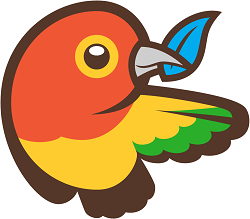
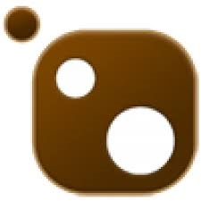
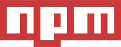
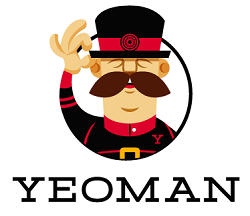

I will be presenting at the 2015 NEWDUG CodeCamp this year. Pretty excited! The CodeCamp is for developers in
NorthEast Wisconsin (or those looking for a roadtrip) and features speakers from all over the Midwest. The CodeCamp is
March 28th and will be at the Fox Valley Technical College. You can find more information, as well as register at
[http://newcodecamp.com/](http://newcodecamp.com/).

My presentation is entitled, Getting Ready for VS 2015 By Loving the Command Prompt. We are going to look at some
of the Open Source tools that will be a big part of Visual Studio 2015. These include things platforms such as
 Bower, Yeoman, NPM,
etc. We may even do some kind of dark magic where we run a Microsoft .NET MVC app natively on a OS X, because that
is now a thing.

If you are in the area, come check out the talk and say hi!

