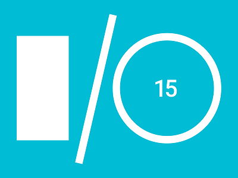

Google recently wrapped up their annual developer conference, 
[Google I/O](https://events.google.com/io2015/#), and I was struck by how very 
little was said about the Web during the keynote. While the death of the web may be 
a bit of click bait title, the 2015 Google I/O conference highlights it is an app world now 
and a connected world is on the way. 
We can
start to envision a future where we use a Web Browser as much as we use a VHS player. 

To provide some background, Google I/O is a developer conference where Google reaches out to get 
developers excited
about their platform. Microsoft has their [Build](http://www.buildwindows.com/) 
conference  and Apple has [WWDC](http://www.buildwindows.com/) and they all do the same
thing; encourage developers to create great things on their respective platforms and show their vision of
the future and why developers should invest their time in adopting this vision. 

The Google we know today, with its $350 Billion (USD) market capitalization and $48 
billion (USD) in cash reserves, is a result of building great tools for the Web 
such as [search](https://www.google.com) and [Gmail](https://www.gmail.com). 
Google also has many great web technologies that developers use every day. 	 
[AngularJS](https://angularjs.org/) is an exceedingly popular JavaScript framework.
[Google App Engine](https://cloud.google.com/appengine/docs) is a popular cloud 
Platform As A Service (PAAS) service offering. [Google Analytics](https://www.google.com/analytics) 
is embedded on nearly every 
web page on the Internet. [Google Maps](http://maps.google.com/) are displayed 
on millions of web pages across the 
Internet. Google Ad Sense is responsible for the vast majority of Google's 
$48 billion cash hoard. Even tools like Google Chart are used every day by millions.

So how many of these apps or services were mentioned during Google's I/O keynote. Nary 
a one, despite the wide adoption and support these tools/apps have. 
The biggest web technology Google focused on during their keynote was 
[Polymer](https://www.polymer-project.org/1.0/), a web toolkit based on their
Material design standard that was released at the conference. Their was also the release of 
[Google Photos](https://photos.google.com), but that is
more about capturing the images you take on your phone than the next great Web thing.
Google used its developer conference to discuss very little of its web technologies.

What does this all mean? Google's mantra as of late has been the next billion users, 
and those users aren't 
coming from the web. They are coming for mobile devices, TV watchers and even cars. 
Google
is racing towards a world where all devices are connected, and they want to be there
first. Self driving cars are impressive technology, but they are also rolling data 
collectors that tell Google more about you and the world around you than your phone 
currently does. Android users in emerging economies will never own a PC and will
experience the Internet through devices and apps instead of the web. Chromecast devices
tell Google what media you like to consume. All of this data feeds to Google and 
provides data and context, which tells Google more about us and the world, all in order to 
serve up ads to 
sell you tickets to go see Ant Man.

Google and Apple are very well entrenched in the mobile world. However, they come from 
very different places. Google wants context and information about you, and they store
it in their massively scalable cloud. For you to give this to them, they provide much of 
these services for free. 
Apple wants to create amazing devices and 
experiences for users, charge you a premium for it and have you keep coming back. Nothing illustrates the 
difference in thought between these two companies than their photo strategy. Google
wants everything you can give it, and you can have it for free. Apple gives you a paltry
5 GB for photo storage and then wants you to pay.

However, the next massive area for tech growth is a world 
where everything is connected and Google is winning.
Apple is not ready to play in that world, and I haven't seen anything to indicate
they are planning to. They do not have their own scalable cloud infrastructure in place, 
though they are working on it, but it is for their services, not for developers to utilize in creating 
applications. Their
development tools are focused on selling hardware devices, not cloud. They are capturing  context
with iBeacons and iPhones, but not to the scale of Google, where it permeates Android.

Google is exceptionally well prepared to be ready for the connected world, it is in their
DNA to do massive scale and be a little bit creepy in what they capture about users. 
They are also creating and or buying companies that feed
data to this connected world. Nest thermostats, self driving cars, Android all feed
data and context to Google.

Who is going to compete with Goolge? One option is  Microsoft. 
They have lost mobile, but they are positioned to execute in a connected
world, with their Azure service for scale, and their Internet of Things strategy. However,
unlike Google, they aren't building the connected devices like Android, Android Wear,
automobiles that consumers want and will feed data and context. Microsoft is also more of an Enterprise
company these days than a consumer company, though they are working to move the bar.

Or maybe it is Amazon that will be there to fight Google for market share. They have the leading cloud 
service so they can do scale. Their shopping service provides context. However, their disastrous 
Fire launch indicates mobile will not be an option for providing data and context. Their focus on growth
in shopping does not provide the cash that Apple, Google and Microsoft have to buy share.

The web browser is now hitting the Grandparent stage of life, having begat a mobile 
world and we are seeing the start of a connected world. It has been a great ride for the web. Google and Apple
own the mobile world. The
question is who else is going to be battling with Google for the connected world?