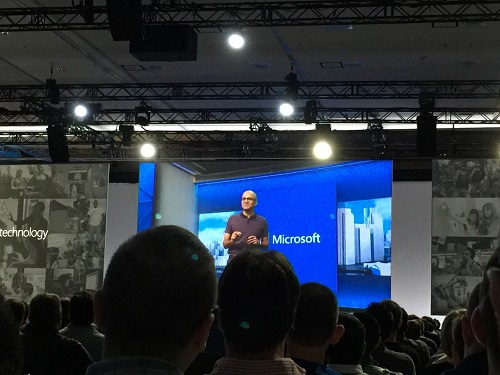

Microsoft’s recent developer conference, Build, finished up last week in San Francisco. Every year, Skyline sends a team of people to Build to understand Microsoft’s direction for our customers in the coming year  

Here are some of the key takeaways

**Xamarin** – Microsoft recently closed their purchase of Xamarin, a toolset for developing cross platform mobile applications across Windows, iOS and Android. The big news out of Build was that Microsoft was making the Xamarin tooling free for everyone. While free is great news, Microsoft also announced they were open sourcing Xamarin. This should encourage organizations who were hesitant about Xamarin because of cost constraints to re-evaluate!

**BASH** – Microsoft is bringing the Bash Shell to Windows! This may not mean anything to a lot of folks, but to developers, it is a huge deal. The Bash Shell is the most popular Unix shell, which is the command line interface (CLI) developers use. With a lot of Open Source tooling, it was always a source of friction between how development would work on Windows vs OS X or Linux. With Microsoft teaming up with Canonical, the maker of the popular Ubuntu Linux distribution, to bring Bash to Windows this should make developing applications for multiple platforms on Windows much easier!

**Bots** – One of the more interesting reveals at Build this year was the release of the Microsoft Bot platform 
(https://dev.botframework.com/). Bots are really mini pieces of functionality done in an interactive environment. For example, you could create a bot to show movie times. Another bot may be able to show you bus times. The impetus for this is really two fold. First, Microsoft feels people are at peak app, which is the idea that users have so many apps, they aren’t downloading more. Does someone really need to download an app to get a bus schedule they need once or twice a year? Microsoft thinks Bots answer that question.

**Cognitive Services** – The second piece of the Bot strategy is Microsoft’s introduction of Cognitive Services (https://www.microsoft.com/cognitive-services). This is a way of bringing intelligence into applications and is the evolvement of Project Oxford via an API. Microsoft has several of these “intelligence” APIs for things such as natural language query, image recognition, etc. One example of this is an application and website that Microsoft created where you can upload a picture to the Azure cloud of a person, and have it use the AI backend Microsoft has created to tell you how old the person is (https://how-old.net/).

**Conversational UX** – By combing Microsoft’s Bot strategy and cognitive services together, they are ultimately trying to create a new User Experience, via conversations. This is where you can interact with a service via your voice or typing and have it perform actions. An example shown during the keynote was ordering a pizza from Dominos via a bot you were interacting with on Skype. 

**HoloLens** – Microsoft officially celebrated their release of HoloLens, their impressive augmented reality headset during the first day keynote, in an oddly stilted demonstration of HoloLens. It will be a bit before we are all playing Minecraft in our living rooms via HoloLens, but the technology is shipping to devs now and it is impressive. Most of the initial applications appear to be focused on education and the enterprise, especially engineering and manufacturing scenarios. 

One of the impressive demos of HoloLens to attendees was a NASA/Microsoft created demo of going to the surface of Mars. Using photos from Nasa rovers, a 3D environment was created that enabled attendees to look and walk around the surface of Mars. Very cool demonstration of the potential!

**New Windows** – Microsoft discussed bits and pieces of the upcoming release of Windows this summer, Windows Anniversary edition, which was previously codenamed Redstone. While there wasn’t a ton of information about Redstone, the Start Menu is being evolved, Live Tiles are getting richer and better notifications are coming to the platform. Further, the Edge browser is getting new features including the ability to have extensions (yeah!).

Build this year was an interesting one. Microsoft, after many years of trying to get folks behind their mobile plans essentially decided to jump past mobile and envision what is after mobile. Some of their ideas include augmented reality with HoloLens as well as new ways for user to interact and do their job, via conversation with intelligent agents. When you look at the inclusion of the Bash shell and giving all developers the ability to create mobile apps for free for all platforms using C#, and you know you are dealing with a different Microsoft, a more open and diverse computing company. This is exciting to see for developers and organizations and opens both to many new and interesting opportunities.

This post originally appeared at [Skyline Technologies](http://www.skylinetechnologies.com/Insights/Skyline-Blog/April_2016/Build_2016_Recap).