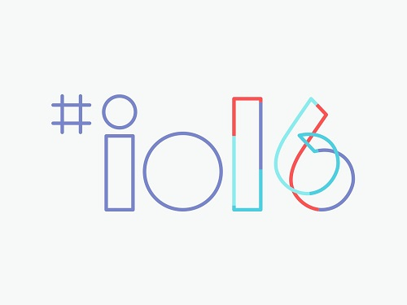

In the Developer world, there are usually three big conferences each year; Microsoft’s Build, Google I/O and Apple’s World Wide Developer Conference (WWDC). Google’s [I/O](https://events.google.com/io2016/) conference, its 10th, just wrapped up last week. Let us take a spin around some of the more interesting announcements from the conference.

 

__Google Assistant__ – One of the main things underlying Google I/O this year, was Artificial Intelligence. The impressive [DeepMind](https://deepmind.com/) technology that drove [AlphaGo](https://deepmind.com/alpha-go) to victory in March (2016) is making its way into Google’s technology. Google Assistant is really the upgrade to Google Now, making it a more conversational assistant. Similar to announcements this year from Microsoft and Facebook, bots are a huge emerging platform. Lots of tech companies definitely believe in a bot future, now it is up to consumers to see if they agree. Developers will be able to integrate with Google Assistant in the future, but no dates or APIs were announced.

__Project Ara__ – Ara is going to be Google’s first manufactured smartphone, remembering that whole Motorola being a separate company when Google owned it. That in itself makes it interesting and worth paying attention to. However, the Project Ara part is what makes it REALLY cool. Project Ara has 6 swappable modules on a phone, including things such as camera and speakers. However, there are many interesting use cases such as blood readers for Glucose and eInk screens. Consumers will be easily able to swap and upgrade their phone components. So if you want the best possible camera, you will be able to buy a module and swap it in. Really want great sounding music on your phone, buy a better speaker. Wired has a great [write-up](http://www.wired.com/2016/05/project-ara-lives-googles-modular-phone-is-ready/) on Google’s vision.

__Google Home__ – Google announced their me too competitor to Amazon’s Alexa, a voice activated search appliance for the home. You will be able to ask Google Home things like what is the weather for the day, did the Chicago Fire win last night, etc. Pricing and availability dates were not announced. Google’s introduction video.

<iframe width="560" height="315" src="https://www.youtube.com/embed/Ro5Bvy1nf_I" frameborder="0" allowfullscreen></iframe>

__TensorFlow__ – This may be, long term, the most impactful of Google’s announcements during I/O. TensorFlow is Google’s machine learning platform that was opened source late last year. At I/O, Google showed the specialty hardware they have created, called tensor processing unit (TPU) that will enable massive improvements in performance when compared to power consumption versus other platforms. If TPUs can be easily consumed via programming in a cost efficient mechanism, it could see a huge increase in use cases for machine learning.

__DayDream__ – Google’s VERY low cost Google Cardboard hardware provides a cheap entry to Virtual Reality. Everyone from [Star Wars](http://www.starwars.com/games-apps/star-wars-app) to the [New York Times](https://play.google.com/store/apps/details?id=com.im360nytvr&hl=en_GB) has created VR apps for the platform. DayDream appears to be the spiritual, and more ambitious, successor to Cardboard, a new virtual reality platform. DayDream will enable special phones running Android N to use VR headset to make compelling VR experiences. It appears to be similar to Samsung or Oculus approaches. Again, no date or APIs were announced. You can see the introduction video on.

<iframe width="560" height="315" src="https://www.youtube.com/embed/Ug6LSaJAO8o" frameborder="0" allowfullscreen></iframe>

__Android N__ – The next version of Google’s flagship Android OS was released and is currently in Beta 3. Android N should be available, with new hardware, this fall. Google is also asking for help with the name, so if you would like to name Google N, head here. Mostly, I wonder why they haven’t doubled down on Nutella yet….

__Allo/Duo__ – Google added to its already long list of messaging applications with two new messaging platforms; Allo and Duo. Allo can be seen as a showcase for the upcoming Google Assistant platform, where interaction with Bots can make for a more purposeful interaction. Duo, is a video chat application (think FaceTime) that includes a feature called Knock-Knock, which allows you to see the video conversation as it starts, before answering it. Neither of these applications require a Google Account, just a phone number. However, they enter a VERY crowded field which includes WhatsApp, Facebook Messenger, etc. Not sure how much traction Google will be able to attain, unless they are made the default apps for Android N devices.

In general, to highlight Google’s message this year at I/O, I believe it is doubling down on the computational power that Google’s Cloud can deliver. Tensor flow, Google Assistant and Google Home are showing where the world is heading when our Smartphones are peaking, at least in terms of features. 
The other thing, is that Google, like Microsoft, is trying to move quickly, and a lot of things that were announced are not ready yet. This is markedly different from previous Google I/O conferences.
There is a land rush out there for using AI to power consumer experiences on the phone and Facebook, Microsoft and Google are rushing to claim it. It will be interesting to see Apple’s take next month at WDDC since Apple tends to be a much better hardware company than software company.
Google has made the I/O conference available for all to [watch](https://www.youtube.com/watch?v=XC9DNYLWvK0).

This blog post originally appeared at [Skyline Technologies](https://www.skylinetechnologies.com/Insights/Skyline-Blog/May_2016/Google_I_O_2016_Recap).
