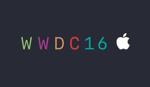

In the Developer world, there are usually three big conferences each year; Microsoft’s Build, Google I/O and Apple’s World Wide Developer Conference (WWDC). Google’s [I/O](https://events.google.com/io2016/) conference, its 10th, just wrapped up last week. Let us take a spin around some of the more interesting announcements from the conference. We have previously looked at 
[Build](https://jptacek.com/2016/04/Build2016Recap/) and [Google I/O](https://jptacek.com/2016/05/GoogleIO2016Recap/), lets
dive into [WWDC](https://developer.apple.com/wwdc/) which was held in June in San Francisco.

 

Apple’s WWDC keynote this year, tended to be the more consumer facing, rather than developer facing of the other keynotes from 2016. A majority of the time was spent on items such as iOS 10 features, Apple music redesign, Apple photos, etc. 

__Siri__ – One of the big rumors heading into WWDC was that iMessage, Apple’s very popular messaging platform would be being made available to Android devices. That wasn’t announced. However, a slew of changes are coming to iMessage. The changes mostly are “fun”; items such as stickers, new emojis, videos, bubble effects etc. Given the popularity of iMessage though, we know these features will be popular. Unlike other messaging application, for example Facebook messenger, WhatsApp, etc, the usage may be limited, since as of now, you cannot take advantage of these new features for users on other platforms like Android. Given that for most iOS users iMessage means SMS, it could lead to frustration.

__iMessage__ – here have been two OS releases of Apple Watch in its first year. However, it can still be frustratingly slow to use in day to day activities. Apple announced watchOS 3 which seems to greatly alleviate some of the performance issues. Applications were shown on the current version and the new version and were markedly faster. Apple Watch users will be excited for the new upgrade if those performance gains are realized as promised.

__Apple Watch__ – Google announced their me too competitor to Amazon’s Alexa, a voice activated search appliance for the home. You will be able to ask Google Home things like what is the weather for the day, did the Chicago Fire win last night, etc. Pricing and availability dates were not announced. Google’s introduction video.

__iOS__ – iOS has a new round of updates as it hits version 10. The notification screen has been greatly redesigned. Apple music has been streamlined and the maps application has been improved. 3D touch, which was introduced with last year’s new iPhones (6s, 6s Plus) is also more fully integrated into the system, especially on the notification screen.

__Contextual Awareness__ – The interesting thing that is permeating a lot of the developer conversations as of late is contextual awareness. A platform, like Google Now, can read email, look at your calendar and contacts as well as location to provide a wealth of information. This can provide very useful and pertinent information to a user. However, the downside to this is you are giving up a some of your privacy, as the service collects your information and mines it. This has definitely been Google’s approach. Apple has a stated focus on privacy, so it is exceedingly more difficult for them to provide these kind of services, which often rely on cloud computing because the information would need to leave the phone. So contextual awareness happens within an application, like Siri, where it will be much more limited.

At WWDC, to make iOS more successful at providing contextual awareness, Apple introduced differential privacy. It is all a bit murky, and involves some crazy abstract mathematics, but it essentially takes information from your phone, randomizes it a bit to mask individual information, stores it and then can aggregate the information together. 

How this actually works in the real world, remains to be seen. However, at first glance, I cannot imagine it being very successful, because the data that would be helpful to you, for example, discerning information about an upcoming flight, wouldn’t have enough other randomized data elements in the cloud for iOS to be able to find information about the flight. 

Resultantly, Apple is using this new feature in four areas for iOS; emoji replacement in iMessage, predictive text in iMessage, search in Notes and search in Spotlight.

It is an interesting take at trying to be contextual and protect user privacy, I am just not sure how successful Apple will be trying to provide contextual awareness with it in their platform as they compete against happily data mining competitors such as Facebook and Google.

So that is a quick tour of 2016 WWDC. Not a lot of big announcements, but more of a refining. As phone platforms reach platform maturity, there will be less and less groundbreaking enhancements on the phone. A lot of the interesting things will be happening in the cloud services that drive these devices. Apple has a lot of catching up to do here.

This blog post originally appeared at [Skyline Technologies](https://www.skylinetechnologies.com/Insights/Skyline-Blog/July_2016/Apple_WWDC_2016_Recap).
