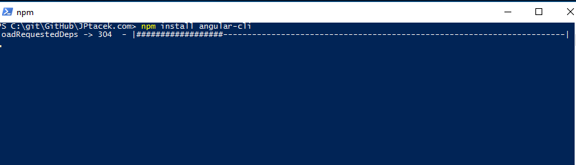
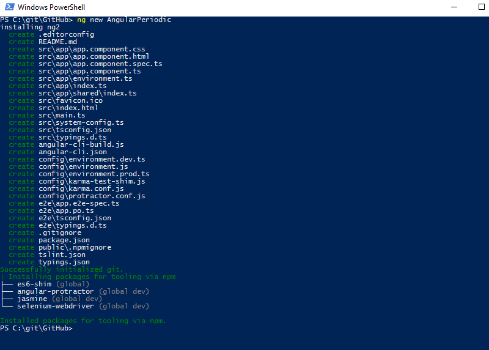
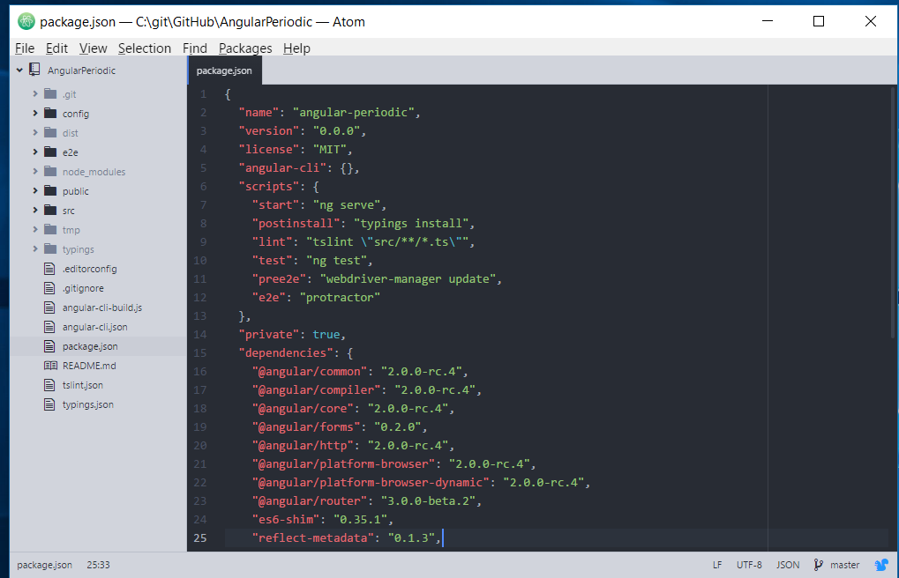
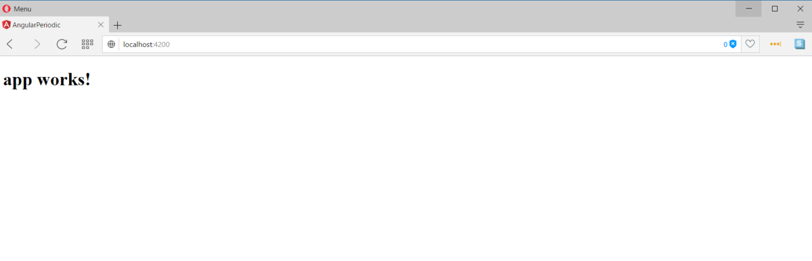
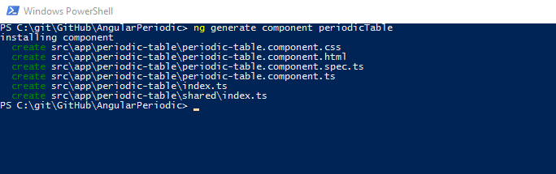
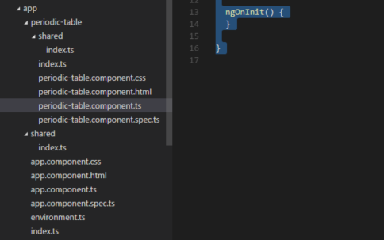

[Angular](https://www.angular.io) is a JavasScript framework from the fine folks over at
[Google](http://www.google.com). The focus of Angular is building applications across all platforms.

</img>

This is the first in a series of posts on Angular where we are using Chemistry data from the periodic table
to help us understand the framework. The others posts are

0. [Angular - Introduction](http://www.jptacek.com/2013/10/angularjs-introduction/)
1. Angular - Getting Started

Getting started in the world of Web Development/JavaScript has become a lot more work over the last several years. We are pretty far
removed where someone could create a web page and a JavaScript application with notepad. Libraries and frameworks such as [React](https://facebook.github.io/react/),  
[Angular](https://angular.io) and [Aurelia](https://aurelia.io) all require things like JavaScript task managers such as [Gulp](http://gulpjs.com) or
[Grunt](http://gruntjs.com) to transpile code, bundle files, minify them, etc.
If that doesn't work, you can consider [Babel](https://babeljs.io) and/or [WebPack](https://webpack.github.io) to get you moving.

The decisions for getting started have become so overwhelming, people have created a term, called [JavaScript fatigue](https://webpack.github.io)
that sums up frustration from a subset of developers. The reality is, especially for a library like React, there are just too many tools
for people. Initial project setup, whether React or Angular takes time.

For example, the Angular five minute quickstart [guide](https://angular.io/docs/ts/latest/quickstart.html) was not very quick for me.
There are over 20 NPM packages to install and users mostly just copy and paste an existing `package.json` file. The good news is that
Angular, as well as React, both recently came out with command line tools to get developers up and running quick. That is
what we will explore in this blog post.

In May of this year at [NG-Conf](https://www.ng-conf.org/) the Angular team introduced the
[Angular Command Line Interfact (CLI)](https://cli.angular.io) that helped really quickstart Angular application development and
follows best practices.

To install the Angular CLI, type
`npm install -g angular-cli`
and wait a few minutes. Angular CLI as of this writing (August of 2016) is currently in beta under active development. One of the
current focuses is moving from Brocolli to WebPack.



Once this is done, we can now use the command line to create our application. This is seriously good stuff.

To get started creating an application, we simply type

`ng new APPLICATION_NAME`

in our case, we will call our application AngularPeriodic and type

`ng new AnuglarPeriodic`

This will create our application structure as well as tests, setup up TypeScript and install all the requisite NPM packages.



A quick look at our directory structure sees that we hae a lot there..



A quick look at our `package.json` file indicates the NPM packages that Google prefers out of the box, along with a testing
framework based on

```xml
{
  "name": "angular-periodic",
  "version": "0.0.0",
  "license": "MIT",
  "angular-cli": {},
  "scripts": {
    "start": "ng serve",
    "postinstall": "typings install",
    "lint": "tslint \"src/**/*.ts\"",
    "test": "ng test",
    "pree2e": "webdriver-manager update",
    "e2e": "protractor"
  },
  "private": true,
  "dependencies": {
    "@angular/common": "2.0.0-rc.4",
    "@angular/compiler": "2.0.0-rc.4",
    "@angular/core": "2.0.0-rc.4",
    "@angular/forms": "0.2.0",
    "@angular/http": "2.0.0-rc.4",
    "@angular/platform-browser": "2.0.0-rc.4",
    "@angular/platform-browser-dynamic": "2.0.0-rc.4",
    "@angular/router": "3.0.0-beta.2",
    "es6-shim": "0.35.1",
    "reflect-metadata": "0.1.3",
    "rxjs": "5.0.0-beta.6",
    "systemjs": "0.19.26",
    "zone.js": "0.6.12"
  },
  "devDependencies": {
    "angular-cli": "1.0.0-beta.10",
    "codelyzer": "0.0.20",
    "ember-cli-inject-live-reload": "1.4.0",
    "jasmine-core": "2.4.1",
    "jasmine-spec-reporter": "2.5.0",
    "karma": "0.13.22",
    "karma-chrome-launcher": "0.2.3",
    "karma-jasmine": "0.3.8",
    "protractor": "3.3.0",
    "ts-node": "0.5.5",
    "tslint": "3.11.0",
    "typescript": "1.8.10",
    "typings": "1.3.1"
  }
}

```

Not only are we able to get our structure created, we can actually run our application. This is done via the
`ng serve`
command. This takes our files, such as typescript and compiles them as well as bundling via Broccoli. Our initial application start displays
a screen that lets us, literally, know that our application is working.



Our next step, and something the Angular CLI can handle for us, is to create a component. We will dig into this more in future posts,
but one of the big benefits of Angular 2 is more modular approach for application development. We are going to create a Periodic
Table application, so it makes sense to create a Periodic Table component. This is done by using the `generate` command for
the Angular CLI command. We type

`ng generate component periodicTable`

and the files and structure for our component our created. This includes a TypeScript file for our component, a specification,
HTML placeholder and CSS markup.



A quick change to our initial app structure to wire up the component (again, more on this later) and we can see our component get rendered.

In general, the structure of our application follows current Angular best practices. All the JavaScript files are placed in
an app directory.




The component TypeScript gets generated and creates our selector, reference our HTML template as well as our
CSS file for styling.

```JavaScript
import { Component, OnInit } from '@angular/core';

@Component({
  moduleId: module.id,
  selector: 'app-periodic-table',
  templateUrl: 'periodic-table.component.html',
  styleUrls: ['periodic-table.component.css']
})
export class PeriodicTableComponent implements OnInit {

  constructor() { }

  ngOnInit() {
  }

}
```

So, this is a quick look at the Angular CLI process for Angular 2. It is a great improvement over the previous setup process and helps
development teams get up and moving quicker.
