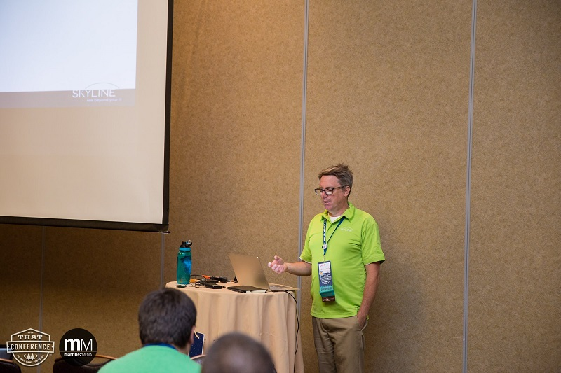

One of my favorite things each year is [That Conference](https://www.thatconference.com). I have been lucky enough to
be chosen as a speaker each year (though I missed last year due to work commitments).

This year I talked on Angular vs React, and compared two of the most popular things going on in the world of
JavaScript these days. Thanks to all of those who attended and provided engaging conversation.

For those interested, here is the [presentation](./Angular vs React-Talk.pptx). I will also be uploading the code to my
[GitHub](https://wwww.github.com/jptacek) in a while after I button it up some more.

Thanks to all the organizer, sponsors and speakers for a great community event! I highly encourage folks to go
next year, Aug 7-9.

