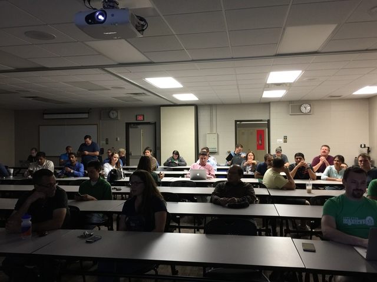

Thanks to everyone who came out to my presentation at the Sept 2016
[NEWDUG](http://newdug.org) meeting. We had a great turnout! You can get an
idea from this pre-talk and dark picture.

Also, I had a bit of a hair issue going on....

<blockquote class="twitter-tweet tw-align-center" data-lang="en">
<a href="https://twitter.com/jptacek">@jptacek</a> shows off an another stellar hair day tonight at <a href="https://twitter.com/newdug">@newdug</a> as he talks Angular vs React <a href="https://twitter.com/hashtag/Angular?src=hash">#Angular</a> <a href="https://twitter.com/hashtag/React?src=hash">#React</a> <a href="https://t.co/4KibrGXZeZ">pic.twitter.com/4KibrGXZeZ</a>
&mdash; Skyline Technologies (@skylinetweets) <a href="https://twitter.com/skylinetweets/status/776193790738436096">September 14, 2016</a></blockquote>

My slide deck is online at [http://newdug0916.jptacek.com](http://newdug0916.jptacek.com)
and the Git repo for the slide deck is at
[https://github.com/jptacek/NewDug0916](https://github.com/jptacek/NewDug0916).
I have also created a very vanilla PDF for [download](./NewDug0916-AngularVsReact.pdf).

Thanks again to everyone who came out and engaged in great conversation!
