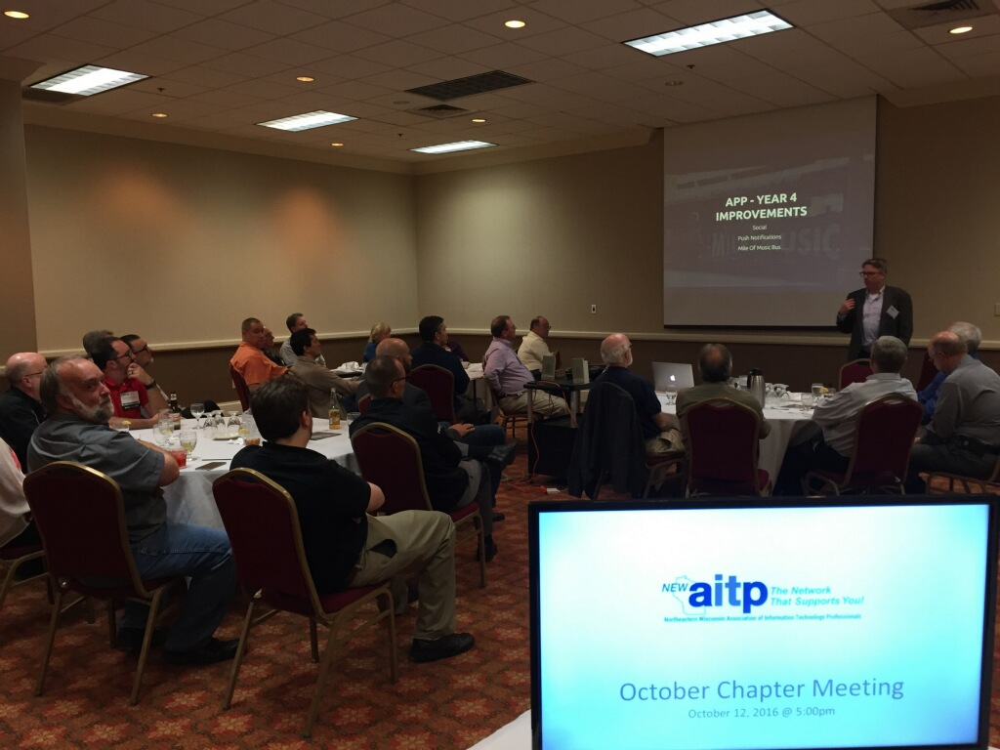

Thanks to everyone who came out to my presentation at the October 2016
[New AITP](http://www.newaitp.org/) meeting. It was a funnight. I always love
talking about [Mile of Music](https://mileofmusic.com/) and how the team
at Skyline created the Festival app.

<blockquote class="twitter-tweet" data-lang="en">
<a href="https://twitter.com/jptacek">@jptacek</a> is wearing a sport coat tonight at the AITP meeting tonight while showing off the Mile of Music app!!! <a href="https://t.co/eUedirhuKt">pic.twitter.com/eUedirhuKt</a>
&mdash; Mark Lezotte (@marklezotte) <a href="https://twitter.com/marklezotte/status/786348349603667969">October 12, 2016</a></blockquote>

My slide deck is online at [newaitp1016.jptacek.com/](https://newaitp1016.jptacek.com/)
and the Git repo for the slide deck is at
[https://github.com/jptacek/NewAITP1016](https://github.com/jptacek/NewAITP1016).

Thanks again to everyone who came out and engaged in starting a conversation!
