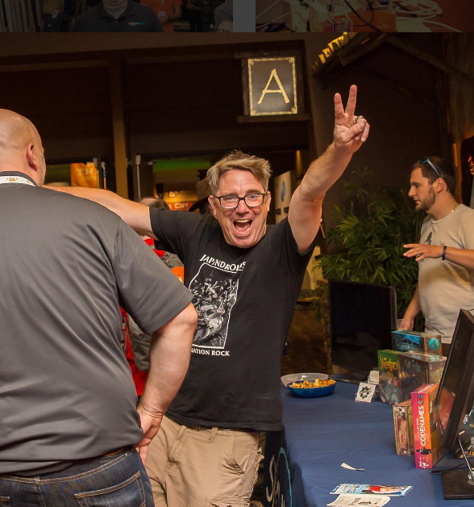

I rave a lot about [That Conference](https://www.thatconference.com), so you can
tell I am pretty enthusiastic for the event. If that doesn't convince you, this
picture should!

This year, my [session](https://www.thatconference.com/Sessions/Session/11585) was An introduction to [Docker](https://www.docker.com), a
very popular virtualization technology that I find .NET developers are
somewhat unaware of.

It was a fun talk and really great questions and crowd participation.

For those interested, here is the [presentation](https://docs.google.com/presentation/d/1Ss3MitzdYtEPDD14NHhIJtWAV_TYCJhK_NKFHkhklLQ/edit#slide=id.p).

The source code can be found on my GitHub repo at
[https://github.com/jptacek/dockerPi](https://github.com/jptacek/dockerPi).
