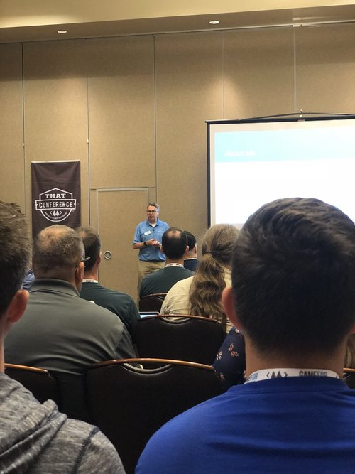

I am a huge fan of life long learning and community, and [That Conference](https://www.thatconference.com) allows me to indulge in it each year.

I have also been lucky enough to speak each year at the event (though I had to bail one year
for work commitments).

This year, my [session](https://www.thatconference.com/sessions/session/12739) was Functional Programminng in JavaScript. During the talk I take a loop through the aspects of Functional 
Programming available in the land of JavaScript.

Thanks to all who attended and provided feedback.

For those interested, here is the [presentation](https://docs.google.com/presentation/d/1o-TNzP79PPlkpq5wiDL58dOQ4coRnOGUg7E10jIsgyI/edit#slide=id.p).
 
The source code can be found on my GitHub account at [https://github.com/jptacek/functional-javascript-that-conf](https://github.com/jptacek/functional-javascript-that-conf).